# مختصات پروژه Personal Agent

آخرین به‌روزرسانی: ۲۰۲۶-۰۸-۳۱

این فایل نقشه ثابت پیشرفت پروژه است و بعد از هر مرحله مهم به‌روزرسانی می‌شود. درصدها تخمینی‌اند و بر اساس قابلیت‌های واقعاً پیاده‌سازی و آزمایش‌شده محاسبه می‌شوند.

## موقعیت فعلی

- پیشرفت MVP: حدود **۷۴٪**
- مرحله فعلی: شناخت اولیه و ترجیحات کاربر
- آخرین مرحله کامل: ایجاد، ویرایش و حذف امن کارها و جلسات
- قدم بعدی: فرم ساعت کاری، روزهای کاری، زمان سکوت و شیوه برنامه‌ریزی
- انتقال دامنه: عمداً تا پایان پروژه متوقف است

```mermaid
flowchart LR
    A[پایه فنی و امنیت<br/>100٪] --> B[کارها و جلسات<br/>100٪]
    B --> C[تقویم واقعی<br/>75٪]
    C --> D[شناخت و ترجیحات کاربر<br/>10٪]
    D --> E[مرکز اعلان و یادآوری<br/>55٪]
    E --> F[اتصال کامل به LLM<br/>40٪]
    F --> G[آزمون نهایی و اپ PWA<br/>60٪]
    G --> H[انتقال دامنه<br/>منتظر تأیید نهایی]

    classDef done fill:#e4f0e5,stroke:#8ca088,color:#26312c;
    classDef active fill:#f8eee8,stroke:#d7a98f,color:#26312c;
    classDef pending fill:#efedf7,stroke:#aa9dbc,color:#26312c;
    class A,B done;
    class C,D active;
    class E,F,G,H pending;
```

## معنی هر بخش

| بخش | وضعیت واقعی | کار باقی‌مانده |
|---|---:|---|
| پایه فنی، ورود، دیتابیس و امنیت | ۱۰۰٪ | فقط نگهداری و بررسی دوره‌ای |
| کارها و جلسات | ۱۰۰٪ | ایجاد، ویرایش، حذف دومرحله‌ای و هماهنگی یادآوری‌ها کامل است |
| تقویم | ۷۵٪ | جابه‌جایی بازه‌ها و ویرایش مستقیم |
| شناخت کاربر | ۱۰٪ | مرحله فعال: فرم شروع، ساعت کاری، عادت‌ها و ترجیحات |
| اعلان‌ها | ۵۵٪ | مرکز اعلان و فعال‌سازی کامل Push |
| LLM و Agent | ۴۰٪ | کلید سرویس، حافظه زمینه‌ای و ابزارهای کامل |
| اپ نصب‌شونده و کنترل کیفیت | ۶۰٪ | آزمایش موبایل، نصب و سناریوهای نهایی |
| سرور و دامنه | آماده‌سازی انجام شده | دامنه فقط پس از پایان پروژه و تأیید مالک منتقل می‌شود |

## قانون به‌روزرسانی این نقشه

پس از هر قابلیت کامل، این فایل باید همراه با نتیجه تست‌ها، مرحله فعلی و قدم بعدی به‌روزرسانی و در GitHub ثبت شود.

## آخرین کنترل کیفیت

- Type Check: موفق
- Lint: موفق
- تست خودکار: ۸ تست موفق
- آزمایش واقعی مرورگر: ساخت، ویرایش و حذف کار و جلسه در حساب محلی موفق
