# مختصات پروژه Personal Agent

آخرین به‌روزرسانی: ۲۰۲۶-۰۹-۰۱

این فایل نقشه ثابت پیشرفت پروژه است و بعد از هر مرحله مهم به‌روزرسانی می‌شود. درصدها تخمینی‌اند و بر اساس قابلیت‌های واقعاً پیاده‌سازی و آزمایش‌شده محاسبه می‌شوند.

## موقعیت فعلی

- پیشرفت نسخه وب/PWA: **۱۰۰٪**
- پیشرفت کل محدوده پیش از Production شامل Android و هشدار پیشرفته: **۱۰۰٪**
- مرحله فعلی: نسخه آزمایشی آفلاین روی گوشی واقعی نصب شد و اعلان و Alarm سی‌ثانیه‌ای با موفقیت اجرا شدند
- آخرین مرحله کامل: ساخت و انتشار APK آفلاین پایدار در GitHub، بررسی دانلود عمومی، شناسه نصب منحصربه‌فرد، Hash و نبود هرگونه وابستگی به Cloudflare یا Production
- قدم بعدی: آماده‌سازی Release امضاشده و اتصال نهایی فقط بعد از تأیید Production
- انتقال دامنه: عمداً تا پایان پروژه متوقف است

محیط لوکال و دیتابیس موجود بدون حذف داده‌ها آماده شده‌اند. به‌دلیل اشغال‌بودن پورت ۳۰۰۰ توسط پروژه‌ای دیگر، نسخه فعلی Personal Agent روی `http://localhost:3001` اجرا می‌شود.

```mermaid
flowchart LR
    A[وب و PWA<br/>100٪] --> B[طراحی و تایپوگرافی<br/>100٪]
    B --> C[هشدار چندمرحله‌ای<br/>98٪]
    C --> D[کد Android<br/>100٪]
    D --> E[Build و تحلیل APK<br/>100٪]
    E --> H[تست ابری Android 16<br/>100٪]
    H --> I[APK قابل نصب بدون کابل<br/>آماده]
    I --> G[تست گوشی واقعی<br/>موفق]
    G --> F[انتقال Production<br/>منتظر تأیید نهایی]

    classDef done fill:#e4f0e5,stroke:#8ca088,color:#26312c;
    classDef active fill:#f8eee8,stroke:#d7a98f,color:#26312c;
    classDef pending fill:#efedf7,stroke:#aa9dbc,color:#26312c;
    class A,B,H,I,G done;
    class C,D,E done;
    class F pending;
```

## معنی هر بخش

| بخش | وضعیت واقعی | کار باقی‌مانده |
|---|---:|---|
| پایه فنی، ورود، دیتابیس و امنیت | ۱۰۰٪ | فقط نگهداری و بررسی دوره‌ای |
| کارها و جلسات | ۱۰۰٪ | ایجاد، ویرایش، حذف دومرحله‌ای و هماهنگی یادآوری‌ها کامل است |
| تقویم | ۱۰۰٪ | پیمایش هفته‌ها، افزودن از روز انتخابی و ویرایش مستقیم کامل است |
| شناخت کاربر | ۱۰۰٪ | ساعت و روز کاری، زمان سکوت، سبک برنامه‌ریزی و یادآوری پیش‌فرض ذخیره می‌شود |
| اعلان‌ها | ۱۰۰٪ | مرکز اعلان، اعلان محلی، Push و مسیر Scheduler کامل است؛ ارسال راه دور فقط به کلید VAPID و HTTPS وابسته است |
| LLM و Agent | ۹۰٪ | بدون کلید، حالت محلی امن فعال است؛ اتصال OpenAI آماده و آزمایش زنده آن اختیاری است |
| اپ نصب‌شونده و کنترل کیفیت | ۱۰۰٪ | Manifest، آیکون‌های ۱۹۲ و ۵۱۲، Service Worker، پوسته آفلاین و Responsive کامل است |
| طراحی و تایپوگرافی | ۱۰۰٪ | وزیرمتن محلی، مقیاس فونت یکپارچه، فاصله‌ها، کنتراست و اندازه لمس موبایل کامل شد |
| اپلیکیشن Android | ۱۰۰٪ پیش از Production | پروژه Capacitor، RTL، آیکون، Splash استاندارد، پوسته امن، APK سالم، تست Android 16 ابری، نصب بدون کابل و Alarm روی گوشی واقعی موفق است |
| هشدار فوری چندمرحله‌ای | ۱۰۰٪ در محدوده فعلی | اعلان، تکرار Alarm، اولویت بالا، Audit، لغو و Mock تماس/پیامک کامل است؛ اعلان و Alarm سی‌ثانیه‌ای روی گوشی واقعی نیز موفق بود |
| امنیت، Backup و Rollback | ۱۰۰٪ | Rate Limit، هدرهای امنیتی، Audit وابستگی، Snapshot سالم و مستند بازیابی کامل است |
| سرور و دامنه | آماده‌سازی انجام شده | دامنه فقط پس از پایان پروژه و تأیید مالک منتقل می‌شود |

## قانون به‌روزرسانی این نقشه

پس از هر قابلیت کامل، این فایل باید همراه با نتیجه تست‌ها، مرحله فعلی و قدم بعدی به‌روزرسانی و در GitHub ثبت شود.

## آخرین کنترل کیفیت

- Type Check: موفق
- Lint: موفق
- تست خودکار: ۳۰ تست موفق
- Build نهایی: موفق
- سلامت API و اتصال دیتابیس: موفق
- آزمایش واقعی مرورگر: داشبورد، کارها، جلسات، تقویم، دستیار، تنظیمات، ورود، حالت ۴۰۴، پنجره‌ها، حذف دومرحله‌ای و بازگشت تغییرات در دسکتاپ و نمای موبایل ۳۹۰×۸۴۴ روی `localhost:3001` بدون سرریز افقی یا کنترل لمسی کوچک اجرا شد
- PWA: Manifest کامل، آیکون‌های استاندارد نصب، Apple Touch Icon و Service Worker نسخه دوم فعال هستند
- طراحی: فونت وزیرمتن از داخل پروژه بارگذاری می‌شود؛ عنوان ۲۷ تا ۳۲ پیکسل، متن اصلی ۱۵ پیکسل و کنترل‌های لمسی حداقل ۳۸ پیکسل هستند
- امنیت وابستگی‌ها: `pnpm audit --prod` بدون آسیب‌پذیری شناخته‌شده
- امنیت برنامه: Rate Limit برای Agent و عملیات تغییردهنده، خطاهای فارسی قابل‌بازیابی، اعتبارسنجی حذف Deadline و لغو خودکار یادآوری کارهای انجام‌شده یا لغوشده آزمایش شد
- Backup: Snapshot تازه `hamrah-2026-09-01T05-45-41-179Z.db` با `VACUUM INTO` ساخته شد و `integrity_check = ok` بود
- Android Build: Gradle ۸٫۱۴٫۵ و AppCompat ۱٫۸٫۰ با موفقیت APK آزمایشی ۴٫۱۷ مگابایتی ساختند
- Android Lint: بدون خطا و هشدار؛ تست واحد Android موفق
- APK: امضای Debug نسخه v2 معتبر، شناسه `ir.wealthos.personalagent`، حداقل API 24 و هدف API 36 تأیید شد
- APK SHA-256: `b7c9de0a8f6fc2bf8826e0aff0cf5231216bfbbf087ed2304b1c46a12c7143bc`
- GitHub Actions وب: Type Check، Lint، ۳۰ تست و Build در محیط تمیز Linux موفق شد
- GitHub Actions Android: ساخت APK، Lint، تست واحد، ۶ تست Instrumented بدون شکست، نمایش و حذف اعلان دارای صدای هشدار، اجرای Alarm دقیق، جلوگیری از اجرای Alarm لغوشده، نصب، Cold Launch و اتصال به API/دیتابیس روی Android 16 موفق شد ([اجرای موفق شماره ۵](https://github.com/tparkhondeh/personalAgent/actions/runs/33488117509))
- APK ابری: SHA-256 برابر `6becc46ca95c3dcee007f07047f546cc9b9f7c4e5c435cddfecb7fac1d49c0f6`؛ فایل APK و شواهد تست تا ۱۴ روز در همان اجرای GitHub نگهداری می‌شوند
- نسخه قابل‌نصب بدون کابل: Workflow مستقل `Temporary phone preview` یک محیط HTTPS موقت، دیتابیس جدا، Secretهای تصادفی و APK متصل به همان محیط ساخت؛ Production تغییر نکرد ([اجرای شماره ۱](https://github.com/tparkhondeh/personalAgent/actions/runs/33493716896))
- APK پیش‌نمایش گوشی: حجم ۴٬۳۷۰٬۵۲۵ بایت و SHA-256 برابر `ecbb0d2847d3ae81a4d0b3a46e05be16de0eeac6d5705952100e9ee0298f347f`؛ دانلود عمومی، تطابق Hash، سلامت API، اتصال دیتابیس و هدرهای امنیتی در همان اجرا تأیید شد
- آزمایش رابط پیش‌نمایش: داشبورد فارسی و RTL روی دسکتاپ و نمای موبایل ۳۹۰×۸۴۴ به‌صورت واقعی باز شد؛ چیدمان Responsive بود و Console مرورگر خطا یا هشدار نداشت
- نصب پیش‌نمایش: هر Build موقت شناسه بسته و نام آزمایشی منحصربه‌فرد می‌گیرد تا باقی‌ماندن نسخه‌ای با امضای متفاوت در گوشی، نصب نسخه تازه را مسدود نکند
- پیش‌نمایش آفلاین پایدار: [اجرای موفق شماره ۲](https://github.com/tparkhondeh/personalAgent/actions/runs/33501513180) APK مستقل با نام «همراه آفلاین ۲» و شناسه `ir.wealthos.personalagent.offlinepreview2` را منتشر کرد. دانلود عمومی فایل ۴٬۳۷۵٬۳۳۷ بایتی، SHA-256 برابر `7d2293f7dacd3264c26c1974afd5d244cee96d93569e9d5666a100c3b63ebc43` و نبود `server.url` دوباره خارج از GitHub Actions تأیید شد
- تست گوشی واقعی: «همراه آفلاین ۲» بدون کابل نصب شد، مجوز اعلان فعال شد و کاربر رسیدن اعلان/صدای Alarm سی‌ثانیه‌ای را تأیید کرد
- نصب گوشی: اسکریپت یک‌مرحله‌ای USB آماده است و پیش از نصب، سلامت برنامه، مجازبودن دقیقاً یک گوشی، اتصال امن محلی و موفقیت Build را کنترل می‌کند؛ هنوز اجرا نشده است
- Emulator و گوشی: Android 16 ابری نصب، اعلان، رسیدن و لغو Alarm را تأیید کرد؛ آزمایش سی‌ثانیه‌ای روی گوشی واقعی نیز موفق بود. آزمون‌های طولانی در حالت ذخیره باتری فقط بررسی سازگاری تکمیلی نسخه نهایی هستند و مانع فعلی نیستند

## وابستگی‌های اختیاری و معوق

- پروژه بدون `OPENAI_API_KEY` با دستیار محلی کار می‌کند. افزودن کلید در آینده فقط کیفیت فهم زبان طبیعی را ارتقا می‌دهد و مانع استفاده از MVP نیست.
- بدون کلید VAPID، اعلان محلی روی دستگاه فعال است. Push از راه دور پس از آماده‌شدن HTTPS دامنه اضافه می‌شود.
- پیامک و تماس تا انتخاب سرویس‌دهنده، شماره تأییدشده و تأیید هزینه فقط Mock هستند و هیچ داده‌ای ارسال نمی‌کنند.
- JDK، Android SDK و Gradle به‌صورت محلی نصب شده‌اند و در Git قرار ندارند.
- اعلان و Alarm روی گوشی واقعی تأیید شده‌اند؛ بررسی طولانی‌مدت در حالت Doze و ذخیره باتری سازندگان مختلف، کنترل سازگاری تکمیلی پیش از انتشار عمومی است.
- پیش‌نمایش متصل به سرور همچنان موقت است، اما [APK آفلاین شماره ۲](https://github.com/tparkhondeh/personalAgent/releases/download/phone-preview-offline-2/hamrah-offline-preview-2.apk) لینک پایدار دارد، منقضی نمی‌شود و داده‌هایش فقط روی همان گوشی ذخیره می‌شوند.
