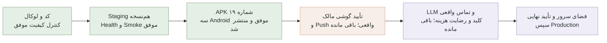

# مختصات پروژه Personal Agent

آخرین به‌روزرسانی: ۲۰۲۶-۰۹-۰۶ UTC

این فایل نقشه ثابت پیشرفت پروژه است. جدول زیر مرجع وضعیت فعلی است؛ یادداشت‌های تاریخ‌دار پایین فایل سابقه کار هستند، نه تضمین سلامت نسخه تازه. درصدهای کلی تخمینی‌اند و فعال‌بودن سرویس خارجی یا پذیرش گوشی را اثبات نمی‌کنند.

## موقعیت فعلی

### حذف سبک برنامه‌ریزی — ۲۰۲۶-۰۹-۰۶، ۰۷:۵۶ UTC

- انتخابگر سبک، هر سه گزینه و توضیحات مربوط از فرم وب/شناخت اولیه حذف شدند؛ متن تأیید ذخیره نیز دیگر وعده اثر این تنظیم بر برنامه‌ریزی نمی‌دهد.
- مقدار قدیمی در ستون دیتابیس و تاریخچه حفظ شده؛ ورودی قدیمی نادیده گرفته می‌شود و پاسخ تنظیمات/زمینه دستیار آن را برنمی‌گرداند. ذخیره فرم تازه نیازمند این فیلد نیست. Migration یا حذف داده انجام نشد.
- ۱۷۱ تست در ۲۳ فایل، Type Check، Lint، Build مستقل و هشت کنترل HTTP حفظ هشدار روی لوکال موفق‌اند. ثبت‌نام حساب آزمون به محدودیت ۴۲۹ برخورد کرد؛ بدون تغییر محدودیت امنیتی، آزمون با حساب مصنوعی موجود اجرا و موفق شد.
- رابط واقعی ۳۹۰ و ۱۲۸۰ پیکسلی بررسی شد: گزینه و متن‌های مربوط وجود ندارند، سرریز افقی و خطای کنسول مشاهده نشد. تنظیمات حساب مالک و پیش‌نویس گفتگوی او دست‌نخورده‌اند.
- پشتیبان کد/Git: `C:/Users/pc/Desktop/project-backups/personal-agent-remove-planning-20260906-004836/source-and-history.tar`؛ پشتیبان داده با integrity موفق: `backups/local/hamrah-2026-09-06T07-48-39-033Z.db`.
- **وضعیت انتشار:** حذف در کد و لوکال اعمال شده؛ Staging هنوز نسخه `07f98c0` است و برای حذف گزینه در حالت متصل گوشی به انتشار وب تازه نیاز دارد. رابط آفلاین APK ۲۶ از قبل این گزینه را نداشت؛ هیچ فایل Android یا mobile-shell تغییر نکرده و APK تازه‌ای در این مرحله ساخته یا منتشر نشده است. Production تغییر نکرده است.

### نسخه ۲۶ آماده آزمایش گوشی — ۲۰۲۶-۰۹-۰۶، ۰۷:۳۰ UTC

- [دانلود مستقیم همراه پایدار ۲۶](https://github.com/tparkhondeh/personalAgent/releases/download/phone-preview-stable-26/Hamrah-stable-26.apk)؛ [لوکال](http://localhost:3001)؛ [Staging](https://personalagent.wealthos.ir:8443).
- کد برنامه در زمان تحویل نسخه ۲۶، Staging و APK: `07f98c06e24b877b8934763a5f94942be76add4d`. تغییرات بعدیِ منتشرنشده در یادداشت جدید بالاتر مشخص شده‌اند؛ این بخش شواهد همان نسخه تحویلی است.
- ۱۶۶ تست، Type Check، Lint، Build، Audit وابستگی‌ها، Android Lint و چهار تست واحد در Build اصلی موفق‌اند. ۳۵ کنترل HTTP روی دیتابیس ایزوله CI و Staging هم‌نسخه موفق؛ رابط واقعی موبایل/دسکتاپ بررسی شد.
- همان فایل بدون بازسازی پس از آماده‌شدن سرویس‌های شبیه‌ساز روی Android 13/14/16، با ۱۱ تست بومی در هرکدام و همه کنترل‌های رابط/قطع اتصال، موفق و منتشر شد: [مدرک نهایی آزمون و انتشار](https://github.com/tparkhondeh/personalAgent/actions/runs/34018848466). شکست‌های اولیه مرتبط با restart فونت سیستم حفظ و مستند شده‌اند؛ رفع همه اشکالات WebView سیستم ادعا نمی‌شود.
- فایل از لینک Release دوباره دانلود و SHA تطبیق شد. متن موتور، تقویم/ساعت، پالت و صفحه بازیابی داخل APK با منبع جاری برابر است؛ تصاویر واقعی بررسی شدند.
- Backup آخر Staging: `pre-release-20260906T070604Z`؛ Rollback کد به `834b8b3` با حفظ داده تازه. Production و DNS/Proxy اصلی تغییر نکردند؛ Health آزمایشی و integrity داده سالم، سایت اصلی HTTP 200 است.
- گزارش کامل هویت فایل، پشتیبان‌ها و محدودیت‌ها: [گزارش ساده‌سازی تأیید](docs/SIMPLIFIED_APPROVAL_2026-09-06.md).

| اصلاح | وب/PWA و Staging | رابط داخل APK ۲۶ |
|---|---|---|
| ساعت و انتخابگر واقعی ۲۴ساعته | اعمال و آزموده | اعمال و آزموده |
| تقویم و ورودی شمسی | اعمال و آزموده | اعمال و آزموده |
| عنوان طبیعی و اصلاح همان پیشنهاد | اعمال و آزموده | موتور مشترک و آزموده |
| حذف فیلدهای اضافی و سکوت برای برنامه تازه | اعمال؛ سوابق و زمان‌های قبلی حفظ | اعمال؛ داده قدیمی حذف نشده |
| ثبت بدون ویرایش، سه یادآوری، لغو و عدم تکرار | کنترل سروری و آزمون عملی | کنترل محلی و سه اعلان بومی آزموده |

باقی‌مانده: پذیرش همین APK روی گوشی مالک، رفتار کیبورد/مجوز/تحویل هشدار واقعی؛ فعال‌سازی رضایت‌مندانه ChatGPT و تبدیل صوت/تماس واقعی؛ افزایش ظرفیت یا تصمیم درباره نگه‌داری فضای سرور (حدود ۸۰۰ MiB آزاد). رابط آفلاین داده مستقل و چیدمان سبک‌تر دارد و جای همگام‌سازی حساب یا سرویس صوت واقعی نیست. پروژه عمومی کاملاً نهایی اعلام نمی‌شود و Production همچنان نیازمند تأیید جداست.

سابقه نسخه ۲۲؛ مرجع تحویل فعلی نیست

### نسخه ۲۲ آماده آزمایش پذیرش — ۲۰۲۶-۰۹-۰۶، ۰۵:۳۰ UTC

- [دانلود مستقیم همراه پایدار ۲۲](https://github.com/tparkhondeh/personalAgent/releases/download/phone-preview-stable-22/Hamrah-stable-22.apk)؛ [لوکال](http://localhost:3001)؛ [Staging](https://personalagent.wealthos.ir:8443).
- کد وب، APK و Staging: `158ab5422a1a38307f28fe6014ba1cc78bde9164`. ساخت و هر سه Android و انتشار [Run 34013442504](https://github.com/tparkhondeh/personalAgent/actions/runs/34013442504) موفق‌اند. Commit بعدی فقط گزارش تحویل است.
- ۱۱۷ تست، Type Check، Lint، Build مستقل وب، Audit وابستگی‌ها، Android Lint، چهار تست واحد و ۱۱ تست بومی روی هرکدام از Android 13/14/16 موفق‌اند؛ ۲۵ کنترل HTTP روی Staging نهایی موفق است.
- فایل منتشرشده دوباره دانلود و Hash تطبیق شد. تصاویر روشن، تاریک و بازیابی هر سه Android بررسی شدند؛ صفحه سفید در سناریوهای آزموده‌شده دیده نشد. این تضمین تمام گوشی‌ها نیست.
- Backup نهایی `pre-release-20260906T052335Z`؛ Rollback کد Staging به `0ed931f` با حفظ داده تازه. Production همچنان `49cceed`، بدون تغییر DNS/Proxy اصلی است.
- نتیجه کامل، شناسه و هش APK، پشتیبان‌ها، محدودیت آزمون‌ها و ترتیب کار بعدی: [گزارش تحویل صوت و تأیید](docs/VOICE_RELEASE_HANDOFF_2026-09-06.md).

| بخش | وضعیت واقعی اکنون | باقی‌مانده |
|---|---|---|
| رنگ‌ها، فونت، شعر و دو تاریخ | اعمال و در APK منتشر شده | پذیرش بصری مالک روی گوشی؛ رابط آفلاین چیدمان سبک‌تر و داده مستقل دارد |
| فهم فارسی و اصلاح گفتگو | موتور مشترک و مجموعه تست بهبود یافته | تضمین فهم همه جمله‌ها نیست؛ موارد مبهم سؤال می‌شوند |
| تأیید عنوان، زمان، تکرار و همه هشدارها | کنترل سروری نسخه‌دار و تکرارناپذیر، در Staging فعال | Alarm به مجوز و همگام‌سازی گوشی وابسته است |
| ضبط وویس و تبدیل به متن | رابط ضبط و قرارداد امن API پیاده و منتشر شده | کلید/هزینه و آزمون صوت واقعی؛ تشخیص صوت آفلاین نداریم |
| ChatGPT واقعی | فعال‌سازی خارجی باقی مانده | کلید خصوصی معتبر و تأیید هزینه؛ پاسخ Mock اتصال واقعی نیست |
| اعلان و Alarm | آزمون بومی سه Android موفق | تحویل Push و رفتار واقعی همین نسخه روی گوشی مالک |
| پیامک و تماس | واقعی خاموش | سرویس، رضایت، شماره تأییدشده و هزینه مشخص |
| انتشار عمومی | انجام نشده | پذیرش گوشی، ظرفیت دیسک حدود ۱٫۰۵ GiB و تأیید نهایی Production |

درصدهای تاریخی پایین برای محدوده قدیمی‌اند. برای درخواست تازه، یک درصد کلی قابل‌دفاع نداریم: پیاده‌سازی مستقل و آزمون‌های فعلی کامل‌اند، اما زنجیره **صوت واقعی → ثبت تأییدشده → هشدار گوشی** هنوز اثبات نشده است. پروژه کاملاً نهایی اعلام نمی‌شود.

سابقه آماده‌سازی این نوبت و وضعیت نسخه ۱۹؛ مرجع وضعیت فعلی نیست

### محدوده تازه در حال آماده‌سازی — صوت و تأیید کامل، ۲۰۲۶-۰۹-۰۶

- درخواست تازه محدوده کار را گسترش داده است؛ درصدهای نسخه ۱۹ پایین به معنی تکمیل این قابلیت‌ها نیستند.
- پشتیبان جدید کد/Git در `C:/Users/pc/Desktop/project-backups/personal-agent-voice-20260906-0420/source-and-history-without-live-db.tar`؛ Snapshot سالم داده: `backups/local/hamrah-2026-09-06T03-54-38-348Z.db`. تلاش اول Archive به فایل زنده قفل‌شده برخورد کرد و دست‌نخورده حفظ شد؛ Archive دوم و Snapshot مستقل کامل‌اند.
- منبع پالت APK از CSS وب تولید می‌شود؛ مقایسه واقعی ۳۹۰پیکسلی، گرادیان و فونت برابر و بدون سرریز بود.
- موتور فارسی مشترک: زمان نسبی/شمسی، اعداد، عصر/صبح، اصلاح ادامه گفتگو، انتخاب مورد موجود، مدت نامشخص، تداخل، ساعات سکوت و تکرار محدود به تعداد تأییدشده.
- پیش‌نویس نسخه‌دار و متعلق به حساب؛ کنترل سرور برای تأیید، انصراف، نسخه منقضی/قدیمی، تکرار درخواست و ثبت اتمی. آلارم و یادآوری فقط از نسخه تأییدشده ساخته می‌شوند.
- ضبط کوتاه با مجوز، لغو/توقف، متن قابل‌ویرایش و قرارداد امن WAV؛ درخواست صوت فقط پس از رضایت مقصد OpenAI. محدودیت مصرف روزانه پایدار، Timeout و خاموش‌بودن پیش‌فرض هزینه اضافه شد.
- ۱۱۴ تست خودکار، Type Check، Lint، Build مستقل وب و ۲۵ کنترل عملی API موفق‌اند. Android Lint بدون مشکل و چهار تست واحد موفق؛ ساخت Debug و APK تست بومی موفق است. اجرای ۹ تست بومی، پالت تاریک و رابط واقعی در Android 13/14/16 و انتشار فایل نهایی هنوز در جریان است.
- کلید و تأیید هزینه هم در لوکال و هم Staging وجود ندارند. آزمون مسیر تبدیل صدا از پاسخ مصنوعی سرویس استفاده کرده است؛ اتصال و دقت تشخیص صدای واقعی اثبات نشده‌اند.
- آخرین نسخه منتشرشده هنوز ۱۹ است و Staging هنوز `17afb3d`؛ تغییرات جدید را منتشرشده حساب نکنید. Production تغییری نکرده است.
- بازبینی دوم: ۱۱۷ تست و ۲۵ کنترل API موفق؛ ساعت «پنج» بدون صبح/عصر سؤال می‌خواهد، Schema سخت‌گیرانه مدل اصلاح شد و دریافت صوت Timeout دارد. کاندید ۲۰ به‌دلیل بسته‌شدن وابسته به سرویس فونت گوگل در Android 14 منتشر نشد؛ Android 13/16 موفق بودند. وابستگی فونت آنلاین حذف و کنترل بومی تازه اضافه شد؛ آزمون کاندید بعدی هنوز لازم است.
- Staging به `0ed931f` ارتقا یافت: Backup سالم `pre-release-20260906T050302Z`، آزمون Migration روی کپی، Health، ۲۵ کنترل تأیید و Smoke موفق‌اند. Production همچنان `49cceed` است. کاندید ۲۱ در Android 13/16 موفق بود ولی به‌دلیل رویداد زودهنگام پل JavaScript در Android 14 منتشر نشد؛ اصلاح محدود و نسخه‌دار Capacitor و آزمون پیشگیری اضافه شدند. آخرین APK منتشرشده هنوز ۱۹ است.
- فضای آزاد سرور حدود ۱٫۳ گیگابایت؛ هیچ فایلی حذف نشده است. هر استقرار آزمایشی با Backup تازه و آزمون Migration روی کپی انجام می‌شود؛ بازگشت به کد قدیمی، توقف Scheduler آزمایشی را لازم دارد تا سیاست جدید هشدار نادیده گرفته نشود.

### وضعیت نسخه منتشرشده قبلی

- وب/PWA و APK تازه: **آماده آزمایش پذیرش؛ کنترل‌های فعلی موفق‌اند، نه تضمین نبود هرگونه خطا**
- پیشرفت کل محدوده پیش از Production: **حدود ۹۵٪؛ تأیید نسخه تازه روی گوشی مالک و تحویل Push واقعی باقی است**
- پیشرفت کل تا انتشار عمومی: **حدود ۹۰٪؛ اتصال‌های واقعی، فضای سرور و انتشار عمومی باقی‌اند**
- مرحله فعلی: «همراه پایدار 19» از Commit `17afb3d5e55ce984fc663068902db7125e9f7d77` منتشر شد و Staging دقیقاً از همین Commit اجرا می‌شود. لوکال نیز کد همین نسخه را دارد؛ Commitهای پس از آن صرفاً مستندات تحویل‌اند.
- قدم بعدی: نصب نسخه ۱۹ کنار نسخه قبلی و آزمایش مالک، سپس تصمیم جداگانه درباره سرویس‌های خارجی و Production
- انتقال دامنه: دامنه اصلی روی پورت ۴۴۳ هنوز تغییری نکرده است؛ Staging جداگانه و قابل‌بازگشت روی `https://personalagent.wealthos.ir:8443` فعال است

محیط لوکال و دیتابیس موجود بدون حذف داده‌ها آماده شده‌اند. به‌دلیل اشغال‌بودن پورت ۳۰۰۰ توسط پروژه‌ای دیگر، نسخه فعلی Personal Agent روی `http://localhost:3001` اجرا می‌شود.

## معنی هر بخش

| بخش | وضعیت واقعی | کار باقی‌مانده |
|---|---:|---|
| ورود و جداسازی حساب | اعمال شده و آزموده | خروج، Reload مهمان و ورود دوباره با حفظ داده حساب در مرورگر Staging بررسی شد |
| کارها، جلسات و تقویم | اعمال شده | Smoke و مرورگر موفق؛ پذیرش نهایی مالک باقی است |
| شناخت کاربر و سه یادآوری | اعمال شده | ذخیره ۱۴۴۰، ۱۸۰ و ۶۰ دقیقه در وب و سه اعلان بومی همراه با لغو در Android آزموده شد |
| طراحی، شعر و دو تاریخ | اعمال شده | وب/Staging هم‌نسخه؛ شعر مشترک و فونت داخل APK وجود دارند |
| PWA و Push | کد و تنظیم سرور آماده | تحویل واقعی Push روی گوشی مالک هنوز اثبات نشده است |
| Android ۱۹ | منتشر شده و آزموده | Android 13/14/16 موفق؛ نصب و پذیرش این نسخه روی گوشی مالک معوق است |
| رابط آفلاین | اعمال شده، ساده‌تر و مستقل | داده‌های محلی با حساب سرور همگام نمی‌شوند؛ این تفاوت عمدی و صریح است |
| دستیار | حالت محلی فعال | LLM واقعی: فعال‌سازی خارجی باقی مانده |
| هشدار پیشرفته | بومی/Mock آزموده | تماس و پیامک واقعی خاموش؛ کلید، سرویس، شماره و رضایت هزینه باقی است |
| امنیت و Backup | کنترل‌های فعلی موفق | بررسی دوره‌ای و ارزیابی مجدد پیش از Production لازم است |
| سرور و دامنه | فقط Staging ارتقا یافته | فضای آزاد ۱٫۳ گیگابایت؛ ظرفیت و Proxy/HTTPS عمومی قبل از Production باید بررسی شوند |

لینک‌ها، شناسه APK، SHA-256، مقایسه نسخه‌ها و روش بازگشت در [گزارش تحویل ۲۰۲۶-۰۹-۰۶](docs/RELEASE_HANDOFF_2026-09-06.md) هستند. لینک مستقیم: [دانلود همراه پایدار ۱۹](https://github.com/tparkhondeh/personalAgent/releases/download/phone-preview-stable-19/Hamrah-stable-19.apk).

## قانون به‌روزرسانی این نقشه

پس از هر قابلیت کامل، این فایل باید همراه با نتیجه تست‌ها، مرحله فعلی و قدم بعدی به‌روزرسانی و در GitHub ثبت شود.

## آخرین کنترل کیفیت

- ۲۰۲۶-۰۹-۰۶، نسخه ۲۲: کنترل‌های وب/Android، ۲۵ تست HTTP Staging، تطبیق فایل دانلود با SHA-256 `772812cebb39f0708123716f761d5248ae2e1e4c903646f08289cbba174f28fb` و تصاویر واقعی موفق‌اند. کاندیدهای ۲۰ و ۲۱ منتشر نشدند؛ خطاهای فونت آنلاین و پل زودهنگام اصلاح و آزمون بازگشت اضافه شدند. پیام مهارشده SystemBars هنگام تعویض سند هنوز در Logcat هست؛ صفحه نهایی و حاشیه‌ها در تصاویر سالم‌اند و در گزارش تحویل ثبت شده است. آزمون متصل WebView روی گوشی، صوت واقعی و Push واقعی باقی‌اند.

- ۲۰۲۶-۰۹-۰۶ UTC، تحویل نسخه ۱۹: [Run 34008659255](https://github.com/tparkhondeh/personalAgent/actions/runs/34008659255) کاملاً موفق؛ ۶۰ تست وب، Type Check، Lint، Build، Audit، Android Lint، چهار تست واحد و هشت تست بومی روی هرکدام از APIهای ۳۳/۳۴/۳۶ موفق‌اند. همان APK با SHA-256 `bb396ba1be0f0efddc2073facedae3670eb9ba0b032c5ac75e5622d79cfac566` منتشر و مجدداً از لینک پایدار دانلود و تطبیق شد. Screenshotهای واقعی رابط و بازیابی بصری بررسی شدند. صفحه سفید در سناریوهای آزموده‌شده دیده نشد؛ به معنی تضمین تمام گوشی‌ها نیست.
- Staging به `17afb3d` با Backup سالم `pre-release-20260906T032354Z` ارتقا یافت؛ مقصد Rollback نسخه `833c67b` است. Health نسخه را تأیید کرد. Smoke وب و مرورگر موبایل ۳۹۰پیکسلی، ورود/خروج، عدم نمایش کار خصوصی به مهمان و بازگشت داده پس از ورود دوباره موفق‌اند. یک کار مصنوعی در حساب QA تکمیل و برای شواهد حفظ شد. Worker مستقل یادآوری/Escalation فعال است. Production همچنان `49cceed` و API عمومی آن همان ۴۰۴ قبلی است.
- نصب جدید روی گوشی مالک، Push واقعی، LLM و تماس واقعی و انتشار عمومی باقی‌اند. هیچ هزینه سرویس، تماس یا پیامک واقعی ایجاد نشده است. پشتیبان‌ها و Worktree قدیمی حفظ شده‌اند؛ هیچ Reset یا بازنویسی تاریخچه انجام نشده است.

- ۲۰۲۶-۰۹-۰۶ (UTC): آزمون خروج از حساب ساختگی در مرورگر، باقی‌ماندن وضعیت حساب در حالت نمایشی را نشان داد. Dashboard اکنون تا تعیین وضعیت ورود Loading دارد و برای هر کاربر/حالت مهمان دوباره ساخته می‌شود؛ State حساب و پاسخ دیررس به حالت مهمان منتقل نمی‌شود. این اصلاح از ذخیره‌شدن برنامه‌های حساب در LocalStorage مهمان هنگام خروج جلوگیری می‌کند؛ هیچ داده موجودی حذف نشد. آزمون رفتار خروج روی نسخه اصلاح‌شده هنوز باید تکمیل شود.

- ۲۰۲۶-۰۹-۰۶ (UTC): Staging اکنون Commit `833c67b` است و Smoke نهایی آن موفق شد؛ Backup تازه `pre-release-20260906T030046Z` محفوظ است. Worker مستقل Staging پس از Backup `pre-scheduler-20260906T025852Z` فعال شد و هر دو endpoint خودکار پاسخ موفق دادند؛ Cron و Processهای Production تغییر نکردند. آزمون APK۱۷ نشان داد `getLocalUrl` در حالت متصل مبدأ سرور است و فونت محلی پیدا نمی‌شود؛ مبدأ خصوصی از Scheme/Host صحیح استخراج شد. نسخه ۱۷ منتشر نشد و آزمون بعدی لازم است.

- ۲۰۲۶-۰۹-۰۶ (UTC): Staging به `af265dc82630a98ad113d9a74a2525ac75339524` ارتقا یافت؛ Backup سالم `pre-release-20260906T024932Z` و Release بازگشت `49cceed` محفوظ‌اند. Smoke روی HTTPS شامل سه یادآوری، Task/Meeting، همراه محلی و سه Alarm موفق بود؛ کلید عمومی Push از تنظیمات زمان اجرای سرور دریافت شد. APK نسخه ۱۶ به‌علت SyntaxError ناشی از جایگزینی head داخل JSON جاسازی‌شده منتشر نشد؛ اصلاح با درج تک‌نقطه‌ای و تست واحد افزوده شد. Production همچنان همان نسخه پیشین است.

- ۲۰۲۶-۰۹-۰۶ (UTC): اجرای `34006539194` با Commit `0691a9e` وب و ساخت APK را گذراند ولی آزمون دقیق اعلان داخل رابط آفلاین روی هر سه Android با `Native notification bridge missing` شکست خورد؛ انتشار نسخه ۱۵ به‌درستی متوقف شد. پل افزونه در صفحه بازیابی و مسیر فونت محلی اصلاح شدند و آزمون مجدد لازم است. تنظیم Push به دریافت امن هنگام اجرای سرور منتقل شد تا بسته یکسان GitHub تنظیمات محیط را از دست ندهد. نشان توسعه Next که روی تب همراه موبایل قرار می‌گرفت حذف شد؛ ورود به تب همراه در نمای ۳۹۰پیکسلی واقعاً بررسی شد.

- ۲۰۲۶-۰۹-۰۶ (UTC): ممیزی واقعی نشان داد لوکال و GitHub روی `df2757b` هستند، ولی Staging هنوز `49cceed` و APK شماره ۱۴ از `e26a8f0` است. پشتیبان کامل کد/Git و worktree قدیمی در `C:/Users/pc/Desktop/project-backups/personal-agent-20260905-191617`، Snapshot سالم دیتابیس لوکال و Backup سالم Staging با نام `pre-parity-20260906T022211Z` ساخته شد. لوکال از پوشه اصلی روی ۳۰۰۱ اجرا شد. شعر مشترک ۳۶۰تایی، تاریخ میلادی، همراه مینیمال و سه یادآوری به رابط محلی اضافه شدند؛ ایراد ماه شمسی و جابه‌جایی ساعت و لغو ناقص اعلان‌های نسخه قدیمی نیز رفع شد. ۵۵ تست، Type Check، Lint، Build و Audit موفق‌اند؛ Smoke لوکال `llm-local,call-mock` است. آزمون/انتشار APK تازه و ارتقای Staging هنوز در جریان است و گوشی واقعی برای این نسخه جدید تأیید نشده است.
- ۲۰۲۶-۰۹-۰۵: وضعیت اتصال‌ها دوباره بررسی شد: LLM واقعی به‌دلیل نبود `OPENAI_API_KEY` در لوکال و سرور فعال نیست و همراه سالم در حالت محلی پاسخ می‌دهد. برای تماس ایران، مسیر واقعی کاوه‌نگار با چهار قفل ایمنی (حالت `live`، کلید سرور، شماره Allowlist‌شده و انتخاب کاربر) پیاده‌سازی شد؛ متن تماس عمومی است و جزئیات کار ارسال نمی‌شود. مسیر وضعیت امن `/api/integrations` اضافه شد. Type Check، Lint، هر ۴۹ تست، Build، Audit و Smoke واقعی موفق بودند؛ نتیجه Smoke برابر `llm-local,call-mock` است و هیچ تماس یا هزینه‌ای ایجاد نشد. Production تغییری نکرد.
- ۲۰۲۶-۰۹-۰۵: سربرگ صفحه «امروز» مینیمال‌تر شد؛ لینک نمایشی منبع شعر حذف شد، تاریخ میلادی با تقویم Gregorian و زمان تهران زیر تاریخ شمسی قرار گرفت و اندازه و وزن شعر برای ترکیب‌بندی ظریف‌تر کاهش یافت. اطلاعات منبع اشعار همچنان داخل داده پروژه حفظ شده است. Type Check، Lint، هر ۴۵ تست و Build موفق بودند و نتیجه در نمای واقعی مرورگر بررسی شد؛ Production تغییری نکرد.
- ۲۰۲۶-۰۹-۰۵: صفحه «گفتگو با همراه» مینیمال‌تر شد؛ نشان تزئینی، عنوان و مثال تکراری و توضیح فنی پایین صفحه حذف شدند. میان‌برهای کاربردی، کادر گفتگو، پاسخ‌ها، پیشنهادهای قابل‌تأیید و پیام ورود بدون تغییر باقی ماندند. Type Check، Lint، هر ۴۵ تست و Build موفق بودند و میان‌بر و پاسخ واقعی همراه در مرورگر بررسی شد؛ Production تغییری نکرد.
- ۲۰۲۶-۰۹-۰۵: یادآوری پیش‌فرض از یک زمان به انتخاب هم‌زمان دو یا سه زمان ارتقا یافت؛ گزینه‌های فعلی «۱ روز قبل»، «۳ ساعت قبل» و «۱ ساعت قبل» هستند و برای هر کار یا جلسه جدید رکوردهای مستقل و بدون تکرار ساخته می‌شود. سازگاری نسخه‌های قبلی حفظ و Migration دیتابیس پس از Backup سالم لوکال اجرا شد. در بررسی «همراه»، پیشنهاد زمان آزاد اصلاح و بازگشت خودکار به حالت محلی هنگام خطای LLM اضافه شد. ایراد قدیمی ذخیره تنظیمات با مخاطب اضطراری خالی نیز رفع شد. Type Check، Lint، هر ۴۵ تست، Build، Smoke Test واقعی API و بررسی رابط مرورگر همگی موفق بودند؛ Production تغییری نکرد.
- ۲۰۲۶-۰۹-۰۵: خوشامدگویی ثابت صفحه «امروز» با ۳۶۰ رباعی کامل مولانا جایگزین شد. هر روز بر اساس زمان تهران یک رباعی چهارمصراعی ثابت نمایش داده می‌شود؛ متن‌ها از Snapshot ثابت داده عمومی گنجور با لینک منبع انتخاب شده‌اند، داخل پروژه قرار دارند و در زمان اجرا به اینترنت یا هوش مصنوعی وابسته نیستند. چیدمان واقعی شعر و رفت‌وبرگشت «امروز ← همراه» در مرورگر بدون خطا بود؛ Type Check، Lint، هر ۴۰ تست و Build نهایی نیز موفق شدند.
- ۲۰۲۶-۰۹-۰۵: گزارش کارنکردن تب «همراه» در مرورگر واقعی بازتولید شد. علت اصلی، خاموش‌بودن سرور لوکال و نمایش پوسته قدیمی از Service Worker بود؛ صفحه دیده می‌شد اما React فعال نبود. همچنین پاسخ دیررس مرحله «شناخت اولیه» می‌توانست انتخاب دستی کاربر را به تنظیمات برگرداند؛ این تداخل نیز رفع شد. سرور دوباره روی پورت ۳۰۰۱ اجرا شد و جابه‌جایی واقعی «تقویم ← همراه» موفق بود. Service Worker نسخه ۵ در localhost دیگر صفحه کش‌شده گمراه‌کننده نمایش نمی‌دهد و همیشه نسخه تازه خود را بررسی می‌کند. Type Check، Lint، هر ۳۷ تست و Build نهایی پس از اصلاح موفق بودند.
- ۲۰۲۶-۰۹-۰۵: مالک تأیید کرد نسخه دقیق «همراه پایدار ۱۴» روی گوشی واقعی نصب شده و برنامه به‌درستی باز می‌شود. مرحله تأیید دستگاه واقعی کامل شد.
- ۲۰۲۶-۰۹-۰۵: علت‌ها و راه‌حل‌های صفحه سفید، لینک منقضی، WebView، Generator، تشخیص نسخه و تست اجباری در [راهنمای دائمی ساخت و تحویل Android](docs/ANDROID_RELEASE_PLAYBOOK.md) ثبت شد تا در Buildها و Releaseهای بعدی تکرار نشوند.
- ۲۰۲۶-۰۹-۰۵: نسخه نهایی آزمایشی [همراه پایدار ۱۴](https://github.com/tparkhondeh/personalAgent/releases/tag/phone-preview-stable-14) از Commit `e26a8f044aeef874a4adda66c9adb2f3f456cb14` منتشر شد. نام برنامه `همراه پایدار 14`، شناسه نصب `ir.wealthos.personalagent.stable14` و نام فایل `Hamrah-stable-14.apk` است.
- ۲۰۲۶-۰۹-۰۵: همان APK تحویلی روی Android 13، 14 و 16 نصب و Cold Launch شد. متن واقعی فارسی و RTL در صفحه بازیابی و رابط محلی کنترل شد؛ قطع اینترنت، بازگشایی، خطای DNS، خاموشی سرور، SSL نامعتبر، ۸ تست Instrumented، اعلان دارای صدا، Alarm دقیق و لغو Alarm موفق بودند. Android 14 پس از یک توقف گذرای پردازش شبیه‌ساز، روی همان فایل و بدون تغییر کد دوباره اجرا و کامل موفق شد ([اجرای موفق، تلاش دوم](https://github.com/tparkhondeh/personalAgent/actions/runs/33985312787)).
- ۲۰۲۶-۰۹-۰۵: رابط محلی دیگر برای شروع هیچ Fetch یا تغییر آدرس WebView انجام نمی‌دهد؛ HTML، CSS و منطق کارها هنگام Build داخل صفحه بازیابی جاسازی می‌شوند. به همین دلیل قطع سرور یا مسدودبودن شبکه به صفحه سفید منجر نمی‌شود.
- ۲۰۲۶-۰۹-۰۵: APK نهایی ۴٬۳۹۴٬۳۹۵ بایت و SHA-256 آن `b3ef3b0ce07632565a2e5db2216d0ffc7da560a8c31dc9368342c1cfb9e17e32` است. لینک مستقیم پایدار: [دانلود Hamrah-stable-14.apk](https://github.com/tparkhondeh/personalAgent/releases/download/phone-preview-stable-14/Hamrah-stable-14.apk).
- ۲۰۲۶-۰۹-۰۵: پس از انتشار، لینک APK با پاسخ ۲۰۰ و اندازه صحیح و Staging با `status=ok` و `database=connected` دوباره بررسی شدند. Production روی پورت ۴۴۳ همچنان پاسخ قبلی ۴۰۴ برای `/api/health` را می‌دهد و تغییر نکرده است.
- ۲۰۲۶-۰۹-۰۵: ریشه صفحه سفید مشخص شد: APK قدیمی آدرس منقضی‌شونده Pinggy را داخل خود داشت. نسخه جدید دیگر به Pinggy یا Cloudflare Tunnel وابسته نیست.
- ۲۰۲۶-۰۹-۰۵: محیط پایدار آزمایشی روی `https://personalagent.wealthos.ir:8443` با دیتابیس و Process جدا فعال شد؛ Health، صفحه ورود فارسی، ثبت‌نام، ساخت و حذف Task/Meeting، اعلان و سه Alarm فوری موفق بودند و داده‌های QA پاک شدند.
- ۲۰۲۶-۰۹-۰۵: قبل از تغییر Staging چهار Backup مستقل از دیتابیس، تنظیمات، Processها و PM2 ساخته شد. Production روی پورت ۳۰۱۱ و دامنه اصلی روی ۴۴۳ دست‌نخورده ماند.
- ۲۰۲۶-۰۹-۰۵: APK جدید Loading بومی، Timeout بیست‌ثانیه‌ای، تشخیص محتوای خالی، توقف اتصال SSL نامعتبر، ثبت خطاهای WebView و صفحه بازیابی فارسی با «تلاش دوباره» و «ادامه در حالت محلی» دارد.
- ۲۰۲۶-۰۹-۰۵: رابط محلی داخل APK با فونت وزیرمتن، پالت پاستلی، داشبورد، CRUD برنامه‌ها، دسته‌های شخصی/شرکتی/جلسه، تقویم، دستیار محلی و اعلان/Alarm بازطراحی و بصری بررسی شد.
- ۲۰۲۶-۰۹-۰۵: Type Check، Lint، ۳۵ تست خودکار، Build وب، Android Lint، تست واحد، ساخت APK و ساخت Test APK محلی موفق شدند.
- ۲۰۲۶-۰۹-۰۵: هشدار امنیتی تازه وابستگی غیرمستقیم `mysql2` با قفل نسخه امن ۳٫۲۳٫۱ رفع شد و Audit تولید دوباره بدون آسیب‌پذیری شناخته‌شده پایان یافت.

- ۱۴۰۴-۰۹-۰۵: لوکال Smoke QA نهایی اجرا شد:
  - `GET /api/health` روی `http://localhost:3001` = `200`
  - Sign-up + ورود/Session = موفق، `200`
  - `GET /api/tasks` قبل/بعد از ساخت = موفق
  - `POST /api/tasks` (درخواست Urgent/Overdue) = `201`  
  - `POST /api/meetings` = `201`
  - `GET /api/notifications` = پاسخ معتبر
  - `POST /api/escalations` = `200` و `GET /api/escalations` = ۳ Alarm آماده برای Task Overdue
  - Type Check: موفق
  - Lint: موفق
  - تست خودکار: ۳۲ تست پاس (۸ فایل)
  - Build: موفق
- ۱۴۰۴-۰۹-۰۵: تولید (Production) smoke انجام شد:
  - `https://personalagent.wealthos.ir/api/health` = `404`
  - `https://personalagent.wealthos.ir/login` و `/api/tasks` و `/api/notifications` و `/api/escalations` = `404`
  - خروجی دامنه فعلی: صفحه `Index of /` از لایت‌اسپیید

- Type Check: موفق
- Lint: موفق
- تست خودکار: ۳۲ تست موفق
- Build نهایی: موفق
- سلامت API و اتصال دیتابیس: موفق
- آزمایش واقعی مرورگر: داشبورد، کارها، جلسات، تقویم، دستیار، تنظیمات، ورود، حالت ۴۰۴، پنجره‌ها، حذف دومرحله‌ای و بازگشت تغییرات در دسکتاپ و نمای موبایل ۳۹۰×۸۴۴ روی `localhost:3001` بدون سرریز افقی یا کنترل لمسی کوچک اجرا شد؛ پس از بازطراحی رنگ نیز داشبورد، فرم برنامه و صفحه ورود دوباره بررسی شدند
- PWA: Manifest کامل، آیکون‌های استاندارد نصب، Apple Touch Icon و Service Worker نسخه جدید (`hamrah-shell-v5`) با سیاست network-first در محیط واقعی و عبور مستقیم از شبکه در localhost فعال است
- طراحی: فونت وزیرمتن از داخل پروژه بارگذاری می‌شود؛ عنوان ۲۷ تا ۳۲ پیکسل، متن اصلی ۱۵ پیکسل و کنترل‌های لمسی حداقل ۳۸ پیکسل هستند. پالت روشن جدید از یاسی، آبی، نعنایی و هلویی استفاده می‌کند؛ همین پالت اکنون در صفحه خطا، Manifest، پوسته آفلاین، آیکون، Splash و اعلان Android نیز یکسان است
- امنیت وابستگی‌ها: `pnpm audit --prod` بدون آسیب‌پذیری شناخته‌شده
- امنیت برنامه: Rate Limit برای Agent و عملیات تغییردهنده، خطاهای فارسی قابل‌بازیابی، اعتبارسنجی حذف Deadline و لغو خودکار یادآوری کارهای انجام‌شده یا لغوشده آزمایش شد
- Backup: Snapshot تازه `hamrah-2026-09-01T05-45-41-179Z.db` با `VACUUM INTO` ساخته شد و `integrity_check = ok` بود
- Android Build: Gradle ۸٫۱۴٫۵ و AppCompat ۱٫۸٫۰ با موفقیت APK آزمایشی ۴٫۱۷ مگابایتی ساختند
- Android Lint: بدون خطا و هشدار؛ تست واحد Android موفق
- APK: امضای Debug نسخه v2 معتبر، شناسه `ir.wealthos.personalagent`، حداقل API 24 و هدف API 36 تأیید شد
- APK محلی Debug: SHA-256 برابر `90d76bedae2faa5dc387ac27d908446791d70a4d9aa7b275dc2ee90ae4f49f1d`
- GitHub Actions وب و RC5: Type Check، Lint، ۳۲ تست، Build، Audit، Migration و Scheduler در محیط تمیز Linux موفق شدند ([اجرای کاندید نهایی](https://github.com/tparkhondeh/personalAgent/actions/runs/33521435867))
- GitHub Actions Android: ساخت APK، Lint، تست واحد، ۶ تست Instrumented بدون شکست، نمایش و حذف اعلان دارای صدای هشدار، اجرای Alarm دقیق، جلوگیری از اجرای Alarm لغوشده، نصب، Cold Launch و اتصال به API/دیتابیس روی Android 16 موفق شد ([اجرای موفق شماره ۱۸](https://github.com/tparkhondeh/personalAgent/actions/runs/33521413925))
- APK نهایی آزمایشی RC5: حجم ۴٬۳۷۱٬۸۰۱ بایت و SHA-256 برابر `4e3011cfe1e12d0d388dc8671fea572a8605e096f70a974289d0f78491db73e1`؛ شناسه `ir.wealthos.personalagent`، حداقل API 24، هدف API 36 و مقصد امن دامنه تأیید شدند
- نسخه قابل‌نصب بدون کابل: Workflow مستقل `Temporary phone preview` یک محیط HTTPS موقت، دیتابیس جدا، Secretهای تصادفی و APK متصل به همان محیط ساخت؛ Production تغییر نکرد ([اجرای شماره ۱](https://github.com/tparkhondeh/personalAgent/actions/runs/33493716896))
- پیش‌نمایش نهایی گوشی: [اجرای شماره ۷](https://github.com/tparkhondeh/personalAgent/actions/runs/33964888070) از Commit `07e27b9` نسخه «همراه آزمایشی ۷» را با هویت نصب مستقل ساخت؛ Type Check، Lint، Test، Build، Android Lint، تست واحد، سلامت API و دیتابیس، هدرهای امنیتی، دانلود APK و ثبت‌نام آزمایشی موفق شدند. لینک مستقیم حدود دو ساعت فعال است و Production تغییری نکرد.
- APK پیش‌نمایش گوشی: حجم ۴٬۳۷۰٬۵۲۵ بایت و SHA-256 برابر `ecbb0d2847d3ae81a4d0b3a46e05be16de0eeac6d5705952100e9ee0298f347f`؛ دانلود عمومی، تطابق Hash، سلامت API، اتصال دیتابیس و هدرهای امنیتی در همان اجرا تأیید شد
- پیش‌نمایش بدون Cloudflare: نسخه مستقل «همراه آزمایشی بدون کلودفلر» با شناسه نصب `ir.wealthos.personalagent.localpreview9` ساخته و در [GitHub Release آزمایشی](https://github.com/tparkhondeh/personalAgent/releases/tag/phone-preview-no-cloudflare-1) منتشر شد. لینک دانلود APK روی GitHub پایدار است و به تونل وابسته نیست؛ خود اپ برای نمایش رابط یک محیط موقت Pinggy و دیتابیس جدا دارد و هیچ تغییری در Production ایجاد نشده است.
- کنترل APK بدون Cloudflare: Android Lint و تست واحد موفق، Build موفق، حجم فایل ۴٬۳۷۲٬۳۳۱ بایت و SHA-256 برابر `7fb0195de7ab13910e422f643719f059685ebb84bd0ca1a0bc4e27e26b605a31` است. مقصد HTTPS و User-Agent اختصاصی داخل APK بررسی شد تا صفحه واسط تونل داخل اپ نمایش داده نشود.
- Smoke محیط بدون Cloudflare: Health و دیتابیس `ok`، صفحه اصلی `200`، ثبت‌نام آزمایشی، ساخت کار و دریافت فهرست کارها همگی از مسیر عمومی موفق شدند. اجرای شماره ۸ GitHub به‌دلیل ناپایداری آدرس رایگان `localhost.run` متوقف شد و Workflow از آن سرویس به Pinggy با باینری نسخه‌ثابت و کنترل SHA-256 منتقل شد.
- جایگزینی لینک منقضی‌شده: پس از پایان محیط محلی نسخه اول، [اجرای شماره ۹](https://github.com/tparkhondeh/personalAgent/actions/runs/33972695058) یک محیط تازه غیرCloudflare ساخت و Type Check، Lint، ۳۲ تست، Build وب، Android Lint، تست واحد، ساخت APK، سلامت API، دیتابیس، هدرهای امنیتی، دانلود و ثبت‌نام آزمایشی را با موفقیت گذراند. نسخه «همراه آزمایشی ۹» با شناسه مستقل `ir.wealthos.personalagent.preview9` در [Release شماره ۲](https://github.com/tparkhondeh/personalAgent/releases/tag/phone-preview-no-cloudflare-2) منتشر شد؛ حجم ۴٬۳۷۱٬۹۰۱ بایت و SHA-256 برابر `c4e5a5f30983275018fc3ae4d460e225cf3f14839f88e93dd0872ed7a855f3e5` است.
- رفع گزارش صفحه سفید: نسخه‌های متصل قبلی بعد از پایان محیط موقت دیگر قابل نمایش نبودند. [اجرای شماره ۱۳](https://github.com/tparkhondeh/personalAgent/actions/runs/33974783381) نسخه تازه «همراه آزمایشی ۱۳» را با شناسه مستقل `ir.wealthos.personalagent.preview13` ساخت؛ Type Check، Lint، ۳۲ تست، Build، Android Lint، تست واحد، سلامت API و دانلود موفق بودند. خود APK روی شبیه‌ساز Android 16 نصب و اجرا شد و تصویر صفحه از نظر رندر غیرسفید و Logcat از نظر خطای شبکه یا خطای بحرانی کنترل شد. فایل ۴٬۳۷۱٬۹۰۵ بایتی با SHA-256 برابر `6289994363bc4a96fbb0cd31bcc1db98f129d936e4ae4af86e2c6e28594fb31d` در [Release شماره ۳](https://github.com/tparkhondeh/personalAgent/releases/tag/phone-preview-no-cloudflare-3) منتشر شد و Production تغییر نکرد.
- آزمایش رابط پیش‌نمایش: داشبورد فارسی و RTL روی دسکتاپ و نمای موبایل ۳۹۰×۸۴۴ به‌صورت واقعی باز شد؛ چیدمان Responsive بود و Console مرورگر خطا یا هشدار نداشت
- نصب پیش‌نمایش: هر Build موقت شناسه بسته و نام آزمایشی منحصربه‌فرد می‌گیرد تا باقی‌ماندن نسخه‌ای با امضای متفاوت در گوشی، نصب نسخه تازه را مسدود نکند
- پیش‌نمایش آفلاین پایدار: [اجرای موفق شماره ۲](https://github.com/tparkhondeh/personalAgent/actions/runs/33501513180) APK مستقل با نام «همراه آفلاین ۲» و شناسه `ir.wealthos.personalagent.offlinepreview2` را منتشر کرد. دانلود عمومی فایل ۴٬۳۷۵٬۳۳۷ بایتی، SHA-256 برابر `7d2293f7dacd3264c26c1974afd5d244cee96d93569e9d5666a100c3b63ebc43` و نبود `server.url` دوباره خارج از GitHub Actions تأیید شد
- پیش‌نمایش آفلاین بدون تداخل: [اجرای موفق شماره ۳](https://github.com/tparkhondeh/personalAgent/actions/runs/33524193644) نسخه «همراه آفلاین ۳» را با شناسه تازه `ir.wealthos.personalagent.offlinepreview3` منتشر کرد تا بدون حذف نسخه قبلی نصب شود. فایل ۴٬۳۷۱٬۸۳۷ بایتی، SHA-256 برابر `809c4b806fb33d9ff0bafbf125c87bb4548c11451ef2d62a4e0d32c79caddf51` و نبود وابستگی شبکه خارج از GitHub Actions تأیید شد
- تست گوشی واقعی: «همراه آفلاین ۲» بدون کابل نصب شد، مجوز اعلان فعال شد و کاربر رسیدن اعلان/صدای Alarm سی‌ثانیه‌ای را تأیید کرد
- نصب گوشی: اسکریپت یک‌مرحله‌ای USB آماده است و پیش از نصب، سلامت برنامه، مجازبودن دقیقاً یک گوشی، اتصال امن محلی و موفقیت Build را کنترل می‌کند؛ هنوز اجرا نشده است
- Emulator و گوشی: Android 16 ابری نصب، اعلان، رسیدن و لغو Alarm را تأیید کرد؛ آزمایش سی‌ثانیه‌ای روی گوشی واقعی نیز موفق بود. آزمون‌های طولانی در حالت ذخیره باتری فقط بررسی سازگاری تکمیلی نسخه نهایی هستند و مانع فعلی نیستند
- کاندید انتشار سوم: [اجرای موفق شماره ۳](https://github.com/tparkhondeh/personalAgent/actions/runs/33512177595) از Commit `9885ac6656738da306cfb5d0984234000ec64389` ساخته شد؛ ۳۰ تست، Type Check، Lint، Build، Audit، Migration بسته‌شده و هر دو Scheduler موفق بودند
- بسته سرور RC3: SHA-256 برابر `590accb327bae1aeade8eaec821b5ad37d1bf80e212d9c265278272934bbb748`، بدون `.env` و شامل سه Migration و اسکریپت Scheduler است
- APK متصل RC3: SHA-256 برابر `256eac4f609c19809a6478a7b33639220aa379f57aeb8e67da9511038fa60819`، شناسه `ir.wealthos.personalagent` و مقصد `https://personalagent.wealthos.ir` تأیید شد؛ این APK هنوز Debug-signed است
- محیط آزمایشی RC3: نسخه تاریخی در `/home/wealthos_dev/.staging/personal-agent/releases/9885ac6` نگه‌داری می‌شود و دیگر Release فعال نیست
- Android Release: خروجی واقعی `assembleRelease` بدون خطا ساخته شد؛ فایل نهایی unsigned دارای SHA-256 برابر `28abeacc64336f4f73054dc0ee5805af0840b925139dc4bf79e4a158c2ee62f4` است و فقط امضای خصوصی انتشار باقی مانده است
- Production: Release `49cceed` روی پورت داخلی ۳۰۱۱ جایگزین شد، دیتابیس و Backup آن سالم و سالم نگه داشته شده‌اند
- کاندید انتشار چهارم: [اجرای موفق شماره ۴](https://github.com/tparkhondeh/personalAgent/actions/runs/33519135966) از Commit `4cd53d42938eedef7d6161e05da45e1117a6fbfe` ساخته شد؛ ۳۰ تست، Type Check، Lint، Build، Audit، Migration، Scheduler، بسته سرور و APK متصل موفق بودند
- محیط آزمایشی RC4: این نسخه سالم به‌عنوان مسیر بازگشت در `/home/wealthos_dev/.staging/personal-agent/releases/4cd53d4` نگه‌داری می‌شود
- Android یکپارچه محلی: Lint، تست واحد، `assembleDebug` و `assembleRelease` موفق شدند؛ APK متصل محلی رنگ Splash و اعلان تازه و مقصد امن دامنه را تأیید کرد. خروجی Release همچنان عمداً unsigned است
- کاندید نهایی RC5: [اجرای موفق شماره ۵](https://github.com/tparkhondeh/personalAgent/actions/runs/33521435867) از Commit `49cceedd8462e9a65172e6ed375a78d8edf7d226` ساخته شد. بسته سرور با SHA-256 برابر `9fbde5e63b08245b1ead7907043d638364e946c27907b1bf4b7d1f40e8bb3939` بدون فایل محیطی و با سه Migration و هر دو Scheduler تأیید شد
- محیط آزمایشی نهایی: RC5 روی `/home/wealthos_dev/.staging/personal-agent/releases/49cceed` فعال است؛ Backup سالم `pre-rc5-20260901T145047Z.db` ساخته شد و ثبت‌نام، تنظیمات، Task، Meeting، Agent محلی، Reminder، Escalation، اعلان و Alarm با پاک‌سازی داده آزمایشی موفق بودند
- Production: Symlink فعلی به `/home/wealthos_dev/apps/personal-agent/releases/49cceed` تغییر کرده و PM2 روی پورت ۳۰۱۱ ری‌استارت شده است

## وابستگی‌های اختیاری و معوق

- پروژه بدون `OPENAI_API_KEY` با دستیار محلی کار می‌کند. افزودن کلید در آینده فقط کیفیت فهم زبان طبیعی را ارتقا می‌دهد و مانع استفاده از MVP نیست.
- بدون کلید VAPID، اعلان محلی روی دستگاه فعال است. Push از راه دور پس از آماده‌شدن HTTPS دامنه اضافه می‌شود.
- پیامک و تماس تا انتخاب سرویس‌دهنده، شماره تأییدشده و تأیید هزینه فقط Mock هستند و هیچ داده‌ای ارسال نمی‌کنند.
- مسیر فنی تماس واقعی ایران با کاوه‌نگار آماده است، اما فعال‌سازی نهایی آن به ساخت/شارژ حساب، کلید API و تأیید شماره مقصد نیاز دارد. Twilio برای مقصد ایران استفاده نمی‌شود.
- JDK، Android SDK و Gradle به‌صورت محلی نصب شده‌اند و در Git قرار ندارند.
- اعلان و Alarm روی گوشی واقعی تأیید شده‌اند؛ بررسی طولانی‌مدت در حالت Doze و ذخیره باتری سازندگان مختلف، کنترل سازگاری تکمیلی پیش از انتشار عمومی است.
- نسخه‌های متصل به Pinggy و Tunnelهای رایگان منسوخ شده‌اند و نباید دوباره نصب شوند. نسخه فعلی فقط [همراه پایدار ۱۴](https://github.com/tparkhondeh/personalAgent/releases/download/phone-preview-stable-14/Hamrah-stable-14.apk) است؛ اتصال آن به Staging پایدار بوده و رابط محلی آن بدون سرور نیز داخل APK قرار دارد.
- فضای دیسک اصلی سرور حدود ۱۰۰٪ مصرف شده و تقریباً ۱٫۴ گیگابایت آزاد دارد؛ پیش از Cutover عمومی باید مدیر سرور با حفظ Backupها فضای امن آزاد کند.

## ریسک و Rollback مرحله‌ی Production (برای تصمیم نهایی شما)

- مانع فعلی: Reverse Proxy دامنه `personalagent.wealthos.ir` روی لایه‌ی وب‌سرور قدیمی `Index of /` است و درخواست‌های `/api/*` و `/login` به اپ Next.js نمی‌رسند.
- ریسک فنی: تغییر دامنه می‌تواند در صورت پیکربندی اشتباه، سرویس‌های دیگر هم‌سرور را تحت تأثیر قرار دهد.
- راهکار rollback:
  - قبل از هر تغییر، snapshot از مسیر ریلیز فعلی روی `/home/wealthos_dev/apps/personal-agent/releases/49cceed` حفظ شود.
  - تغییر Reverse Proxy روی یک پیکربندی موقت قابل‌بازگشت انجام شود (VirtualHost/نگارش مسیر 443 → `127.0.0.1:3011` با مجدد‌نویسی فقط دامنه هدف).
  - بعد از هر تغییر، یک smoke production mini (`/api/health`, `/login`, `POST /api/tasks`) با همان دامنه انجام شود.
  - در صورت خطا، فوراً بازگشت به تنظیمات قبلی Proxy و `symlink` فعلی و نگهداشت سرویس بدون اختلال انجام می‌شود.
