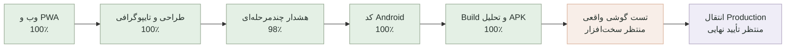

# مختصات پروژه Personal Agent

آخرین به‌روزرسانی: ۲۰۲۶-۰۸-۳۱

این فایل نقشه ثابت پیشرفت پروژه است و بعد از هر مرحله مهم به‌روزرسانی می‌شود. درصدها تخمینی‌اند و بر اساس قابلیت‌های واقعاً پیاده‌سازی و آزمایش‌شده محاسبه می‌شوند.

## موقعیت فعلی

- پیشرفت نسخه وب/PWA: **۱۰۰٪**
- پیشرفت کل محدوده جدید شامل Android و هشدار پیشرفته: حدود **۹۹٪**
- مرحله فعلی: تمام کارهای مستقل از گوشی و Production کامل است؛ تست نهایی اعلان و Alarm روی گوشی واقعی عمداً معوق مانده
- آخرین مرحله کامل: کنترل جامع وب/PWA، امنیت، Build، امضا، تحلیل ساختاری، Lint و تست واحد Android
- قدم بعدی: هر زمان گوشی آماده بود، نصب خودکار APK و آزمایش Alarm؛ سپس آماده‌سازی Release فقط بعد از تأیید Production
- انتقال دامنه: عمداً تا پایان پروژه متوقف است

محیط لوکال و دیتابیس موجود بدون حذف داده‌ها آماده شده‌اند. به‌دلیل اشغال‌بودن پورت ۳۰۰۰ توسط پروژه‌ای دیگر، نسخه فعلی Personal Agent روی `http://localhost:3001` اجرا می‌شود.

## معنی هر بخش

| بخش | وضعیت واقعی | کار باقی‌مانده |
|---|---:|---|
| پایه فنی، ورود، دیتابیس و امنیت | ۱۰۰٪ | فقط نگهداری و بررسی دوره‌ای |
| کارها و جلسات | ۱۰۰٪ | ایجاد، ویرایش، حذف دومرحله‌ای و هماهنگی یادآوری‌ها کامل است |
| تقویم | ۱۰۰٪ | پیمایش هفته‌ها، افزودن از روز انتخابی و ویرایش مستقیم کامل است |
| شناخت کاربر | ۱۰۰٪ | ساعت و روز کاری، زمان سکوت، سبک برنامه‌ریزی و یادآوری پیش‌فرض ذخیره می‌شود |
| اعلان‌ها | ۱۰۰٪ | مرکز اعلان، اعلان محلی، Push و مسیر Scheduler کامل است؛ ارسال راه دور فقط به کلید VAPID و HTTPS وابسته است |
| LLM و Agent | ۹۰٪ | بدون کلید، حالت محلی امن فعال است؛ اتصال OpenAI آماده و آزمایش زنده آن اختیاری است |
| اپ نصب‌شونده و کنترل کیفیت | ۱۰۰٪ | Manifest، آیکون‌های ۱۹۲ و ۵۱۲، Service Worker، پوسته آفلاین و Responsive کامل است |
| طراحی و تایپوگرافی | ۱۰۰٪ | وزیرمتن محلی، مقیاس فونت یکپارچه، فاصله‌ها، کنتراست و اندازه لمس موبایل کامل شد |
| اپلیکیشن Android | ۹۹٪ | پروژه Capacitor، RTL، آیکون، Splash استاندارد، پوسته امن، APK سالم و نصب خودکار USB آماده است؛ فقط تست روی گوشی واقعی باقی مانده |
| هشدار فوری چندمرحله‌ای | ۹۸٪ | اعلان، تکرار Alarm، اولویت بالا، Audit، لغو و Mock تماس/پیامک کامل است؛ رفتار Alarm باید روی گوشی واقعی تأیید شود |
| امنیت، Backup و Rollback | ۱۰۰٪ | Rate Limit، هدرهای امنیتی، Audit وابستگی، Snapshot سالم و مستند بازیابی کامل است |
| سرور و دامنه | آماده‌سازی انجام شده | دامنه فقط پس از پایان پروژه و تأیید مالک منتقل می‌شود |

## قانون به‌روزرسانی این نقشه

پس از هر قابلیت کامل، این فایل باید همراه با نتیجه تست‌ها، مرحله فعلی و قدم بعدی به‌روزرسانی و در GitHub ثبت شود.

## آخرین کنترل کیفیت

- Type Check: موفق
- Lint: موفق
- تست خودکار: ۲۸ تست موفق
- Build نهایی: موفق
- سلامت API و اتصال دیتابیس: موفق
- آزمایش واقعی مرورگر: داشبورد، کارها، جلسات، تقویم، دستیار، تنظیمات، ورود، حالت ۴۰۴، پنجره‌ها، حذف دومرحله‌ای و بازگشت تغییرات در دسکتاپ و نمای موبایل ۳۹۰×۸۴۴ روی `localhost:3001` بدون سرریز افقی یا کنترل لمسی کوچک اجرا شد
- PWA: Manifest کامل، آیکون‌های استاندارد نصب، Apple Touch Icon و Service Worker نسخه دوم فعال هستند
- طراحی: فونت وزیرمتن از داخل پروژه بارگذاری می‌شود؛ عنوان ۲۷ تا ۳۲ پیکسل، متن اصلی ۱۵ پیکسل و کنترل‌های لمسی حداقل ۳۸ پیکسل هستند
- امنیت وابستگی‌ها: `pnpm audit --prod` بدون آسیب‌پذیری شناخته‌شده
- امنیت برنامه: Rate Limit برای Agent و عملیات تغییردهنده، خطاهای فارسی قابل‌بازیابی، اعتبارسنجی حذف Deadline و لغو خودکار یادآوری کارهای انجام‌شده یا لغوشده آزمایش شد
- Backup: Snapshot تازه `hamrah-2026-09-01T05-45-41-179Z.db` با `VACUUM INTO` ساخته شد و `integrity_check = ok` بود
- Android Build: Gradle ۸٫۱۴٫۵ و AppCompat ۱٫۸٫۰ با موفقیت APK آزمایشی ۴٫۱۷ مگابایتی ساختند
- Android Lint: بدون خطا و هشدار؛ تست واحد Android موفق
- APK: امضای Debug نسخه v2 معتبر، شناسه `ir.wealthos.personalagent`، حداقل API 24 و هدف API 36 تأیید شد
- APK SHA-256: `b7c9de0a8f6fc2bf8826e0aff0cf5231216bfbbf087ed2304b1c46a12c7143bc`
- نصب گوشی: اسکریپت یک‌مرحله‌ای USB آماده است و پیش از نصب، سلامت برنامه، مجازبودن دقیقاً یک گوشی، اتصال امن محلی و موفقیت Build را کنترل می‌کند؛ هنوز اجرا نشده است
- Emulator: Android 16 و AVD آماده‌اند، اما نبود Virtualization در این رایانه مانع بوت عملی شد؛ تست گوشی واقعی باقی مانده است

## وابستگی‌های اختیاری و معوق

- پروژه بدون `OPENAI_API_KEY` با دستیار محلی کار می‌کند. افزودن کلید در آینده فقط کیفیت فهم زبان طبیعی را ارتقا می‌دهد و مانع استفاده از MVP نیست.
- بدون کلید VAPID، اعلان محلی روی دستگاه فعال است. Push از راه دور پس از آماده‌شدن HTTPS دامنه اضافه می‌شود.
- پیامک و تماس تا انتخاب سرویس‌دهنده، شماره تأییدشده و تأیید هزینه فقط Mock هستند و هیچ داده‌ای ارسال نمی‌کنند.
- JDK، Android SDK و Gradle به‌صورت محلی نصب شده‌اند و در Git قرار ندارند.
- برای تأیید نهایی Alarm و اعلان بومی، یک گوشی Android یا رایانه دارای Virtualization لازم است؛ این مورد مانع استفاده از نسخه وب/PWA یا دریافت APK آزمایشی نیست.
