# مختصات پروژه Personal Agent

آخرین به‌روزرسانی: ۲۰۲۶-۰۹-۰۵

این فایل نقشه ثابت پیشرفت پروژه است و بعد از هر مرحله مهم به‌روزرسانی می‌شود. درصدها تخمینی‌اند و بر اساس قابلیت‌های واقعاً پیاده‌سازی و آزمایش‌شده محاسبه می‌شوند.

## موقعیت فعلی

- پیشرفت نسخه وب/PWA: **۱۰۰٪**
- پیشرفت کل محدوده پیش از Production شامل Android و هشدار پیشرفته: **۱۰۰٪**
- پیشرفت کل تا انتشار عمومی: **۹۷٪**
- مرحله فعلی: پایان‌کار QA لوکال (desktop/mobile + API smoke) و آماده‌سازی دقیق برای قطع تولید
- قدم بعدی: رفع نهایی Reverse Proxy دامنه و سپس تأیید نهایی شما برای انتشار Production
- انتقال دامنه: روی آدرس واقعی هنوز به‌دلیل `Index of /` روی وب‌سرور لایت‌اسپیید بلاک می‌شود؛ برنامه و پورت داخلی سالم است

محیط لوکال و دیتابیس موجود بدون حذف داده‌ها آماده شده‌اند. به‌دلیل اشغال‌بودن پورت ۳۰۰۰ توسط پروژه‌ای دیگر، نسخه فعلی Personal Agent روی `http://localhost:3001` اجرا می‌شود.

```mermaid
flowchart LR
    A[وب و PWA<br/>100٪] --> B[طراحی و تایپوگرافی<br/>100٪]
    B --> C[هشدار چندمرحله‌ای<br/>100٪]
    C --> D[کد Android<br/>100٪]
    D --> E[Build و تحلیل APK<br/>100٪]
    E --> H[تست ابری Android 16<br/>100٪]
    H --> I[APK قابل نصب بدون کابل<br/>آماده]
    I --> G[تست گوشی واقعی<br/>موفق]
    G --> J[کاندید انتشار و Staging<br/>100٪]
    J --> F[اتصال Reverse Proxy دامنه<br/>و راه‌اندازی Production]

    classDef done fill:#e4f0e5,stroke:#8ca088,color:#26312c;
    classDef active fill:#f8eee8,stroke:#d7a98f,color:#26312c;
    classDef pending fill:#efedf7,stroke:#aa9dbc,color:#26312c;
    class A,B,H,I,G,J done;
    class C,D,E done;
    class F pending;
```

## معنی هر بخش

| بخش | وضعیت واقعی | کار باقی‌مانده |
|---|---:|---|
| پایه فنی، ورود، دیتابیس و امنیت | ۱۰۰٪ | فقط نگهداری و بررسی دوره‌ای |
| کارها و جلسات | ۱۰۰٪ | ایجاد، ویرایش، حذف دومرحله‌ای و هماهنگی یادآوری‌ها کامل است |
| تقویم | ۱۰۰٪ | پیمایش هفته‌ها، افزودن از روز انتخابی و ویرایش مستقیم کامل است |
| شناخت کاربر | ۱۰۰٪ | ساعت و روز کاری، زمان سکوت، سبک برنامه‌ریزی و یادآوری پیش‌فرض ذخیره می‌شود |
| اعلان‌ها | ۱۰۰٪ | مرکز اعلان، اعلان محلی، Push، کلید VAPID و هر دو مسیر Scheduler آماده‌اند؛ آزمایش نهایی Push از دامنه بعد از Cutover انجام می‌شود |
| LLM و Agent | ۹۰٪ | بدون کلید، حالت محلی امن فعال است؛ اتصال OpenAI آماده و آزمایش زنده آن اختیاری است |
| اپ نصب‌شونده و کنترل کیفیت | ۱۰۰٪ | Manifest، آیکون‌های ۱۹۲ و ۵۱۲، Service Worker، پوسته آفلاین و Responsive کامل است |
| طراحی و تایپوگرافی | ۱۰۰٪ | وزیرمتن محلی، مقیاس فونت یکپارچه، پالت روشن پاستیلی، حالت تاریک، کنتراست و اندازه لمس موبایل کامل شد |
| اپلیکیشن Android | ۱۰۰٪ پیش از Production | پروژه Capacitor، RTL، آیکون، Splash استاندارد، پوسته امن، APK سالم، تست Android 16 ابری، نصب بدون کابل و Alarm روی گوشی واقعی موفق است |
| هشدار فوری چندمرحله‌ای | ۱۰۰٪ در محدوده فعلی | اعلان، تکرار Alarm، اولویت بالا، Audit، لغو و Mock تماس/پیامک کامل است؛ اعلان و Alarm سی‌ثانیه‌ای روی گوشی واقعی نیز موفق بود |
| امنیت، Backup و Rollback | ۱۰۰٪ | Rate Limit، هدرهای امنیتی، Audit وابستگی، Snapshot سالم، Migration قابل تکرار و بازگشت نسخه کامل است |
| سرور و دامنه | ۹۷٪ | کاندید نهایی روی Production داخلی اجرا شده؛ فقط اتصال Reverse Proxy دامنه و تنظیمات HTTPS نهایی باقی مانده است |

## قانون به‌روزرسانی این نقشه

پس از هر قابلیت کامل، این فایل باید همراه با نتیجه تست‌ها، مرحله فعلی و قدم بعدی به‌روزرسانی و در GitHub ثبت شود.

## آخرین کنترل کیفیت

- ۱۴۰۴-۰۹-۰۵: لوکال Smoke QA نهایی اجرا شد:
  - `GET /api/health` روی `http://localhost:3001` = `200`
  - Sign-up + ورود/Session = موفق، `200`
  - `GET /api/tasks` قبل/بعد از ساخت = موفق
  - `POST /api/tasks` (درخواست Urgent/Overdue) = `201`  
  - `POST /api/meetings` = `201`
  - `GET /api/notifications` = پاسخ معتبر
  - `POST /api/escalations` = `200` و `GET /api/escalations` = ۳ Alarm آماده برای Task Overdue
  - Type Check: موفق
  - Lint: موفق
  - تست خودکار: ۳۲ تست پاس (۸ فایل)
  - Build: موفق
- ۱۴۰۴-۰۹-۰۵: تولید (Production) smoke انجام شد:
  - `https://personalagent.wealthos.ir/api/health` = `404`
  - `https://personalagent.wealthos.ir/login` و `/api/tasks` و `/api/notifications` و `/api/escalations` = `404`
  - خروجی دامنه فعلی: صفحه `Index of /` از لایت‌اسپیید

- Type Check: موفق
- Lint: موفق
- تست خودکار: ۳۲ تست موفق
- Build نهایی: موفق
- سلامت API و اتصال دیتابیس: موفق
- آزمایش واقعی مرورگر: داشبورد، کارها، جلسات، تقویم، دستیار، تنظیمات، ورود، حالت ۴۰۴، پنجره‌ها، حذف دومرحله‌ای و بازگشت تغییرات در دسکتاپ و نمای موبایل ۳۹۰×۸۴۴ روی `localhost:3001` بدون سرریز افقی یا کنترل لمسی کوچک اجرا شد؛ پس از بازطراحی رنگ نیز داشبورد، فرم برنامه و صفحه ورود دوباره بررسی شدند
- PWA: Manifest کامل، آیکون‌های استاندارد نصب، Apple Touch Icon و Service Worker نسخه جدید (`hamrah-shell-v4`) با سیاست network-first برای به‌روزرسانی فعال است
- طراحی: فونت وزیرمتن از داخل پروژه بارگذاری می‌شود؛ عنوان ۲۷ تا ۳۲ پیکسل، متن اصلی ۱۵ پیکسل و کنترل‌های لمسی حداقل ۳۸ پیکسل هستند. پالت روشن جدید از یاسی، آبی، نعنایی و هلویی استفاده می‌کند؛ همین پالت اکنون در صفحه خطا، Manifest، پوسته آفلاین، آیکون، Splash و اعلان Android نیز یکسان است
- امنیت وابستگی‌ها: `pnpm audit --prod` بدون آسیب‌پذیری شناخته‌شده
- امنیت برنامه: Rate Limit برای Agent و عملیات تغییردهنده، خطاهای فارسی قابل‌بازیابی، اعتبارسنجی حذف Deadline و لغو خودکار یادآوری کارهای انجام‌شده یا لغوشده آزمایش شد
- Backup: Snapshot تازه `hamrah-2026-09-01T05-45-41-179Z.db` با `VACUUM INTO` ساخته شد و `integrity_check = ok` بود
- Android Build: Gradle ۸٫۱۴٫۵ و AppCompat ۱٫۸٫۰ با موفقیت APK آزمایشی ۴٫۱۷ مگابایتی ساختند
- Android Lint: بدون خطا و هشدار؛ تست واحد Android موفق
- APK: امضای Debug نسخه v2 معتبر، شناسه `ir.wealthos.personalagent`، حداقل API 24 و هدف API 36 تأیید شد
- APK محلی Debug: SHA-256 برابر `90d76bedae2faa5dc387ac27d908446791d70a4d9aa7b275dc2ee90ae4f49f1d`
- GitHub Actions وب و RC5: Type Check، Lint، ۳۲ تست، Build، Audit، Migration و Scheduler در محیط تمیز Linux موفق شدند ([اجرای کاندید نهایی](https://github.com/tparkhondeh/personalAgent/actions/runs/33521435867))
- GitHub Actions Android: ساخت APK، Lint، تست واحد، ۶ تست Instrumented بدون شکست، نمایش و حذف اعلان دارای صدای هشدار، اجرای Alarm دقیق، جلوگیری از اجرای Alarm لغوشده، نصب، Cold Launch و اتصال به API/دیتابیس روی Android 16 موفق شد ([اجرای موفق شماره ۱۸](https://github.com/tparkhondeh/personalAgent/actions/runs/33521413925))
- APK نهایی آزمایشی RC5: حجم ۴٬۳۷۱٬۸۰۱ بایت و SHA-256 برابر `4e3011cfe1e12d0d388dc8671fea572a8605e096f70a974289d0f78491db73e1`؛ شناسه `ir.wealthos.personalagent`، حداقل API 24، هدف API 36 و مقصد امن دامنه تأیید شدند
- نسخه قابل‌نصب بدون کابل: Workflow مستقل `Temporary phone preview` یک محیط HTTPS موقت، دیتابیس جدا، Secretهای تصادفی و APK متصل به همان محیط ساخت؛ Production تغییر نکرد ([اجرای شماره ۱](https://github.com/tparkhondeh/personalAgent/actions/runs/33493716896))
- APK پیش‌نمایش گوشی: حجم ۴٬۳۷۰٬۵۲۵ بایت و SHA-256 برابر `ecbb0d2847d3ae81a4d0b3a46e05be16de0eeac6d5705952100e9ee0298f347f`؛ دانلود عمومی، تطابق Hash، سلامت API، اتصال دیتابیس و هدرهای امنیتی در همان اجرا تأیید شد
- آزمایش رابط پیش‌نمایش: داشبورد فارسی و RTL روی دسکتاپ و نمای موبایل ۳۹۰×۸۴۴ به‌صورت واقعی باز شد؛ چیدمان Responsive بود و Console مرورگر خطا یا هشدار نداشت
- نصب پیش‌نمایش: هر Build موقت شناسه بسته و نام آزمایشی منحصربه‌فرد می‌گیرد تا باقی‌ماندن نسخه‌ای با امضای متفاوت در گوشی، نصب نسخه تازه را مسدود نکند
- پیش‌نمایش آفلاین پایدار: [اجرای موفق شماره ۲](https://github.com/tparkhondeh/personalAgent/actions/runs/33501513180) APK مستقل با نام «همراه آفلاین ۲» و شناسه `ir.wealthos.personalagent.offlinepreview2` را منتشر کرد. دانلود عمومی فایل ۴٬۳۷۵٬۳۳۷ بایتی، SHA-256 برابر `7d2293f7dacd3264c26c1974afd5d244cee96d93569e9d5666a100c3b63ebc43` و نبود `server.url` دوباره خارج از GitHub Actions تأیید شد
- پیش‌نمایش آفلاین بدون تداخل: [اجرای موفق شماره ۳](https://github.com/tparkhondeh/personalAgent/actions/runs/33524193644) نسخه «همراه آفلاین ۳» را با شناسه تازه `ir.wealthos.personalagent.offlinepreview3` منتشر کرد تا بدون حذف نسخه قبلی نصب شود. فایل ۴٬۳۷۱٬۸۳۷ بایتی، SHA-256 برابر `809c4b806fb33d9ff0bafbf125c87bb4548c11451ef2d62a4e0d32c79caddf51` و نبود وابستگی شبکه خارج از GitHub Actions تأیید شد
- تست گوشی واقعی: «همراه آفلاین ۲» بدون کابل نصب شد، مجوز اعلان فعال شد و کاربر رسیدن اعلان/صدای Alarm سی‌ثانیه‌ای را تأیید کرد
- نصب گوشی: اسکریپت یک‌مرحله‌ای USB آماده است و پیش از نصب، سلامت برنامه، مجازبودن دقیقاً یک گوشی، اتصال امن محلی و موفقیت Build را کنترل می‌کند؛ هنوز اجرا نشده است
- Emulator و گوشی: Android 16 ابری نصب، اعلان، رسیدن و لغو Alarm را تأیید کرد؛ آزمایش سی‌ثانیه‌ای روی گوشی واقعی نیز موفق بود. آزمون‌های طولانی در حالت ذخیره باتری فقط بررسی سازگاری تکمیلی نسخه نهایی هستند و مانع فعلی نیستند
- کاندید انتشار سوم: [اجرای موفق شماره ۳](https://github.com/tparkhondeh/personalAgent/actions/runs/33512177595) از Commit `9885ac6656738da306cfb5d0984234000ec64389` ساخته شد؛ ۳۰ تست، Type Check، Lint، Build، Audit، Migration بسته‌شده و هر دو Scheduler موفق بودند
- بسته سرور RC3: SHA-256 برابر `590accb327bae1aeade8eaec821b5ad37d1bf80e212d9c265278272934bbb748`، بدون `.env` و شامل سه Migration و اسکریپت Scheduler است
- APK متصل RC3: SHA-256 برابر `256eac4f609c19809a6478a7b33639220aa379f57aeb8e67da9511038fa60819`، شناسه `ir.wealthos.personalagent` و مقصد `https://personalagent.wealthos.ir` تأیید شد؛ این APK هنوز Debug-signed است
- محیط آزمایشی RC3: نسخه تاریخی در `/home/wealthos_dev/.staging/personal-agent/releases/9885ac6` نگه‌داری می‌شود و دیگر Release فعال نیست
- Android Release: خروجی واقعی `assembleRelease` بدون خطا ساخته شد؛ فایل نهایی unsigned دارای SHA-256 برابر `28abeacc64336f4f73054dc0ee5805af0840b925139dc4bf79e4a158c2ee62f4` است و فقط امضای خصوصی انتشار باقی مانده است
- Production: Release `49cceed` روی پورت داخلی ۳۰۱۱ جایگزین شد، دیتابیس و Backup آن سالم و سالم نگه داشته شده‌اند
- کاندید انتشار چهارم: [اجرای موفق شماره ۴](https://github.com/tparkhondeh/personalAgent/actions/runs/33519135966) از Commit `4cd53d42938eedef7d6161e05da45e1117a6fbfe` ساخته شد؛ ۳۰ تست، Type Check، Lint، Build، Audit، Migration، Scheduler، بسته سرور و APK متصل موفق بودند
- محیط آزمایشی RC4: این نسخه سالم به‌عنوان مسیر بازگشت در `/home/wealthos_dev/.staging/personal-agent/releases/4cd53d4` نگه‌داری می‌شود
- Android یکپارچه محلی: Lint، تست واحد، `assembleDebug` و `assembleRelease` موفق شدند؛ APK متصل محلی رنگ Splash و اعلان تازه و مقصد امن دامنه را تأیید کرد. خروجی Release همچنان عمداً unsigned است
- کاندید نهایی RC5: [اجرای موفق شماره ۵](https://github.com/tparkhondeh/personalAgent/actions/runs/33521435867) از Commit `49cceedd8462e9a65172e6ed375a78d8edf7d226` ساخته شد. بسته سرور با SHA-256 برابر `9fbde5e63b08245b1ead7907043d638364e946c27907b1bf4b7d1f40e8bb3939` بدون فایل محیطی و با سه Migration و هر دو Scheduler تأیید شد
- محیط آزمایشی نهایی: RC5 روی `/home/wealthos_dev/.staging/personal-agent/releases/49cceed` فعال است؛ Backup سالم `pre-rc5-20260901T145047Z.db` ساخته شد و ثبت‌نام، تنظیمات، Task، Meeting، Agent محلی، Reminder، Escalation، اعلان و Alarm با پاک‌سازی داده آزمایشی موفق بودند
- Production: Symlink فعلی به `/home/wealthos_dev/apps/personal-agent/releases/49cceed` تغییر کرده و PM2 روی پورت ۳۰۱۱ ری‌استارت شده است

## وابستگی‌های اختیاری و معوق

- پروژه بدون `OPENAI_API_KEY` با دستیار محلی کار می‌کند. افزودن کلید در آینده فقط کیفیت فهم زبان طبیعی را ارتقا می‌دهد و مانع استفاده از MVP نیست.
- بدون کلید VAPID، اعلان محلی روی دستگاه فعال است. Push از راه دور پس از آماده‌شدن HTTPS دامنه اضافه می‌شود.
- پیامک و تماس تا انتخاب سرویس‌دهنده، شماره تأییدشده و تأیید هزینه فقط Mock هستند و هیچ داده‌ای ارسال نمی‌کنند.
- JDK، Android SDK و Gradle به‌صورت محلی نصب شده‌اند و در Git قرار ندارند.
- اعلان و Alarm روی گوشی واقعی تأیید شده‌اند؛ بررسی طولانی‌مدت در حالت Doze و ذخیره باتری سازندگان مختلف، کنترل سازگاری تکمیلی پیش از انتشار عمومی است.
- پیش‌نمایش متصل به سرور همچنان موقت است، اما [APK آفلاین شماره ۳](https://github.com/tparkhondeh/personalAgent/releases/download/phone-preview-offline-3/hamrah-offline-preview-3.apk) لینک پایدار و شناسه نصب مستقل دارد، منقضی نمی‌شود و داده‌هایش فقط روی همان گوشی ذخیره می‌شوند.
- فضای دیسک اصلی سرور حدود ۱۰۰٪ مصرف شده و تقریباً ۱٫۴ گیگابایت آزاد دارد؛ پیش از Cutover عمومی باید مدیر سرور با حفظ Backupها فضای امن آزاد کند.

## ریسک و Rollback مرحله‌ی Production (برای تصمیم نهایی شما)

- مانع فعلی: Reverse Proxy دامنه `personalagent.wealthos.ir` روی لایه‌ی وب‌سرور قدیمی `Index of /` است و درخواست‌های `/api/*` و `/login` به اپ Next.js نمی‌رسند.
- ریسک فنی: تغییر دامنه می‌تواند در صورت پیکربندی اشتباه، سرویس‌های دیگر هم‌سرور را تحت تأثیر قرار دهد.
- راهکار rollback:
  - قبل از هر تغییر، snapshot از مسیر ریلیز فعلی روی `/home/wealthos_dev/apps/personal-agent/releases/49cceed` حفظ شود.
  - تغییر Reverse Proxy روی یک پیکربندی موقت قابل‌بازگشت انجام شود (VirtualHost/نگارش مسیر 443 → `127.0.0.1:3011` با مجدد‌نویسی فقط دامنه هدف).
  - بعد از هر تغییر، یک smoke production mini (`/api/health`, `/login`, `POST /api/tasks`) با همان دامنه انجام شود.
  - در صورت خطا، فوراً بازگشت به تنظیمات قبلی Proxy و `symlink` فعلی و نگهداشت سرویس بدون اختلال انجام می‌شود.
