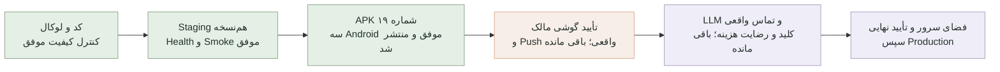

# مختصات پروژه Personal Agent

### پذیرش تازه نسخه شخصی و پشتیبان روزانه — ۲۲ سپتامبر ۲۰۲۶

**وب آزمایشی قابل‌آزمون است؛ نسخه جدید گوشی هنوز تحویل نهایی نشده است.** مجوز تازه مالک فقط اجازه کنارگذاشتن داده قدیمی همین اپ گوشی در صورت نیاز به نصب تمیز است؛ سرور، حساب‌ها، بودجه، کلیدها، پشتیبان‌ها و داده‌های آینده محفوظ‌اند. حفظ طولانی داده قدیمی گوشی دیگر مانع نیست. ساخت امضای دائمی با حفظ شناسه۴۰ هنوز به تأیید مشخصِ پرسیده‌شده وابسته است؛ کلید تازه یا APK تازه ساخته نشد.

۱۰۲۳/۱۰۲۳آزمون بدون Skip، Type Check، Lint، Build و بررسی وابستگی‌ها موفق شدند. [CI35739703693](https://github.com/tparkhondeh/personalAgent/actions/runs/35739703693) برای Commit `65da5a21facada662f216c51e0fdebdbf937b3ac` نیز موفق است؛ آزمون جدید پشتیبان و یکپارچه‌سازی بسته واقعی وب هم در آن گذشتند. وب واقعی روی دسکتاپ و اندازه موبایل و شروع روی کارها کنترل شد. لوکال دوباره روی همین ویندوز راه‌دور اجرا و واقعاً در مرورگر دیده شد؛ لینک آن خودکار روی لپ‌تاپ فیزیکی/گوشی کار نمی‌کند. [لوکال](http://localhost:3001/) | [وب آزمایشی](https://personalagent.wealthos.ir:8443/).

دو پاسخ **واقعی GPT از HTTPS۸۴۴۳** با داده ساختگی موفق بودند: عنوان، ساعت، سه یادآوری، اصلاح همان پیشنهاد، انصراف و نبود اجرا پیش از تأیید. مجوز موقت مصرف حساب آزمون بسته و تنظیمات قبلیِ فقط مالک دقیقاً برگردانده شدند. دفتر مشترک اکنون۱۴رسید و۰٫۱۶۷۹۸۶دلار دارد؛ افزایش این آزمون۰٫۰۰۳۵۵۲دلار است، داخل همان سقف۲دلار. لوکال همچنان بدون مصرف GPT و دفتر قبلی آن قفل است؛ صدای شخصی ارسال نشد.

کمبود پشتیبان منظم Staging رفع شد: ابزار جدید با داده ساختگی، هم‌زمانی، مسیرهای نامعتبر و حفظ سوابق آزموده شد؛ نخستین Snapshot واقعی اپ و بودجه جدا بازیابی و سلامت/کلیدهای خارجی/هش‌ها تأیید شدند. یک زمان‌بندی محدود در ساعت۰۲:۴۷سرور اضافه شد؛ سایر Cronها و همه پشتیبان‌های قبلی محفوظ‌اند. پشتیبان فعلاً خصوصی و **روی همان سرور، بدون رمزگذاری** است؛ پشتیبان خارج سرور و بازیابی رمز حساب هنوز آماده عملیاتی نیستند.

سرور Staging همچنان `8dcfea6e3f9f42d871c0c864c0206e2d3de1575b` است؛ Production تغییر نکرده و هدرهای قدیمی دارد. آخرین APK عمومی همان آزمایشی۴۰ است، نه نسخه نهایی با لوگو/اصلاحات جدید. آزمون تازه همان APK تحویلی روی۱۳/۱۴/۱۶، GPT در Android و پذیرش اعلان/Alarm/میکروفون گوشی انجام‌نشده‌اند. [گزارش کوتاه فنی، پشتیبان‌ها، مشخصات APK و اقدامات باقی‌مانده](docs/PERSONAL_RELEASE_2026-09-22.md). گزارش‌های قدیمی پایین، سابقه‌اند؛ مجوز جدید گوشی و ارقام بودجه این بخش مقدم‌اند.

### لوگوی یکپارچه و بررسی اتصال گوشی — ۲۲ سپتامبر ۲۰۲۶

لوگو ساده‌تر و واضح‌تر شد؛ منبع برداری مشترک، آیکون وب/PWA، برش گرد و مربعی، لایه تک‌رنگ اندروید و صفحه بازیابی هماهنگ‌اند. فایل قابل‌ویرایش و پیش‌نمایش در پروژه محفوظ‌اند. ۱۰۲۳تست بدون Skip، Type Check، Lint، Build وب و Android Lint/Unit Test موفق‌اند؛ مرورگر واقعی دسکتاپ و موبایل هم بررسی شد. [طرح و شواهد، پشتیبان و محدودیت‌ها](docs/LOGO_PHONE_2026-09-22.md).

نسخه `8dcfea6e3f9f42d871c0c864c0206e2d3de1575b` پس از موفقیت [CI35699727856](https://github.com/tparkhondeh/personalAgent/actions/runs/35699727856)، پشتیبان تازه و بازیابی جدا، فقط روی [وب آزمایشی](https://personalagent.wealthos.ir:8443/) نصب شد. هش آیکون‌های دانلودشده و لوگوی واقعی مرورگر عمومی تطبیق دارند. دفتر مشترک بودجه همان۱۲رسید/۰٫۱۶۴۴۳۴دلار و بدون مصرف تازه باقی ماند. Production و APK منتشرشده تغییر نکردند.

[Android16 داخلی35699728052](https://github.com/tparkhondeh/personalAgent/actions/runs/35699728052) نیز موفق شد:۱۴تست، متن فارسی و RTL، تصویر شروع روی کارها بدون پنجره خطای سیستم و Logcat سالم؛ فایل شواهد با SHA تطبیق و تصویر بصری بررسی شد. این فایل مخصوص شبیه‌ساز است و برای نصب روی گوشی معرفی نمی‌شود؛ آزمون تازه۱۳/۱۴ یا ارتقای گوشی ادعا نمی‌شود.

ابزار روی ویندوز مجازیِ راه‌دور اجرا می‌شود، نه لپ‌تاپِ متصل به هات‌اسپات گوشی؛ هیچ گوشی مجاز به ADB متصل نیست. اتصال امن باید روی لپ‌تاپ فیزیکی و شبکه بی‌سیم مشترک بررسی شود؛ پورت عمومی/تونل ایجاد نشد. مالک نام و نسخه را قبلاً مشخص کرده: آزمایشی۴۰،۱٫۰٫۴۰؛ **اطلاعات هر دو حالت حساب و مهمان باید حفظ شوند**. نام/نسخه دوباره پرسیده نشود. امضای نصب و پشتیبان داده فقط‌روی‌گوشی هنوز احراز نشده‌اند. APK تازه ناسازگار تحویل نشد؛ برنامه، داده، کلید و بودجه قبلی دست‌نخورده‌اند. لوگوی منبع به معنی به‌روزرسانی آیکون نصب‌شده نیست.

### اطلاعات نسخه گوشی از عکس مالک مشخص شد — ۲۱ سپتامبر ۲۰۲۶

دو تصویر «اطلاعات برنامه» نام `tia آزمایشی 40` و نسخه `1.0.40` را نشان می‌دهند؛ این مشخصات ظاهری با انتشار۴۰ تطبیق دارند. اعلان و زنگ/یادآوری در تنظیمات گوشی Allowed هستند؛ این فقط مجوز است، نه مدرک تحویل واقعی اعلان/Alarm. دیگر نام و شماره نسخه از مالک پرسیده نشود.

عکس‌ها Package ID، گواهی امضا یا یکسان‌بودن بایت‌های APK را ثابت نمی‌کنند. طبق مقایسه ثبت‌شده، امضای کاندید داخلی با فایل منتشرشده۴۰ سازگار نیست و امضای اصلی در محل‌های مرتبط بررسی‌شده پیدا نشده است. داده فقط‌روی‌گوشی/بدون ورود هنوز احراز نشده؛ نبود آن را فرض نکنید و از تأیید پاک‌سازی قدیمی استفاده نکنید. پیش از انتخاب انتقال، باید روشن شود مالک کارها را با ورود، بدون ورود یا در هر دو حالت ثبت کرده است. برنامه و حافظه قبلی حفظ شوند. در این مرحله فقط مستندات به‌روز شد؛ سرور، کد، بودجه، APK و داده‌های کاربر تغییر نکردند. تصویر گوشی در Git قرار نگرفت.

### GPT روی سرور آزمایشی فعال شد — ۲۱ سپتامبر ۲۰۲۶، تحویل گوشی هنوز نهایی نیست

نسخه `1b6676742c759216d1f2516cf8d6026cedf8bcd5` پس از موفقیت **۱۰۱۸تست، Type Check، Lint، Build و آزمون‌های بسته سرور** در [CI35584608903](https://github.com/tparkhondeh/personalAgent/actions/runs/35584608903)، با پشتیبان تازه فقط روی Staging نصب شد. آزمون واقعی GPT از HTTPS۸۴۴۳ موفق است: عنوان، ساعت، سه یادآوری، اصلاح همان پیشنهاد، ثبت پس از تأیید بدون تکرار و انصراف. یک جلسه ساختگی پس از آزمون تکمیل و هر۳یادآوری آینده آن لغو شدند؛ داده مالک تغییر نکرد.

کلید جایگزین موجود امن روی سرور استفاده می‌شود؛ کلید تازه‌ای ساخته نشده و صدای شخصی ارسال نمی‌شود. **فقط حساب تأییدشده مالک اجازه مصرف دارد**؛ مجوز حساب آزمون بسته شد و بازگشت آن به حالت محلی تأیید شد. تنها دفتر فعال بودجه روی سرور است؛ لوکال قفل و مصرفش خاموش است.۱۲رسید و۰٫۱۶۴۴۳۴دلار در دفتر محفوظ است؛ آزمون‌های تازه۰٫۰۰۸۱۹۷دلار به آن افزوده‌اند. این حسابداری محافظه‌کارانه است، نه صورتحساب قطعی ارائه‌دهنده. سقف مشترک۲دلار برقرار است و Restart هزینه را تغییر نداد.

شروع عادی وب/PWA و منبع رابط داخلی Android روی «کارها» است؛ دکمه+ و لینک مستقیم دستیار محفوظ‌اند. مرورگر واقعی دسکتاپ و۳۹۰×۸۴۴ و رابط داخلیِ مرورگر بررسی شدند. **APK منتشرشده هنوز آزمایشی۴۰ و به‌روز نشده است.** نسخه و امضای نصب گوشی و مسیر حفظ اطلاعات باید احراز شوند؛ برنامه قبلی حذف نشود. [Android16 جدید35584608948](https://github.com/tparkhondeh/personalAgent/actions/runs/35584608948) موفق شد:۱۴تست بومی، متن واقعی فارسی/RTL، تصویر شروع روی «کارها» بدون پنجره خطای سیستم و کنترل Logcat موفق‌اند. تصویر فایل شواهد جدا دریافت و بصری بازبینی شد. این APK داخلیِ متصل به سرور شبیه‌ساز است، نه فایل تحویلی گوشی، آزمون GPT عمومی روی Android یا آزمون تازه۱۳/۱۴.

دو قانون کش محدود همین زیردامنه فعال‌اند؛ فایل و سیاست فعلی Staging در مرورگر عمومی تأیید شدند. پنل ارائه‌دهنده ذخیره قانون تکمیلی را با خطای `pathId` رد می‌کند؛ موقتاً کش فایل‌های ثابت نیز خاموش است. **Production هنوز نسخه قدیمی و دارای هدرهای قدیمی است**؛ تغییر کد آن خارج از مجوز فعلی کش است. هیچ DNS، TLS، داده کاربر یا پروژه دیگر تغییر نکرد. [گزارش کامل، شواهد و روش بازگشت](docs/CACHE_GPT_STARTUP_2026-09-21.md).

برای آزمون فعلی: [وب آزمایشی](https://personalagent.wealthos.ir:8443/) و [دستیار پس از ورود](https://personalagent.wealthos.ir:8443/?view=assistant). [لوکال](http://localhost:3001/) روی همین کامپیوتر و بدون مصرف GPT است. فعال‌شدن GPT سرور به معنی تأیید GPT/اعلان/Alarm روی گوشی واقعی یا نهایی‌بودن کل پروژه نیست. گزارش‌های انتقالِ ناموفق زیر صرفاً سابقه‌اند.

### آزمون زنده ادامه پیشنهاد — ۲۱ سپتامبر، اصلاح دوم

نسخه `c13ad95` با CI وب موفق روی Staging نصب شد؛ Production تغییر نکرد. دو پاسخ واقعی بعدی، خطای مستقل دیگری را آشکار کردند: GPT اصلاح پیشنهاد ایجادِ ثبت‌نشده را UPDATE بدون شناسه قلمداد کرد. کنترل اعتبارسنجی جلوی ساخت نادرست را گرفت. اکنون فقط وقتی مدل و تحلیل محلی و پیشنهاد قبلی درباره ایجاد همان نوع مورد توافق دارند و هیچ هدف ثبت‌شده‌ای وجود ندارد، ادامه پیشنهاد CREATE باقی می‌ماند؛ مجوز تغییر یا حذف داده افزایش نیافته است.۶آزمون تازه و مجموع۱۰۱۸تست، Type Check و Lint مربوط موفق شدند. آزمون زنده نهایی هنوز باید تکرار شود.

Android16 در Run35582388630 ناموفق بود: متن واقعی «فهرست برنامه‌ها» رندر شده، ولی آزمون هنوز عنوان صفحه قبلی «برنامه امروز» را انتظار داشت. انتظار شروع به صفحه کارها اصلاح شد؛ بررسی متن، RTL، تصویر و خطاهای سیستم حذف نشده‌اند. این اصلاح به‌تنهایی موفقیت آزمون Android نیست.

### انتقال واقعی بودجه و پاسخ GPT سرور — ۲۱ سپتامبر ۲۰۲۶، پذیرش نهایی در جریان

دفتر محلی پس از پشتیبان و بازیابی تأییدشده قفل شد؛ همان۶رسید/۰٫۱۵۶۲۳۷دلار به دفتر نسخه۲ روی سرور منتقل شدند. تنها مرجع فعال به میزبان و مسیر خصوصی سرور مقید است؛ لوکال هزینه را غیرفعال و مبدأ را FROZEN نگه می‌دارد. کلید جایگزین موجود از مسیر خصوصی منتقل شد، کلید جدید ساخته نشد و صدای خارجی خاموش است. حساب مالک دقیق تطبیق دارد؛ حساب ساختگی جدا فقط برای پذیرش اضافه شد و باید پس از آزمون از مجوز مصرف خارج شود.

دو درخواست واقعی از HTTPS۸۴۴۳ پاسخ `online` دادند؛ عنوان، تاریخ، ساعت۱۷، سه یادآوری و اصلاح همان پیشنهاد به ساعت۱۸ درست بودند. بدون رضایت ارسال، مسیر محلی اجرا شد؛ پیش از تأیید هیچ کار یا جلسه ساخته نشد. مجموع دفتر۸رسید/۰٫۱۵۹۱۱۷دلار است؛ افزایش۰٫۰۰۲۸۸۰دلار، نه صورتحساب قطعی ارائه‌دهنده.

آزمون ثبت پس از اصلاح، ایراد واقعی پیدا کرد: سؤال کلی GPT «می‌خواهید این جلسه ساخته شود؟» مانع ثبت پیشنهاد کامل می‌شد. فیلتر فقط جمله کاملِ تأیید ایجاد و هم‌نوع پیشنهاد را حذف می‌کند؛ سؤال مبهم/مشروط/حذف و تأیید صریح ثبت محفوظ‌اند. راهنمای مدل هم سؤال تأیید عمومی را از اطلاعات ناقص جدا می‌کند.۷رگرسیون جدید و مجموع۱۰۱۲تست موفق‌اند؛ نسخه اصلاح‌شده هنوز باید روی Staging نصب و آزمون واقعی ثبت تکرار شود. این گزارش اعلام پایان یا پذیرش گوشی نیست.

### اصلاح شروع برنامه و کش محدود زیردامنه — ۲۱ سپتامبر ۲۰۲۶، در حال تکمیل

پشتیبان کد/تاریخچه و دیتابیس محلی جدا بازیابی شد. Snapshot تازه Staging نیز با۱۸جدول و بدون خطای سلامت/کلید خارجی بازیابی شد؛۶رسید و۰٫۱۵۶۲۳۷دلار هزینه قبلی و تطبیق دقیق یک حساب مالک محفوظ‌اند. مسیر خصوصی شواهد: `C:/Users/pc/Desktop/project-backups/tia-cache-startup-20260921/`.

شروع عادی وب، PWA و منبع رابط داخلی Android اکنون «کارها» است؛ لینک مستقیم تب‌ها حفظ می‌شود و «+» همچنان فرم ثبت را باز می‌کند. کد قبلی پیش‌فرض «امروز» داشت و فرم ثبت خودکار باز نمی‌شد؛ علت گزارش گوشی بدون احراز نسخه نصب‌شده قطعی نیست.۱۷آزمون تازه اضافه شد؛۱۰۰۵تست، Type Check، Lint و Build جدا موفق‌اند. اجرای اول تست ورود به Timeout خورد؛ اجرای کامل بعدی، همه آزمون‌های ورود را هم موفق گذراند. مرورگر۳۹۰×۸۴۴ شروع روی کارها، بازکردن فرم با+ و لینک مستقیم tia را تأیید کرد؛ این نتیجه به معنی به‌روزرسانی APK منتشرشده نیست.

مجوز جدید فقط کش `personalagent.wealthos.ir` روی۴۴۳/۸۴۴۳ را پوشش می‌دهد. در پنل، مسیر دقیق همین میزبان با Cache Settings=Off و Browser Caching=Off ذخیره و فعال شد؛ DNS، مقصد، TLS و سایر پروژه‌ها تغییر نکردند. کش/کوکی/داده کاربر پاک نشد. Windows و Linux اکنون worker صحیح هر پورت و `no-store` برای worker و recovery دریافت می‌کنند؛ صفحات/API/ورود Staging نیز `no-store` دارند. گزینه Ignore Cache Control و Client Headers در پنل خطای `pathId` دادند و ذخیره نشدند. این مرحله موقتاً کش فایل‌های ثابت همین برنامه را نیز محدود می‌کند؛ بازگشت با غیرفعال‌کردن دو قانون جدید است. Production همچنان کد قدیمی دارد و HTML آن `s-maxage=31536000` می‌دهد؛ تغییر کد Production در این مجوز نیست. فعال‌سازی GPT و تحویل APK هنوز موفق اعلام نمی‌شوند؛ ادامه و نتیجه نهایی جدا ثبت خواهد شد.

### تأیید نهایی GPT و بررسی تازه — ۲۱ سپتامبر ۲۰۲۶

تأیید فعال‌سازی GPT با همان سقف مشترک۲دلار معتبر است؛ سؤال مجدد برای همین مجوز لازم نیست. **HTTPS۸۴۴۳ اکنون از Windows هم موفق شد و مرورگر رابط جدید و تب tia را نشان داد.** Staging همان `4838bd4` سالم است؛۳۰کنترل کش مبدأ و۸۴آزمون بودجه/رضایت/انتقال موفق شدند. پشتیبان Git جدا بازیابی و بررسی شد؛ داده، تنظیمات، کلید و۶رسید هزینه قبلی تغییر نکردند؛ هزینه تازه صفر است.

**GPT سرور هنوز فعال نشد:** سیاست کش عمومی درست منتقل نمی‌شود؛ صفحه/ورود/API بدون هدر `no-store` می‌آیند و worker/recovery کش۴ساعته دارند. پاسخ worker از دو مسیر یکسان نبود: سرور Linux نسخه قدیمی و Windows نسخه جدید دریافت کرد. بنابراین بازشدن رابط جدید به‌تنهایی حل کامل کش نیست. تنظیم مشترک CDN خارج از مجوز محدود سرویس tia است؛ [گزارش تازه و اقدام دقیق مدیر](docs/GPT_ACTIVATION_PREFLIGHT_2026-09-21.md). تا رفع این مانع، بودجه به سرور منتقل نشده و لوکال تنها اجرای دارای بودجه باقی مانده است. APK تازه یا پذیرش گوشی اعلام نمی‌شود؛ گزارش‌های TLS/رابط قدیمی زیر، سوابق تاریخی‌اند.

### ادامه پس از رفع فضای سرور — ۱۹ سپتامبر ۲۰۲۶

مانع پرشدن دیسک رفع شده است: حدود۱۸گیگابایت فضای قابل‌استفاده و امکان نوشتن خصوصی تأیید شد. پشتیبان تازه Git، تنظیمات، داده‌ها و دفتر هزینه در مسیر خصوصی تهیه و جدا بازیابی شد؛۱۸جدول سالم و۶رسید/۰٫۱۵۶۲۳۷دلار محفوظ‌اند. حساب مالک دوباره با یک حساب Staging تطبیق داده شد. هیچ داده، پشتیبان یا فایل قبلی حذف نشد.

بسته آزموده‌شده `4838bd4bf1cb36ecdcbf31260d0157bc895c2c9c` با همان SHA تأییدشده، پشتیبان سرور و بررسی مهاجرت روی کپی، فقط روی Staging نصب شد. سلامت همان Commit،۳۰کنترل کش مبدأ،۳۶کنترل دستیار و۷کنترل نشست/ورود از مسیر عمومی۸۴۴۳ روی سرور Linux موفق‌اند. **Type Check، Lint،۹۸۸تست و Build محلی مجدداً موفق شدند؛ رابط لوکال در۱۲۸۰×۹۰۰ و۳۹۰×۸۴۴ بررسی شد.** Production تغییر نکرد.

اما رفع همه مشکلات اتصال تأیید نشد: Windows برای۸۴۴۳ همچنان خطایTLS/ECONNRESET دارد. فایل `sw.js` عمومی۸۴۴۳ دقیقاً با فایل قدیمی Production برابر است، نه Staging جدید؛ کش۱۴۴۰۰ثانیه‌ای CDN باقی است. مرورگر واقعی نیز پس از بازکردن دوباره، فایل‌های رابط قدیمی را نشان داد؛ صرف بازشدن صفحه موفقیت نسخه جاری نیست. کش و اطلاعات کاربر پاک نشدند. تنظیم مشترک CDN/دامنه نیازمند اقدام هماهنگ مدیر است؛ جزئیات، Hashها و آزمون پذیرش در [گزارش ادامه سرور](docs/SERVER_RESUME_2026-09-19.md) آمده‌اند.

**GPT سرور هنوز فعال نشد**؛ کلید/بودجه منتقل نشده و GPT لوکال تنها اجرای دارای بودجه قبلی است. نسخه منتشرشده همچنان آزمایشی۴۰ است؛۴۳ داخلی از نظر شناسه و امضا ارتقای سازگار۴۰ نیست. نام/نسخه نصب‌شده و داده‌های فقط‌روی‌گوشی از مالک پرسیده شده و هنوز پاسخ نداریم؛ برنامه قبلی حذف نشود. Android16 تاریخی35188159692 اکنون Success تأیید شد، نه انتشار تازه یا پذیرش گوشی. پروژه برای اتکای کامل به نسخه گوشی نهایی اعلام نمی‌شود.

### انتقال GPT به سرور و ارتقای امن — ۱۷ سپتامبر ۲۰۲۶، مجوز دریافت شد؛ اجرا متوقف در پیش‌نیاز واقعی

کد این مرحله با Commit `4838bd4bf1cb36ecdcbf31260d0157bc895c2c9c` به GitHub رسید و [CI وب35188159724](https://github.com/tparkhondeh/personalAgent/actions/runs/35188159724) موفق شد. بسته سرور همان آزمون دریافت و SHA-256 آن تطبیق داده شد؛ برای زمان رفع مانع محفوظ است، نه نصب‌شده روی سرور. Android16 خودکار هنوز هنگام ثبت این گزارش در حال اجراست؛ نتیجه آن موفق فرض نشده و APK تازه‌ای برای گوشی منتشر نشده است.

مالک، فعال‌سازی محدود GPT روی سرور tia با همان بودجه۲دلاری و آماده‌سازی ارتقای حافظ اطلاعات را تأیید کرد؛ برای همین مجوز دوباره سؤال نشود. **فضای قابل‌استفاده دیسک سرور صفر و ظرفیت۱۰۰٪ است**؛ سلامت HTTP به معنی امکان ذخیره امن داده/هزینه نیست. بدون حذف هیچ داده یا پشتیبان، فعال‌سازی/انتشار متوقف ماند و از مدیر سرور درخواست فضای امن شد. آزمون OpenAI بدون کلید فقط401 داد، نه پاسخ واقعی GPT. کلید منتقل نشد، مصرف تازه صفر و دفتر محلی۶رسید/۰٫۱۵۶۲۳۷دلار بدون تغییر است.

پشتیبان Git، کد، تنظیمات و دفتر هزینه در نسخه جدا تأیید شد. دیتابیس Staging نیز بدون نوشتن روی سرور پر، با Snapshot خواندنی دریافت و۱۸جدول آن با سلامت/کلیدهای خارجی بازیابی شدند. حساب تأییدشده دقیقاً با یک حساب Staging تطبیق دارد؛ شناسه‌های دو دیتابیس متفاوت‌اند و نگاشت خصوصی محفوظ است. هیچ ورود نیابتی یا ارسال متن شخصی انجام نشد.

آماده‌سازی مستقل: ابزار انتقال بودجه با قفل مبدأ، حفظ رسیدها، کنترل مقصد یکتا و بازگشت بدون بازنشانی هزینه اضافه شد؛ ابزار بررسی امضای APK نیز۴۳ را به‌درستی به‌عنوان آپدیت ناسازگار۴۰ رد می‌کند. **۹۸۸تست در۸۴فایل، Type Check، Lint و Build موفق‌اند؛ رابط واقعی دسکتاپ/موبایل نیز بررسی شد.** امضای اصلی در محل‌های مرتبط پیدا نشد؛ نسخه نصب‌شده گوشی از مالک پرسیده شده و دستگاهی متصل نیست. TLS عمومی۸۴۴۳ از این میزبان همچنان ناموفق است و تنظیم مشترک دامنه تغییر نکرد. [شواهد، روش اجرا و بازگشت](docs/GPT_SERVER_CUTOVER_2026-09-17.md). این مرحله هنوز فعال‌سازی GPT سرور یا APK تازه نیست؛ دفتر هزینه و اطلاعات قبلی بدون تغییر حفظ شدند.

### بازبینی تخصصی واقعی — ۱۷ سپتامبر ۲۰۲۶، اصلاحات محلی آزموده‌شده

چهار زیرایجنت واقعی رابط، Android، داده و امنیت دستیار بررسی کردند؛ هماهنگ‌کننده اصلاحات را یکپارچه و بازبینی مستقل انجام داد. پشتیبان Git و داده در نسخه جدا بازیابی شد؛۱۸جدول، سلامت و کلیدهای خارجی تأیید شدند. حفظ اطلاعات بین تب‌ها/تغییر مقصد، ویرایش بدون جابه‌جایی موعد، پاسخ دیررس دستیار، بودجه مرز ماه، رسید لغو زنگ و جلوگیری از تکرار هشدار اصلاح شدند. ساخت زنجیره هشدار نیز پس از یافتن رقابت هم‌زمانی، اتمیک و مستقل بازبینی شد. داده تازه پاک نشده و Production دست‌نخورده است.

**۹۶۱ تست در۸۲فایل، Type Check، Lint، Build نهایی وب،۲۰۲بررسی HTTP و مرورگر واقعی دسکتاپ/موبایل موفق‌اند.** Android Lint،۱۱تست Java و۱۴تست بومی روی هرکدام از Android۱۳/۱۴/۱۶ موفق شدند. تصاویر فارسی، راه‌اندازی مجدد آفلاین و بازیابی خطای شبکه/گواهی بررسی شدند؛۸۱کنترل تصویر بدون پوشش خطای سیستم بود. چهار خطای ابزار مشاهده جدا ثبت شده‌اند، نه خطای اپ و نه لاگ کاملاً خالی. آزمون‌ها روی داده ساختگی و مبدأ جدا از حساب اصلی بودند؛ هزینه GPT صفر است. [گزارش شواهد و موانع](docs/SPECIALIST_REVIEW_2026-09-17.md).

کد `40a3e21` به GitHub رسید؛ [CI وب35183333243](https://github.com/tparkhondeh/personalAgent/actions/runs/35183333243)، [Android۱۶ متصل35183333254](https://github.com/tparkhondeh/personalAgent/actions/runs/35183333254) و [آزمون سه‌نسخه35183336465](https://github.com/tparkhondeh/personalAgent/actions/runs/35183336465) موفق‌اند. کاندید۴۳ فقط داخلی است؛ فایل واحد آزموده و SHA آن تأیید شده، اما شناسه/امضایش ارتقای امن۴۰ نیست و عمداً منتشر نشد. ثبت بعدی فقط مستندات شواهد است.

بررسی تازه سرور: Staging=`2d4484c`، Production=`49cceed`، APK منتشرشده همان۴۰ است؛ هیچ‌کدام با اصلاح کد خودکار به‌روز نشده‌اند. کش مشترک دامنه، مسیر امن HTTPS گوشی، امضای سازگار ارتقا، پشتیبان خارج از سرور/بازیابی حساب عملیاتی و پذیرش گوشی واقعی باقی‌اند. GPT روی سرور/گوشی نهایی نشده؛ انتقال مجاز باید یک بودجه مشترک حفظ کند. [نسخه لوکال](http://localhost:3001/) روی همین میزبان آماده آزمون است، نه اعلام تکمیل۱۰۰٪ یا تحویل APK تازه. داده و Production تغییر نکردند؛ باقی‌مانده‌ها به اختیار سرور، امضای اصلی یا پذیرش گوشی وابسته‌اند.

### شروع بدون داده آزمایشی — ۱۶ سپتامبر ۲۰۲۶

با اجازه صریح مالک، داده‌های آزمایشی حساب تأییدشده در لوکال و Staging و۵برنامه مهمان مرورگر پاک شدند. ابتدا پشتیبان سازگار گرفته و در کپی جدا بازیابی/آزمایش شد؛ سپس صفرشدن محتوا، کارها، جلسات و آمار تأیید شد. حساب ورود، کلیدها، هزینه۰٫۱۵۶۲۳۷از۲دلار، رسیدهای ضدتکرار و تمام ردیف‌های سایر حساب‌ها حفظ شدند. مرورگر پس از Reload خالی است؛ داده‌های بعدی واقعی محسوب شوند و این مجوز یک‌باره را تکرار نکنید.

**حافظه و Alarm داخل گوشی از راه دور پاک نشده‌اند.** رضایت حذف داده‌های آزمایشی ثبت شد، اما مشکل مسیر عمومی و مجوز تغییر Production همچنان جداست. این مرحله تغییر داده است، نه APK تازه یا اعلام نهایی‌بودن گوشی. [لوکال خام](http://localhost:3001/) · [پشتیبان‌ها، شمارش‌ها و مرز دقیق تحویل](docs/CLEAN_OWNER_START_2026-09-16.md).

### بررسی تحویل شخصی — ۱۶ سپتامبر ۲۰۲۶

لوکال از پوشه صحیح دوباره اجرا و در دسکتاپ/موبایل بررسی شد. پشتیبان کامل Git و داده‌ها در نسخه جدا بازیابی و تأیید شدند. یک ایراد واقعی رفع شد: اولویت جلسه پس از ثبت به «مهم» تبدیل می‌شد؛ اکنون انتخاب تأییدشده ذخیره می‌شود و سوابق قبلی حفظ شده‌اند. **۷۵۱تست، Type Check، Lint و Build موفق**؛۴۶کنترل ثبت/تکرار و۳۶کنترل دستیار نیز موفق‌اند. اصلاح `2d4484c` با [CI وب35068078084](https://github.com/tparkhondeh/personalAgent/actions/runs/35068078084) موفق، بکاپ پیش از انتشار و سلامت نسخه دقیق، فقط روی Staging3010 نصب شد؛۳۶کنترلHTTP دستیار روی آن نیز موفق‌اند.

آزمون نخست Android16 در Run35068078138 با Crash واقعی فرایند برنامه در WebView شکست خورد و موفق حساب نشد. آماده‌سازی استاندارد شبیه‌ساز به CI داخلی اضافه شد؛ کنترل متن واقعی فارسی، تصویر بدون خطای سیستم و Logcat نیز اکنون الزامی است. کد آزمون `12dada5` با [CI وب35069980278](https://github.com/tparkhondeh/personalAgent/actions/runs/35069980278) و [Android16 جدید35069980561](https://github.com/tparkhondeh/personalAgent/actions/runs/35069980561) موفق شد:۱۲تست بومی، صفحه فارسی RTL، تصویر واقعی بررسی‌شده و لاگ بدون خطای برنامه. این نتیجه شاهد اجرای جدید است، نه اثبات علت قطعی Crash قبلی، آزمون تازه13/14 یا انتشار گوشی. APK داخلی این اجرا به شبیه‌ساز وصل است و برای نصب مالک منتشر نمی‌شود.

پشتیبان تازه پس از اصلاح نیز در نسخه جدا بازیابی شد؛۱۸جدول، سلامت و کلیدهای خارجی تأیید شدند و داده زنده تغییر نکرد. بررسی وابستگی‌های اجرایی آسیب‌پذیری شناخته‌شده‌ای گزارش نکرد. تغییرات کد و آزمون به GitHub رسیدند؛ اسناد نهایی این مرحله جدا ثبت می‌شوند.

**نسخه گوشی هنوز برای اتکای کامل به اطلاعات واقعی نهایی نیست.** TLS عمومی8443، کش مشترک443/8443، انتقال حساب/GPT به مقصد نهایی، امضای سازگار ارتقایAPK و پذیرش واقعی گوشی باقی‌اند. حساب مالک رویStaging وجود دارد ولی شناسه‌اش با لوکال متفاوت است؛ حساب متناظر رویProduction پیدا نشد. GPT فقط درلوکال آماده است؛ بودجه قبلی۰٫۱۵۶۲۳۷از۲دلار حفظ شد و امروز آزمون پولی انجام نشد. APK40 همان نسخه قدیمی است، نه خروجی تازه. Production، کلیدها و گوشی تغییر نکردند. [شواهد، لینک‌ها و اقدام دقیق بعدی](docs/PERSONAL_HANDOFF_2026-09-16.md).

### فعال‌سازی حساب شخصی GPT در لوکال — ۱۵ سپتامبر ۲۰۲۶

مالک، حساب «taha» را تأیید کرد؛ ایمیل اعلام‌شده دقیقاً با یک حساب موجود تطبیق داشت. **GPT فقط برای همین حساب در لوکال فعال شد**؛ حساب ساختگی دیگر مجاز نیست. سقف۲دلار ماهانه، همان دفتر هزینه قبلی و رضایت جداگانه ارسال متن/ثبت پیشنهاد حفظ شدند؛ صدا به OpenAI ارسال نمی‌شود. محدودیت۱۰درخواست مخصوص آزمون به مقدار معمول۲۰درخواست روزانه برگشت؛ این محدودیت مستقل از سقف دلاری است و سوابق مصرف پاک نشدند.

یک پاسخ واقعی تازه با پیام کاملاً ساختگی موفق بود (۲۰:۲۰UTC، هزینه محافظه‌کارانه۰٫۰۰۰۱۱۸دلار). مجموع منظورشده دفتر ماهانه۰٫۱۵۶۲۳۷دلار است، شامل رزروهای قبلی؛ این عدد صورتحساب OpenAI نیست. آمادگی حساب مالک و مسدودبودن سایر حساب‌ها در فرایند تازه بررسی شد؛ سرویس فعال نیز حساب آزمایشی را در حالت محلی نگه داشت. ۵۷تست مرتبط دوباره موفق شد؛ شواهد کامل۷۴۰تست/Build/Android16 برای کد بدون تغییر معتبر است. پشتیبان تنظیمات و دفتر هزینه و بازیابی۱۸جدول پیش از فعال‌سازی تأیید شدند. [شواهد و روش بازگشت](docs/GPT_MONTHLY_USE_2026-09-15.md).

[ورود به لوکال](http://localhost:3001/login?returnTo=assistant): پس از ورود، ارسال متن به GPT باید در خود tia انتخاب شود؛ هیچ داده شخصی برای آزمون این فعال‌سازی ارسال نشد. Staging/Production/APK تغییر نکردند؛ استفاده GPT روی گوشی هنوز به اتصال امن عمومی و انتقال کنترل‌شده اجرای پولی به یک سرور واحد وابسته است. گزارش‌های زیر درباره انتظار تأیید حساب، وضعیت تاریخی پیش از این فعال‌سازی‌اند.

### سقف ماهانه GPT و آزمون واقعی — ۱۵ سپتامبر ۲۰۲۶

سقف۲دلار در ماه و ارسال متن با رضایت صریح تأیید شده است. کنترل ماندگار و مشترک هزینه، درخواست‌های هم‌زمان، اجرای دوباره و ماه جدید پیاده‌سازی شد؛ صدا همچنان محلی است. چهار پاسخ واقعی تازه با هزینه برآوردی۰٫۰۰۶۱۱۹دلار موفق بودند؛ عنوان/زمان، اصلاح همان پیشنهاد، سه یادآوری، انصراف و ثبت بدون ویرایش در مرورگر واقعی بررسی شدند. ایراد سؤال تأیید تکراری GPT که دکمه ثبت را مسدود می‌کرد هم اصلاح و تست شد. [شواهد و مرز فعال‌سازی](docs/GPT_MONTHLY_USE_2026-09-15.md).

اجرای کامل [CI وب35017123003](https://github.com/tparkhondeh/personalAgent/actions/runs/35017123003) با **۷۴۰تست در۷۴فایل**، Type Check، Lint، Build، پشتیبان رمزگذاری‌شده و کنترل‌های بسته سرور موفق شد. [کنترل خودکار Android16](https://github.com/tparkhondeh/personalAgent/actions/runs/35017122922) نیز موفق است؛ این نتیجه، آزمون گوشی مالک یا انتشار APK تازه نیست. محلی نیز۲۷کنترلHTTP و بازیابی۱۸جدول موفق است. برای حساب واقعی محلی «taha» سؤال تطبیق هویت مطرح شده و هنوز پاسخ ندارد؛ **مصرف پولی پس از آزمون خاموش است، سقف هزینه نیازمند تأیید مجدد نیست**.

کد آزموده‌شده `b841d89c7de4fef86e7cb04b3841f128ed1ceed6` به GitHub و Staging3010 رسید؛ بکاپ قبل انتشار، سلامت پایگاه داده، نسخه `/api/health` و۳۰کنترل کش تأیید شدند. **Staging کلید GPT ندارد و پرداخت آن خاموش است**؛ ارتباط عمومی8443 همچنان از این میزبان خطایTLS دارد. APK40 آخرین انتشار آزمایشی است، نه نسخه تازه GPT؛ تغییر این مرحله سروری است و ساخت APK، مشکل اتصال یا انتقال امن حساب را حل نمی‌کند. Production و اطلاعات گوشی دست‌نخورده‌اند. مرحله مستقل تکمیل شده؛ فعال‌سازی روزمره منتظر حساب واقعی و برای گوشی، مسیر اتصال امن/انتقال کنترل‌شده اجرای GPT به یک سرور واحد است.

### پاسخ واقعی GPT و نگهداری امن جایگزین — ۱۵ سپتامبر ۲۰۲۶

کلید افشاشده در پنل **Inactive** مشاهده شد؛ این اجرا آن را باطل نکرد و کلید codex تغییر نکرد. مالک جایگزین اختصاصی و محدود tia را ساخت؛ کلید جدید بدون انقضای خودکار، رمزگذاری‌شده و خارج از پروژه ذخیره و با پاسخ واقعی تأیید شد. **۶ درخواست واقعی GPT در لوکال** با داده ساختگی موفق شدند؛ هزینه برآوردی مجموع **۰٫۰۰۶۴۹۱ دلار** و رزرو محافظه‌کارانه۰٫۱۵دلار از سقف۰٫۲۵دلار است، نه هزینه صورتحساب.

عنوان، تاریخ شمسی، ساعت۲۴ساعته، سه یادآوری، اصلاح همان پیشنهاد، انصراف و ثبت هم‌زمان بدون تکرار بررسی شدند. ایراد واقعی تبدیل خوش‌آمدگویی به کار پیدا و اصلاح و با همان پیام دوباره روی GPT آزموده شد. ضبط/تشخیص محلی نمونه عمومی فارسی و ارسال متن حاصل به GPT جدا بررسی شدند؛ آزمون پیوسته وویس روی گوشی مالک هنوز انجام نشده است. رابط واقعی۱۲۸۰×۹۰۰ و۳۹۰×۸۴۴، Type Check، Lint، Build و۲۷کنترلHTTP موفق‌اند. پشتیبان و بازیابی جداگانه۱۸جدول نیز تأیید شد. [شواهد دقیق، هزینه و مرز تحویل](docs/GPT_LIVE_ACCEPTANCE_2026-09-15.md).

اجرای کامل نهایی **۷۱۵تست در۷۲فایل موفق** شد. پس از آزمون، **مصرف پولی خاموش و حالت محلی دوباره تأیید شد**؛ کلید امن آماده است اما مصرف روزمره نیازمند رضایت و کنترل بودجه جداست. [لوکال](http://localhost:3001/?view=assistant) باز است. Production، Staging و APK تغییر نکردند؛ این موفقیت معادل فعال‌بودن GPT در نسخه گوشی یا نهایی‌بودن کل پروژه نیست. گزارش‌های قدیمی زیر فقط سابقه‌اند و وضعیت «کلید ساخته نشده/آزمون صفر» با این گزارش جایگزین می‌شود.

کد `56cf01d` به GitHub رسید و [CI وب35013119559](https://github.com/tparkhondeh/personalAgent/actions/runs/35013119559) با۷۱۵تست کامل، Type Check، Lint، پشتیبان رمزگذاری‌شده، Build و کنترل بسته سرور موفق شد. اجرای اضافی Android16 هنوز در جریان است؛ تحویل تازه گوشی اعلام نمی‌شود. ثبت بعدی فقط مستندات است.

### کنترل امن آزمون GPT — ۱۵ سپتامبر ۲۰۲۶، منتظر ساخت جایگزین

بررسی تازه پنل نشان داد **کلید افشاشده Inactive است**؛ ابطال آن توسط این اجرا انجام نشده و کلید codex دست‌نخورده فعال است. فرم جایگزین اختصاصی با دسترسی محدود Responses و **بدون انقضای خودکار** آماده است، اما تأیید امنیتی همان‌لحظه هنوز پاسخ ندارد؛ کلید تازه ساخته/ذخیره نشده، درخواست پولی صفر و هزینه این آزمون **۰ دلار** است. این وضعیت جایگزین گزارش تاریخی زیر درباره فعال‌بودن کلید و پیشنهاد۳۰روز می‌شود.

کنترل مستقل حساب ساختگی و رزرو محافظه‌کارانه بودجه۰٫۲۵دلاری پیاده‌سازی شد؛ اطلاعات حساب‌های شخصی وارد این آزمون نمی‌شوند. سیاست آزمون فعلاً فعال نشده و محیط لوکال همچنان محلی است. پشتیبان تازه و بازیابی۱۸جدول،۷۰۳تست کامل سپس۲۱تست بخش تکمیلی (۷۰۵تست یکتا)، Type Check، Lint، Build و۲۷کنترل HTTP موفق‌اند. مرورگر واقعی۱۲۸۰×۹۰۰ و۳۹۰×۸۴۴ عنوان، تاریخ/۱۷:۰۰، سه یادآوری، اصلاح پیشنهاد و انصراف را درست نشان داد؛ حساب ساختگی خارج شد. [شواهد، هزینه و مسیر ادامه](docs/GPT_SYNTHETIC_TEST_GATE_2026-09-15.md).

Production، Staging، داده‌های قبلی و APK تغییر نکردند. [تست لوکال](http://localhost:3001/?view=assistant) آماده است؛ **پاسخ واقعی GPT و مسیر صوت تا GPT هنوز آزموده نشده و اتصال نهایی اعلام نمی‌شود**. مرحله بعد فقط پس از تأیید ساخت جایگزین: نگهداری رمزگذاری‌شده، فعال‌سازی آزمون محدود و اندازه‌گیری پاسخ واقعی.

کد `b90eaf5` Push و همسانی GitHub تأیید شد. [CI وب35007195083](https://github.com/tparkhondeh/personalAgent/actions/runs/35007195083) با اجرای کامل۷۰۵تست، Type Check، Lint، بازیابی پشتیبان رمزگذاری‌شده، Build و کنترل‌های بسته وب موفق شد. اجرای خودکار Android16 هنوز در جریان است و نتیجه‌اش تأیید نشده؛ این تغییر سروری APK تازه لازم ندارد. ثبت بعدی فقط مستندات است.

### بررسی امن جایگزینی کلید — ۱۵ سپتامبر ۲۰۲۶، منتظر تأیید امنیتی

سقف مجموع **۰٫۲۵ دلار فقط برای آزمون با داده ساختگی تأیید شده است**؛ تأیید هزینه دیگر مانع این آزمون نیست. حساب صحیح، پروژه و ردیف کلید افشاشده با مشخصات آن تطبیق داده شدند. پنجره ابطال همان کلید آماده است؛ تأیید الزامی همان‌لحظه برای ابطال و جایگزین محدود یک‌جا درخواست شد و هنوز پاسخی دریافت نشده است. **کلید قبلی باطل نشده، کلید جدید ساخته یا ذخیره نشده، هیچ درخواست پولی ارسال نشده و GPT هنوز فعال نیست.** سایر کلیدها دست‌نخورده‌اند.

main محلی و GitHub در شروع `042806ef363a700f99ef28929ec2e4f3e26c65ad` همسان و تمیز بودند. پشتیبان تازه Git/کد و Restore مستقل ۱۸ جدول موفق شد. بررسی تازه: **۶۸۲ تست در۷۰فایل، Type Check، Lint، Build و سلامت HTTP موفق**؛ اجرای اولیه پرتراکم در آماده‌سازی آزمون ورود Timeout داشت، اجرای کامل با دو Worker و بدون تغییر آزمون/مهلت موفق شد. ورود حساب ساختگی، عنوان، تاریخ شمسی/۱۷:۰۰، سه یادآوری، اصلاح همان پیش‌نویس به revision2 و انصراف در مرورگر واقعی دسکتاپ/موبایل بررسی شدند. [شواهد و مسیر ادامه](docs/GPT_KEY_ROTATION_2026-09-15.md).

تغییر این نوبت فقط ثبت شواهد در مستندات است؛ تنظیمات فعال‌سازی، کد برنامه، Production، Staging و APK تغییر نکردند. [تست لوکال](http://localhost:3001/?view=assistant) فعلاً محلی است؛ آزمون واقعی GPT پس از تأیید امنیتی و ذخیره امن جایگزین باقی مانده است.

### آماده‌سازی اتصال واقعی GPT — ۱۵ سپتامبر ۲۰۲۶، هنوز فعال نشده

حساب صحیح و پروژه انتخاب‌شده در OpenAI بررسی شدند؛ حساب دیگر و کلیدهای قبلی تغییر نکردند. ساخت کلید محدود tia و سقف مجموع ۰٫۲۵ دلار برای آزمون ساختگی، منتظر پاسخ به دو تأیید مطرح‌شده هستند. **کلید تازه ذخیره نشده، آزمون پولی انجام نشده و GPT در هیچ نسخه‌ای در این مرحله فعال اعلام نمی‌شود.**

ایراد ارسال متنِ حاصل از صدا همواره به مسیر محلی رفع شد: اکنون انتخاب صریح GPT رعایت می‌شود؛ خود صدا همچنان پیش‌فرض روی دستگاه می‌ماند. خطاهای امن و روشن، جلوگیری از ارسال سریع تکراری، محدودیت حجم درخواست و جداسازی فعال‌سازی GPT از تبدیل صدای پولی اضافه شدند. ۶۸۰ تست کامل و سپس۲۰ تست بخش‌های تکمیلی موفق‌اند (۶۸۲ تست یکتای پوشش‌داده‌شده)، Type Check، Lint، Build و۲۷ کنترل HTTP موفق‌اند. رابط واقعی دسکتاپ/موبایل، اصلاح همان پیشنهاد، سه یادآوری، دوبارکلیک با فقط یک رکورد و انصراف بررسی شدند. نمونه عمومی صوت به «خوش آمدید» و پیشنهاد محلی رسید، بدون ثبت خودکار یا ارسال صدا به بیرون.

پشتیبان Git/کد و Restore جداگانه۱۸جدول بررسی شد. Production، Staging و APKها در این مرحله تغییر نکردند؛ اصلاح وب را به‌روزرسانی گوشی حساب نکنید. [جزئیات، محدودیت‌ها و ادامه دقیق](docs/GPT_ACTIVATION_2026-09-15.md). [لوکال](http://localhost:3001/) همچنان مسیر محلی دارد؛ آزمون واقعی GPT و تأیید مصرف شخصی باقی‌اند.

### اصلاحات شخصی — ۱۵ سپتامبر ۲۰۲۶، کد و وب بررسی‌شده

ثبت دستی با پیام done و بازگشت به امروز، ورود مستقیم با نشست معتبر، شعر شخصی روزانه با دکمه +، چیدمان هماهنگ شعرها، سه صدای Alarm، صفر تکرار و انتقال مخاطب اضطراری به بخش اختیاری پیاده‌سازی شدند. نسخه پشتیبان تاریخچه/کد و SQLite با بازیابی جداگانه ۱۸ جدول بررسی شد؛ داده‌ها و Production دست‌نخورده‌اند. شعر شخصی فقط روی همان دستگاه و جدا برای هر حساب/روز ذخیره می‌شود، نه همگام با سرور.

۶۴۶ تست ترکیبی، Type Check، Lint، Build وب، Android Lint، تست واحد و ساخت Debug/AndroidTest موفق؛ audit تولید بدون آسیب‌پذیری شناخته‌شده است. ثبت، ورود معتبر، شعر شخصی، صدای نمونه و ماندگاری صفر تکرار در مرورگر واقعی بررسی شدند. کل ۳۶۰ شعر در دسکتاپ یک‌خطی‌اند؛ در عرض۳۹۰، ۹۳ شعر بلند برای حفظ خوانایی می‌شکنند و هیچ کلمه‌ای حذف نشده است؛ بزرگ‌نمایی۲۰۰٪ هم بررسی شد. بازبینی مستقل، تأخیر لغو زنگ پشت شبکه معطل را پیدا کرد؛ لغو فوری و پاک‌کردن نتیجه دیررس با آزمون رقابت رفع شد. [مدرک، پشتیبان و محدودیت‌های تحویل](docs/PERSONAL_REFINEMENTS_2026-09-15.md).

کد نهایی این مرحله289a76f با [CI وب34962242066](https://github.com/tparkhondeh/personalAgent/actions/runs/34962242066) و۱۶۳کنترل HTTP، [Android16 متصل34962242163](https://github.com/tparkhondeh/personalAgent/actions/runs/34962242163) با۱۲تست بومی و تصویر فارسی موفق شد؛ پس از پشتیبان/کنترل SHA فقط روی Staging3010 نشست و۳۰کنترل origin موفق شد. پشتیبان سرور `pre-release-20260915T112040Z` و کد بازگشت7130c91 محفوظ‌اند. مرورگر8443 هنوز UI قدیمی بدون +/چهار باکس نشان داد؛ سلامت سرور را حل کش عمومی حساب نمی‌کنیم. Production49cceed تغییر نکرد.

کاندید داخلی41 به‌دلیل قفل فرم بعدی هنگام انتظار زنگ رد شد؛ ایراد رفع و41 منتشر نشد. همان فایل42 با منبع289a76f روی Android13/14 در [34962247040](https://github.com/tparkhondeh/personalAgent/actions/runs/34962247040) و16 در [34965992619](https://github.com/tparkhondeh/personalAgent/actions/runs/34965992619) تمام سناریوها و۱۲تست بومی هر دستگاه را گذراند؛12تصویر واقعی نیز بازبینی شدند. خطای ابزار UIAutomator در دو اجرای قبلی با شواهد PID/UID جدا بررسی و محفوظ شد؛ اجرای نهایی16 هیچ خطای اپ یا خطای طبقه‌بندی‌شده ابزار نداشت. تغییر آخر فقط ابزار آزمون و مستندات است، نه بایت APK یا نسخه فعال وب.

**آپدیت گوشی هنوز تحویل نشده است:**42 فقط کاندید داخلی آزموده‌شده است؛ امضا/شناسه آن برای آپدیت40 مناسب نیست و حفظ اطلاعات نصب مالک هنوز احراز نشده است. APK40 آخرین Release منتشرشده باقی مانده؛ هیچ برنامه‌ای روی گوشی نصب/حذف نشد، کلید عملیاتی یا CDN تغییر نکرد. محل ذخیره داده گوشی، مسیر ارتقای امن و شنیده‌شدن واقعی Alarm باقی‌اند. [لوکال آماده تست](http://localhost:3001/) است؛ نمایش قدیمی دامنه در بررسی این نوبت همچنان حل‌نشده بود. این مرحله را تحویل نهایی گوشی یا پایان کامل پروژه حساب نکنید.

### گزارش بخش صدای زنگ — پیش از آزمون ترکیبی ۱۵ سپتامبر ۲۰۲۶

سه صدای اصیل داخلی، پیش‌نمایش فقط با کلیک، انتخاب ذخیره‌شده روی دستگاه و بازکردن تنظیمات واقعی صدای Android اضافه شد. کانال‌های جدید زنگ از اعلان معمولی جدا هستند؛ تغییر صدا، زنگ‌های موجود را دوباره زمان‌بندی نمی‌کند. Retry/تکمیل هم‌زمان و موارد گذشته بدون ساخت موج زنگ بررسی شدند؛ تأیید سرور فقط شناسه‌های واقعاً پذیرفته‌شده را می‌فرستد. ۴۹ آزمون مرتبط در ۸ فایل موفق شد. [فایل‌ها، راهنمای اتصال و شواهد](docs/ALARM_SOUNDS_2026-09-15.md).

اتصال generator/تگ آفلاین/فهرست مجاز پیش‌نمایش و app.js کامل شد. نگاشت شناسه/زمان زنگ‌های جدید پیش از مجوز ذخیره می‌شود؛ زنگ‌های قدیمیِ بدون نگاشت بازپخش نمی‌شوند و فعال‌سازی اعلان، شناسه‌ها را عوض نمی‌کند. ۸۷ آزمون محدود در۶فایل، شامل صفر تکرار و ثبت دستی، موفق شد. مهلت یک‌باره زنگ اولیه با کار اصلی است. آزمون بومی افزونه و کانال واقعی اضافه شده ولی این بخش آن را اجرا نکرد؛ تولید نهایی recovery، ساخت/شبیه‌ساز/پذیرش گوشی و بررسی ترکیبی با کار اصلی است. APK40، هویت/امضا، کلیدها، سرورها و انتشار تغییری نکردند؛ مانع امضای40 باقی است.

### تکمیل مستقل نسخه شخصی — ۱۴ سپتامبر ۲۰۲۶

فروشگاه‌ها به درخواست مالک معوق‌اند. از main تمیز و همسان با GitHub `ec9ab6c` ادامه داده شد؛ تاریخچه و SQLite با restore18جدول پشتیبان گرفته شدند. ثبت دستی در Retry و کلیک هم‌زمان با رسید تراکنشی اصلاح شد؛ کار/جلسه/یادآوری دوباره ساخته نمی‌شود. مسیر بازیابی رمز با مهلت۱۵دقیقه، مصرف یک‌باره و لغو نشست آماده و ارسال واقعی عمداً خاموش است. ابزار رمزگذاری/بازیابی پشتیبان با داده ساختگی کامل آزموده شد؛ نه کلید عملیاتی ساخته شد و نه اطلاعاتی آپلود شد.

۵۱۱ تست/۵۸فایل، Type Check، Lint، Build و۳۶کنترل HTTP تازه موفق؛ مرورگر واقعی موبایل/دسکتاپ، دوبارکلیک و Reload با حفظ۴رکورد قبلی و تکمیل فقط آماری بررسی شدند. audit تولید صفر مورد شناخته‌شده؛ استثنای نسخه بسیار تازه Nodemailer حذف شد و10.0.1 با سیاست امنیتی عادی نصب شد. [شواهد کامل، محدودیت‌ها و راه انتقال/بازگشت](docs/PERSONAL_USE_2026-09-14.md).

کد `b4d4178` Push شد: [CI وب34849717765](https://github.com/tparkhondeh/personalAgent/actions/runs/34849717765) با۱۳۳کنترل HTTP و [Android34849717862](https://github.com/tparkhondeh/personalAgent/actions/runs/34849717862) با۱۱آزمون روی16 موفق؛ XML و تصویر فارسی بدون پنجره خطای سیستم بازبینی شدند. همان بسته وب پس از backup/بررسی migration فقط روی Staging3010 نشست و۲۸کنترل HTTPS/حساب ساختگی دیگر موفق شد؛ Production همچنان `49cceed` است. جزئیات backup/rollback و exit مبهم انتقال CRLF در گزارش ثبت است.

مرورگر8443 پس از Loading هنوز UI قدیمی بدون چهار باکس نشان داد؛ chunkهایش با HTML تازه خوانده‌شده از سرور متفاوت بود. worker عمومی443/8443 نسخه قدیمی Production با cache14400 است. ایراد مستقل origin هم پیدا شد: صفحه اصلی ساکن با s-maxage31536000؛ اکنون صفحات اصلی/ورود/بازیابی request-rendered و APIها no-store شده‌اند. Type Check، Lint،۵۱۱تست و Build دوباره موفق و Reload واقعی لوکال/آمار محفوظ بررسی شد. اصلاح `95bbda4` با [CI34851479021](https://github.com/tparkhondeh/personalAgent/actions/runs/34851479021) و۳۰کنترل cache-policy افزوده (مجموع۱۶۳کنترل HTTP) موفق شد؛ بسته با SHA/manifest برابر در13:51Z پس از backup فقط روی Staging3010 نشست. ۳۰کنترل روی origin واقعی هم موفق؛ health عمومی8443 commit جدید می‌دهد، ولی هدر عمومی HTML/API هنوز حذف و worker قدیمی است. همه این‌ها جدا از پذیرش گوشی و Production هستند.

APK عمومی هنوز40 با SHA تأییدشده قبلی است؛ گواهی debug موجود با40 متفاوت است، پس APK تازه یا تغییر package/endpoint بدون مسیر حفظ اطلاعات انجام نشد. رفع سیاست مشترک کش/انتقال443 نیازمند تأیید محدود Production است. گوشی متصل نیست؛ پذیرش Notification/Alarm/صوت، تنظیم SMTP و پشتیبان برون‌سرور/کلید مجاز باقی‌اند. انتقال/همگام‌سازی خودکار داده آفلاین با حساب هنوز وجود ندارد. نسخه شخصی «نهایی» اعلام نمی‌شود.

[Android34851479015](https://github.com/tparkhondeh/personalAgent/actions/runs/34851479015) برای اصلاح95bbda4 نیز با۱۱آزمون/صفرشکست/صفرskipped موفق؛ XML و تصویر واقعی چهار باکس بررسی شدند. بسته CI مخصوص شبیه‌ساز است، نه آپدیت APK40. آخرین پاسخ تیکت52407 بعد از Reload هنوز۲۲شهریور15:12:16 بود؛ عدم شرط پورت در Page Rule و اختلال خارجی8443 را اعلام کرده‌اند. گزارش کار، پیشنهاد محدود تغییر کش با خطر/rollback و تمام وابستگی‌ها در سند همین مرحله ثبت است. فقط مستندات پس از کد95bbda4 تغییر کرده‌اند.

### حفاظت حافظه آفلاین و بازبینی مستقل — ۱۴ سپتامبر ۲۰۲۶

از `3640927` پس از پایان اجرای هم‌زمان، با پشتیبان Git/کد و Restore جدا هر ۱۸ جدول ادامه یافت. خطای حافظه آفلاین دیگر به ذخیره فهرست خالی یا نمایش تکمیل موفق منجر نمی‌شود؛ کنترل بایت‌های ذخیره، حفظ داده قدیمی و جلوگیری از ثبت هم‌زمان فرم اضافه شد. **این اصلاح هنوز در APK40 یا سرور منتشر نشده**؛ export/import، همگام‌سازی و مهاجرت بسته/Origin و چرخه حساب باقی‌اند. [شواهد دقیق و حدود این اصلاح](docs/store/OFFLINE_STORAGE_2026-09-14.md).

۴۷۴ تست/۵۴ فایل، Type Check، Lint و Build وب موفق؛ خطای quota/JSON خراب و مسیر سالم در مرورگر با داده کاملاً ساختگی آزموده شدند. فایل APK40 با digest تازه GitHub برابر است؛ گوشی متصل نیست. در بررسی تازه `10:18Z` سرویس ASR ready، ولی صوت شخصی ارسال نشد؛ LLM بدون کلید/رضایت هزینه و دریافت Push/Alarm تأییدنشده است. HTTPS۸۴۴۳ و کش۴ساعته همچنان مانع دارند؛ تیکت۵۲۴۰۷ پاسخ جدیدتر از۲۲شهریور ندارد. سرصفحه مخصوص بازار با نسبت۵:۲ آماده شد؛ حساب، کلید، پرداخت، Production و انتشار عمومی تغییر نکردند.

کد `56978d4d39e8f7e6866441650ec30e7282530d7a` Push و همسانی با GitHub تازه احراز شد. [وب34832681611](https://github.com/tparkhondeh/personalAgent/actions/runs/34832681611) با ۹۷ کنترل HTTP و [Android34832681637](https://github.com/tparkhondeh/personalAgent/actions/runs/34832681637) با ۱۱ آزمون/صفر شکست/صفر skipped موفق شدند؛ XML، هش بسته وب و تصویر واقعی شبیه‌ساز جدا بررسی شدند. APK داخلی CI به سرور شبیه‌ساز متصل است؛ پذیرش گوشی نیست. AAB و APK Release محلی **بدون امضا** نیز ساخته و جاسازی کد اصلاح‌شده تأیید شد؛ هویت/مقصد نهایی و ارتقای APK40 هنوز تأیید نشده‌اند. شواهد/هش‌ها در گزارش پیوندشده ثبت‌اند. هنوز کار مهندسی انتقال/تطبیق داده، بازیابی/حذف حساب و پشتیبان خارج سرور باقی است؛ همه کارها تمام‌شده اعلام نمی‌شوند.

### ارزیابی استفاده واقعی و انتشار فروشگاه — ۱۴ سپتامبر ۲۰۲۶

**استفاده مطمئن به‌عنوان تنها محل اطلاعات مهم، کاربران عمومی، Google Play و بازار هنوز مانع دارند.** [گزارش تازه، شواهد نسخه‌ها و برآورد مشروط](docs/store/READINESS_2026-09-14.md)، [نسخه خالی/نگهداری و بازیابی](docs/store/OPERATIONS.md)، [پیش‌نویس معرفی و تصاویر](docs/store/LISTING.fa.md) آماده شدند. بخشی از باقی‌مانده‌ها توسعه واقعی بازیابی/حذف حساب و انتقال اطلاعات آفلاین است، نه فقط انتظار برای عوامل بیرونی.

شروع `58b1b43` تمیز و همسان GitHub؛ bundle/archive کد و snapshot سازگار SQLite گرفته شد و Restore جدا با حفظ هر ۱۸ جدول موفق بود. محیط جدا `backups/clean-start/tia-DfBKQW` با ۱۷ جدول کاری خالی و هش بررسی‌شده آماده است؛ **حساب، کلید و سرویس جدید ایجاد/فعال نشده‌اند**. ابزار آماده‌سازی هر بار پوشه تازه می‌سازد و داده قبلی را خالی نمی‌کند. اطلاعات قبلی مهمان لوکال نیز حفظ شدند.

اصلاح واقعی وب: نمونه‌های پیش‌فرض شروع مهمان حذف شدند؛ داده ذخیره‌شده قدیمی پاک نشد. خرابی/عدم دسترسی/پرشدن حافظه دیگر با ذخیره خودکار فهرست خالی جایگزین نمی‌شود؛ تغییر موفق فقط پس از ذخیره معتبر نمایش داده می‌شود. این اصلاح در لوکال/کد است و **هنوز روی Staging یا داخل APK منتشر نشده**. رابط آفلاین APK40 از قبل شروع خالی دارد؛ مدیریت خطای حافظه/انتقال داده آن باقی است. مسیر حساب آنلاین از ذخیره مهمان جدا باقی ماند.

تازه‌ترین شبکه: health عمومی **۴۴۳ اکنون ۲۰۰** است، نه ۴۰۴ قبلی؛ فایل‌های صفحه با Production قدیمی `49cceed` روی ۳۰۱۱ تطبیق دارند، نه tia جدید. Staging روی `94adb4b` و loopback۳۰۱۰ سالم است؛ TLS۸۴۴۳ از ویندوز شکست می‌خورد و worker عمومی همچنان max-age۱۴۴۰۰ دارد. آخرین پاسخ تیکت۵۲۴۰۷ همان ۲۲ شهریور است؛ تغییر origin مشترک، راه‌حل بی‌خطر Staging محسوب نمی‌شود. هیچ تنظیم سرور/CDN/Production در این مرحله تغییر نکرد.

بکاپ خودکار Production ساعت۰۲:۱۷ با زمان سرور+۰۳:۳۰ تأیید شد؛ آخرین فایل سالم است، ولی همان‌سرور و رمزگذاری‌نشده است. ASR اختصاصی health آماده دارد؛ صوت شخصی ارسال نشد. ChatGPT کلید و رضایت هزینه ندارد؛ Notification/Alarm/Push و صوت روی گوشی مالک هنوز نیازمند پذیرش واقعی‌اند.

Type Check، Lint، **۴۵۴ تست در ۵۳ فایل** و Build مجزای وب موفق؛ ۱۱ آزمون هدفمند اعتبارسنجی حافظه پس از سخت‌گیرترشدن نوع فیلدها نیز موفق‌اند. Android `lintRelease` و ۵ آزمون `testReleaseUnitTest` موفق؛ APK40 دوباره هش/Package/target36/مجوز/امضای Debug و zipalign بررسی شد. گزارش وابستگی‌های تولید آسیب‌پذیری شناخته‌شده‌ای نشان نداد؛ این برابر تضمین امنیت نیست. رابط واقعی دسکتاپ۱۳۶۶×۹۰۰ و موبایل۳۹۰×۸۴۴ بررسی شد؛ شواهد ماتریس همان APK40 قبلی‌اند، نه آزمون تازه گوشی/باینری عمومی.

کد `8bab4df48d5f8ac72c85a0ad7e5dc0d75ec0afea` Push شد؛ [CI وب34830214606](https://github.com/tparkhondeh/personalAgent/actions/runs/34830214606) شامل آزمون بسته روی دیتابیس جدا موفق است. [Android16 داخلی34830214587](https://github.com/tparkhondeh/personalAgent/actions/runs/34830214587) نیز **۱۱/۱۱، بدون خطا یا skipped** موفق؛ فایل شواهد دانلود و تصویر واقعی داشبورد فارسی با چهار شمارنده صفر و بدون خطای پوشاننده سیستم بازبینی شد. این APK داخلی فقط برای آزمون ساخته شد، نه برای تحویل عمومی یا ارتقای گوشی مالک. این ثبت تکمیلی فقط مستندات است و آزمون کد تغییرنکرده بی‌دلیل دوباره اجرا نمی‌شود.

نام عمومی پیشنهادی `tia` و شناسه پیشنهادی `ir.wealthos.personalagent` هنوز تأیید/رزرو نشده‌اند؛ APK جاری همچنان [tia آزمایشی40](https://github.com/tparkhondeh/personalAgent/releases/download/phone-preview-stable-40/tia-stable-40.apk)، منبع`34180286b90008498c839f3ec3b4fd72749c750a` و SHA`909bf6f8b5dbb46f937210a787215006cfd7b223eaf880a359636fc1b2262fe9` است. APK تازه‌ای تحویل/منتشر نشد و امضای عملیاتی/عمومی ساخته نشد. دستور `node scripts/check-store-readiness.mjs --require-ready` تا رفع موانع با وضعیت ناموفق پایان می‌یابد؛ مدرک را با درصد ساختگی جایگزین نمی‌کند.

### اصلاح دکمه اعلان داخل Android — ۱۳ سپتامبر ۲۰۲۶

مالک پیام «مرورگر از اعلان پشتیبانی نمی‌کند» را داخل اپ دید. علت تأیید شد: دکمه نسخه متصل همیشه مسیر Web Push را اجرا می‌کرد. اکنون Android از مجوز بومی Notification و مرورگر از Push استفاده می‌کند؛ رد مجوز/نبود پل/مجوز Alarm جدا گزارش می‌شوند و موفقیت تنظیمات معادل دریافت واقعی نیست. دکمه ثابت و پیام جدا، با جلوگیری از کلیک هم‌زمان اضافه شد. [شواهد و مرز انتشار](docs/NATIVE_NOTIFICATION_FIX_2026-09-13.md).

پشتیبان و Restore هر ۱۸ جدول موفق؛ ۴۳۷ تست در ۴۹ فایل، Type Check، Lint و Build مجزا موفق‌اند. Build اولیه با ۲۳ worker کمبود حافظه داشت؛ تعداد worker فقط برای ساخت محلی مجزا به ۲ محدود شد و ساخت کامل تکرار/موفق شد. مرورگر واقعی با حساب ساختگی، بازشدن مرکز اعلان و نمایش صحیح رد مجوز را تأیید کرد.

[CI وب 34767172094](https://github.com/tparkhondeh/personalAgent/actions/runs/34767172094) و ۹۷ کنترل بسته موفق شدند؛ همان بسته کد `94adb4b` با پشتیبان `pre-release-20260913T160736Z` روی Staging نصب شد. ۲۸ کنترل تازه HTTPS و health همان Commit در `2026-09-13T16:08:53.573Z` موفق‌اند؛ هر ۱۳ فایل JS/CSS عمومی با نسخه نصب‌شده برابر بودند و پیام جدید بومی در آن وجود داشت. نسخه بازگشت `d271511` و داده‌ها محفوظ‌اند.

اجرای جدا Android 16 ابتدا در یکی از ۱۱ آزمون به‌علت انتظار اشتباه HTTPS از سرور داخلی شبیه‌ساز شکست خورد؛ فقط کد آزمون در `b070867` اصلاح شد. [اجرای بعدی 34768185035](https://github.com/tparkhondeh/personalAgent/actions/runs/34768185035) با **۱۱ آزمون موفق، بدون خطا/حذف آزمون**، Build/Lint بومی و تصویر فارسی سالم موفق شد؛ CI وب همین Commit نیز موفق است. این APK داخلی شبیه‌ساز برای نصب گوشی منتشر نشده؛ کد اجرایی Android/رابط آفلاین تغییر ندارد و APK ۴۰ با همان SHA حفظ می‌شود. **رفع روی گوشی و تحویل واقعی اعلان هنوز تأیید نشده‌اند**؛ مانع CDN/اتصال نیز جدا باقی است. Production، اطلاعات گوشی و تنظیمات دامنه تغییر نکردند.

### معیار تحویل و پاسخ واقعی پشتیبانی — ۱۳ سپتامبر ۲۰۲۶

از `399f5a7` تمیز و همسان با GitHub بررسی شد؛ ایراد اجرایی تازه اثبات نشد. [چک‌لیست پذیرش، نسخه‌ها، اقدام مدیر سرور و بازگشت](docs/DELIVERY_ACCEPTANCE_2026-09-13.md) آماده شد. پاسخ واقعی تیکت ۵۲۴۰۷ با زمان پنل ۱۴۰۵/۶/۲۲، ۱۵:۱۲:۱۶ خوانده شد: Page Rule شرط پورت ندارد؛ پشتیبانی اختلال ارتباط خارجی ۸۴۴۳ و امکان تغییر پورت Origin در DNS را گزارش می‌کند. **تغییر رکورد hostname اصلی می‌تواند Production را هم جابه‌جا کند؛ اجرا نشده است.** دیگر منتظر اولین پاسخ نیستیم؛ تصمیم مسیر محدود و اعمال/آزمون آن باقی است.

آزمون تازه: Staging در `2026-09-13T14:55:36.217Z` روی `d271511` با DB سالم؛ Production loopback سالم ولی Commit نامشخص. Origin worker دارای no-store، CDN روی ۸۴۴۳ همچنان HIT/max-age=14400، health عمومی ۴۴۳ برابر ۴۰۴ و اتصال ویندوز به ۸۴۴۳ timeout است؛ این سه مسئله جدا هستند. سرویس صوت خودمان healthy است؛ ChatGPT کلید/رضایت هزینه ندارد و Push هنوز تحویل واقعی تأییدشده ندارد.

رابط لوکال موبایل/دسکتاپ، چهار باکس، شعر و تایپ دوباره بررسی شدند؛ پشتیبان تازه و بازیابی هر ۱۸ جدول موفق بود. CI همان کد دوباره success تأیید شد: ۴۲۱ آزمون، Type Check، Lint، Build و ۹۷ کنترل بسته؛ شواهد ۹۳ کنترل Staging و Android ۱۳/۱۴/۱۶ قبلی معتبرند، نه دوباره اجراشده. Android/رابط آفلاین تغییر ندارند؛ APK ۴۰ با هش یکسان حفظ شد. فقط مستندات تغییر کردند؛ Deploy، تغییر دامنه، ارسال صوت/پیامک/تماس یا هزینه‌ای انجام نشد. **تحویل آنلاین، پذیرش گوشی و LLM واقعی هنوز ۱۰۰٪ نیست.**

### تکمیل مستقل کنترل کیفیت — ۱۳ سپتامبر ۲۰۲۶

از `main` تمیز `6e31357` ادامه یافت؛ پشتیبان کد/Git/env و SQLite سازگار گرفته و بازیابی جدا با حفظ هر ۱۸ جدول تأیید شد. چهار ایراد واقعی اصلاح شدند: مبدأ درخواست‌های تغییردهنده، پذیرش منطقه زمانی نامعتبر، اعلام نادرست آمادگی LLM با سقف مصرف نامعتبر، و پذیرش مقصد دلخواه برای Push. اطلاعات قبلی و تنظیمات امنیتی حفظ شدند؛ سرویس پولی/تماس واقعی اجرا نشد.

۴۲۱ آزمون در ۴۶ فایل، Type Check، Lint، Build مجزا و بررسی وابستگی‌های تولید موفق شدند. ۲۸ کنترل HTTP جدید و ۲۷ کنترل پیشنهاد/تأیید روی لوکال موفق؛ ثبت‌نام‌های مکرر به سقف امنیتی رسیدند و ادامه آزمون‌های بسته روی دیتابیس جدا CI انجام می‌شود، نه با حذف محدودیت. مرورگر واقعی دسکتاپ/موبایل: ورود، ذخیره تنظیمات، عنوان فارسی، تاریخ شمسی، ساعت ۱۷، سه یادآوری، ثبت بدون ویرایش و حذف از فهرست پس از تکمیل بررسی شد. [شواهد، پشتیبان و باقی‌مانده‌ها](docs/INDEPENDENT_READINESS_2026-09-13.md).

نتیجه نهایی مستقل: [CI 34752938042](https://github.com/tparkhondeh/personalAgent/actions/runs/34752938042) و **۹۷ کنترل همان بسته سرور** موفق شدند. کد `d2715116332d78871bd75551a8b3a301d4698deb` با پشتیبان `pre-release-20260913T105629Z` در Staging نصب شد؛ **۹۳ کنترل تازه HTTPS** از سرور و health همان Commit با دیتابیس سالم در `2026-09-13T10:57:36.570Z` تأیید شدند. نسخه بازگشت `be77c3a` و همه داده‌های قبلی حفظ شدند. مشکل اولیه تست CI، ششمین ثبت‌نام در برابر سقف ۵ در ساعت بود؛ فقط آزمون برای استفاده از حساب ساختگی موجود اصلاح شد، نه محدودیت امنیتی. آزمون ورود از loopback نیز مطابق سیاست امنیتی ۴۰۳ داد؛ از آدرس HTTPS مجاز استفاده شد، بدون افزودن مبدأ مورداعتماد.

تغییرات فقط سرور و آزمون‌ها هستند؛ APK ۴۰ و رابط آفلاین آن حتی نسبت به Commit سازنده APK تغییر نکرده‌اند و هش فایل با Release یکسان است؛ APK تازه لازم نیست. Production و تنظیمات مشترک دامنه دست‌نخورده‌اند. **مانع CDN همچنان با شاهد تازه برقرار است:** `sw.js` در Origin دارای `no-store`، ولی در لبه ساعت `2026-09-13T10:58:02Z` دارای `max-age=14400` است. موفقیت HTTPS از سرور، تأیید نمایش تازه در گوشی/مرورگر ویندوز نیست. موارد خارجی در آخر قرار دارند: نتیجه تیکت ۵۲۴۰۷ و تحویل سالم HTTPS، پذیرش واقعی گوشی/صوت/Push/Alarm، کلید و سقف هزینه LLM، و تصمیم امضا/انتقال نهایی Production.

### تیکت پشتیبانی ثبت شد — ۱۳ سپتامبر ۲۰۲۶

با تأیید مالک، [تیکت ۵۲۴۰۷ میزبان‌کلود](https://portal.mizbancloud.com/support/tickets/52407) برای کش اجباری دو فایل و خطای TLS پورت ۸۴۴۳ ارسال شد. ثبت واقعی با مشاهده متن پیام و شماره اختصاصی تأیید شد؛ زمان پیام پنل ۱۴۰۵/۶/۲۲، ۱۲:۳۶:۲۰ است. فقط بررسی و راهکار محدود درخواست شد؛ هیچ تغییر، هزینه یا تضعیف امنیتی به پشتیبانی اجازه داده نشده است. اطلاعات محرمانه و پیوست ارسال نشد. پاسخ پشتیبانی هنوز مشاهده نشده؛ مانع فعلی دیگر ورود یا اجازه ارسال نیست. فقط این مستندات پس از پشتیبان و تطبیق هش به‌روز شدند؛ کد، Staging، APK، داده‌ها و Production بدون تغییر. [جزئیات و حدود اختیار](docs/STAGING_DELIVERY_BLOCKER_2026-09-12.md).

### بررسی پنل CDN پس از ورود مالک — ۱۲ سپتامبر ۲۰۲۶

ورود مالک و دسترسی پنل تأیید شد؛ دیگر منتظر ورود حساب نیستیم. کش لبه/مرورگر چهار ساعت و «همیشه در دسترس» روشن است. قانون صفحه‌ای وجود ندارد و در پنل فعلی راه تأییدشده‌ای برای جداسازی hostname/پورت Staging پیدا نشد؛ تنظیمات مشترک دامنه و سایر پروژه‌ها دست‌نخورده ماندند. آزمایش تازه: ویندوز روی 8443 خطای TLS دارد (حتی TLS 1.2)، ولی روی 443 پاسخ HTTP می‌گیرد؛ از سرور خود پروژه 8443 موفق است و کش چهار‌ساعته همچنان اعمال می‌شود. SSL در پنل معتبر است؛ این را معادل رفع اتصال گوشی/مرورگر نمی‌گیریم. [شواهد پنل و متن آماده پشتیبانی](docs/STAGING_DELIVERY_BLOCKER_2026-09-12.md) ثبت شد؛ تیکت ارسال نشده و برای هماهنگی با پشتیبانی اجازه مشخص لازم است. فقط مستندات تغییر کردند؛ کد، Staging، APK، داده‌ها و Production بدون تغییر. دو سند قبلی جدا پشتیبان و تطبیق هش شدند؛ تست‌های کد قبلی به دلیل نبود تغییر اجرایی دوباره اجرا نشدند.

### بازیابی امن صفحه وب — ۱۲ سپتامبر ۲۰۲۶

شروع از main تمیز `a30264b` و Staging سالم `eb6193e`؛ آخرین APK واقعی همچنان ۴۰ است. پشتیبان کد/Git/env خصوصی و SQLite سازگار گرفته و بررسی شد. لوکال که خاموش بود از همین پوشه دوباره اجرا شد.

نمایش خاموش رابط ذخیره‌شده پس از قطع شبکه در Service Worker اصلاح شد: نسخه وب در خطای اتصال/5xx/انتظار طولانی صفحه بازیابی فارسی با فونت/پالت مشترک و «تلاش دوباره» نشان می‌دهد؛ API، RSC و اسناد حساب کش نمی‌شوند و هیچ کش، داده یا نشستی حذف نشد. حالت مستقل آفلاین APK تغییر نکرده است.

۳۲۰ تست در ۴۳ فایل، Type Check، Lint، Build و ۶۵ کنترل HTTP لوکال موفق؛ worker واقعی در مرورگر جدا با خطای شبکه/سرور/انتظار، Retry و حفظ داده/کش قبلی بررسی شد. تصویر دسکتاپ روشن و موبایل تیره بازبینی شد. [CI 34697613659](https://github.com/tparkhondeh/personalAgent/actions/runs/34697613659) و ۶۹ کنترل همان بسته موفق؛ بسته کد `be77c3a0d41895fadbf94938b01fa62a1312c5d6` با Backup `pre-release-20260912T135533Z` در Staging نصب و ۶۵ کنترل HTTPS موفق شد. health در `2026-09-12T13:56:52.468Z` همان کد/دیتابیس سالم را تأیید کرد. [شواهد و باقی‌مانده‌ها](docs/PWA_RECOVERY_2026-09-12.md).

**مانع واقعی انتشار نهایی:** آزمون تحویل به‌روز شکست خورد: Origin برای `sw.js` و `pwa-recovery.js` هدر `no-store` دارد، ولی MizbanCloud آن را به `max-age=14400` تبدیل می‌کند (`HIT`/`MISS`). هش هر دو فایل در Origin و لبه با بسته برابر است؛ ایراد، سیاست کش به‌روزرسانی است. مرورگر این میزبان هنوز chunk قدیمی دارد؛ درخواست مستقیم health در همان مرورگر `ERR_CONNECTION_CLOSED` و curl ویندوز خطای TLS handshake داد. گواهی مستقیم Origin نیز self-signed بود؛ بررسی TLS دور زده نشد. اصلاح پنل ابری به دسترسی مالک و جداسازی قطعی Staging از Production نیاز دارد. [گزارش کوتاه و اقدام لازم پنل](docs/STAGING_DELIVERY_BLOCKER_2026-09-12.md).

Production و APK دست‌نخورده‌اند. باقی‌مانده وابسته: پذیرش گوشی و اتصالش، صوت/Push/Alarm واقعی، کلید و سقف هزینه LLM، امضا/انتقال داده و تأیید نهایی Production. اطلاعات یا برنامه قدیمی گوشی را حذف نکنید.

### کنترل نهایی و اتصال امن — ۱۰ سپتامبر ۲۰۲۶

نتیجه تکمیلی، ۱۱ سپتامبر تهران: [CI 34526245754](https://github.com/tparkhondeh/personalAgent/actions/runs/34526245754) برای کد `eb6193e8391c9049e04c1bc88aa2094b3945a7bf` موفق شد؛ همان بسته لینوکس، هر چهار مجموعه HTTP را با ۶۹ کنترل گذراند و **در Staging نصب شد**. SHA بسته: `0ac750d79663b98f53d81535b7e08f5f3fa99f31cf8521a319cbf8fb1a4e0791`؛ ۷۴٬۱۸۹٬۷۵۲ بایت. پشتیبان پیش از نصب `pre-release-20260910T204155Z` و نسخه بازگشت `3418028` حفظ شدند. HTTPS health ساعت `2026-09-10T20:44:45.456Z` کد جدید و دیتابیس سالم را نشان داد؛ ۶۵ کنترل HTTP تازه روی حساب‌های ساختگی Staging موفق شد. Production، DNS/TLS و APK تغییر نکردند.

محدودیت اتصال این میزبان: انتقال اولیه SSH/SFTP و بازکردن HTTPS ناپایدار بود؛ دریافت مستقیم همان Artifact از GitHub روی سرور خودمان و تطبیق SHA، نصب را ممکن کرد. در مرورگر این میزبان هنوز رابط قدیمی با chunk `3tgg3x87j1gfr.js` دیده شد؛ درخواست صفحه تازه نیز timeout شد. در مقابل، پاسخ مستقیم سرور از loopback و HTTPS، chunk جدید `3b4f3btvn8k7w.js` و همه ۱۳ فایل JS/CSS را با HTTP 200 برگرداند؛ بسته جدید چهار باکس و شعر بعدی دارد. این اختلاف با fallback آفلاین Service Worker سازگار است، اما علت زیرساختی شبکه قطعی نیست. کش/نشست/اطلاعات پاک نشدند؛ نمایش جدید Staging در این مرورگر و شبکه گوشی هنوز تأیید نشده است.

مرورگر واقعی ۱۲۸۰×۷۲۰ و ۳۹۰×۸۴۴ و تصاویر هر دو بازبینی شدند: دکمه ثبت معتبر بدون ویرایش در دسترس، عنوان «جلسه با تیم فروش»/۱۷:۰۰/سه ساعت قبل درست، ثبت فقط پس از تأیید، تکمیل از رابط، ۰ باقی‌مانده و ۷ انجام‌شده در حساب ساختگی، حفظ آمار بعد از reload و نبود رکورد در تقویم موفق؛ اسکرول افقی دیده نشد. از حساب آزمایشی خارج شد و اندازه مرورگر به حالت عادی برگشت. هش APK ۴۰ محلی با digest فعلی Release یکسان است؛ فایل تازه‌ای به نام APK جدید منتشر نشد.

- مبنا main محلی/GitHub `c72e420` و آخرین APK عمومی ۴۰ دوباره احراز شد؛ شروع Staging از `3418028` با HTTPS و دیتابیس سالم بود. README که هنوز ۳۸/۲۸ را آخرین نسخه معرفی می‌کرد اصلاح شد.
- پشتیبان کامل Git/کد/env خصوصی و Snapshot سازگار SQLite گرفته و بازیابی روی کپی جدا آزموده شد: سلامت و کلیدهای خارجی موفق؛ هر ۱۸ جدول و تمام ردیف‌های قبلی بدون تغییر، بدون اجرای زمان‌بند. [گزارش، محل پشتیبان و راه بازگشت](docs/FINAL_READINESS_2026-09-10.md).
- اتصال خارجی: سقف صفر/نامعتبر و خطای شمارش دیگر باعث ارسال نمی‌شوند؛ لغو درخواست تا مدل می‌رسد، نتیجه دیررس ذخیره نمی‌شود و `store:false` صریح است. ۷ شکست اولیه به تست بازگشت تبدیل و ۲۹ آزمون تازه موفق شدند. کلید، رضایت هزینه و تماس واقعی هنوز در لوکال و Staging موجود/فعال نیست؛ Push در Staging تنظیم شده اما تحویل گوشی اثبات نشده است.
- Type Check، Lint، ۳۰۵ تست در ۴۳ فایل، Build مجزای وب و بررسی امنیت وابستگی‌ها موفق. HTTP لوکال: ۲۷ تأیید، ۸ حفظ زمان‌بندی، ۷ نشست/خروج و ۲۶ تکمیل/fixture موفق. مرورگر واقعی لوکال، دسکتاپ و موبایل: تایپ مهمان و منع ثبت بدون ورود، حفظ متن بعد از ورود، عنوان جلسه/ساعت ۱۷/یادآوری و ثبت بدون ویرایش موفق؛ بسته لینوکس نیز جدا آزموده شد.
- کد بومی، منابع و رابط داخل APK تغییر نکرده‌اند؛ APK تازه لازم نشده و همان نسخه ۴۰ با آزمون‌های Android 13/14/16 قبلی باقی است. کنترل تازه وب/سرور معادل تأیید جدید گوشی نیست. Production و مقصد APK تغییر نکرده‌اند.
- CI وب اکنون بسته لینوکس را جدا می‌سازد و همان بسته را روی دیتابیس جدا آزمایش می‌کند؛ هیچ Deploy یا انتشار عمومی خودکار ندارد. نصب محدود به Staging پس از احراز نسخه فعال و Backup انجام شد؛ شواهد خصوصی سرور در `/home/wealthos_dev/.staging/personal-agent/qa-final-G5HcKK` حفظ شدند.
- باقی‌مانده وابسته: چک‌لیست کوتاه گوشی، کیفیت صوت واقعی/Push/Alarm، کلید و سقف هزینه LLM، تصمیم هویت/امضای نهایی و انتقال امن داده پیش از Production. [چک‌لیست یک‌باره و مرز تأیید نهایی](docs/FINAL_READINESS_2026-09-10.md).

### تحویل قابل‌آزمایش ۴۰: انجام‌شده‌ها فقط در آمار — ۱۰ سپتامبر ۲۰۲۶

[دانلود tia آزمایشی 40](https://github.com/tparkhondeh/personalAgent/releases/download/phone-preview-stable-40/tia-stable-40.apk)؛ [وب آزمایشی](https://personalagent.wealthos.ir:8443/)؛ [لوکال](http://localhost:3001/). کد اجرایی، Staging و APK: `34180286b90008498c839f3ec3b4fd72749c750a`. Package: `ir.wealthos.personalagent.stable40`؛ ۶۰٬۰۵۶٬۲۶۹ بایت؛ SHA-256: `909bf6f8b5dbb46f937210a787215006cfd7b223eaf880a359636fc1b2262fe9`. نسخه آزمایشی و Debug-signed است. نسخه قبلی گوشی و داده محلی آن را فعلاً حذف نکنید.

- مبنا `aaccd2b` با درخت تمیز؛ پشتیبان کامل Git/کد/env خصوصی در `C:/Users/pc/Desktop/project-backups/tia-completed-20260910`، bundle تأیید شد. SQLite با VACUUM INTO و integrity OK: `backups/local/hamrah-2026-09-09T22-44-04-489Z.db`. هیچ سابقه‌ای حذف نشد.
- انتخاب فهرست فعال از محدوده آماری جدا شد: انجام‌شده‌ها در امروز، کارها و تقویم نمایش داده نمی‌شوند؛ شمارنده اصلی فقط باقی‌مانده‌ها و عدد کوچک فقط انجام‌شده‌هاست. مشترک بین وب و رابط تولیدشده داخل APK. کلیک سریع آفلاین دیگر وضعیت را برنمی‌گرداند.
- ترجیح توضیح کوتاه و ساده فارسی در AGENTS و DEVELOPMENT_RULES ثبت شد.
- ۲۷۶ آزمون در ۴۱ فایل، Type Check، Lint و Build وب موفق. ۲۶ کنترل HTTP اختصاصی لوکال و ۲۷ کنترل تأیید دستیار موفق؛ محدودیت ۵ ثبت‌نام در ساعت در آزمون‌های اضافه رعایت شد. هر چهار مجموعه HTTP در CI با دیتابیس جدا موفق شدند: ۲۷ تأیید، ۸ حفظ هشدار، ۱۱ ورود/رابط و ۲۳ تکمیل.
- مرورگر واقعی ۱۲۸۰×۷۲۰ و ۳۹۰×۸۴۴: تکمیل شخصی/شرکتی/جلسه، آمار نهایی ۰ باقی‌مانده و ۶ انجام‌شده، نبود در تقویم و ماندگاری پس از reload/new tab تأیید شد؛ رابط آفلاین نیز جدا آزموده شد. سوابق آزمایشی قبلی حفظ شدند.
- [اجرای 34414607065](https://github.com/tparkhondeh/personalAgent/actions/runs/34414607065) در هر سه Android 13/14/16 موفق: Build/Lint/Unit، ۱۱ تست بومی، پنج نوبت آزمون داشبورد/تکمیل/حفظ سابقه و لغو سه اعلان؛ ۲۷ کنترل UI سیستم و ۱۱ کنترل Logcat در هرکدام. ۱۲ تصویر روشن/تیره/کیبورد/بازیابی بصری بررسی شد؛ صفحه سفید یا پنجره خطای پوشاننده دیده نشد.
- Staging با همان کد و پشتیبان سالم `pre-release-20260909T230636Z` به‌روز شد؛ ۲۳ کنترل HTTPS تکمیل/لغو هشدار روی حساب آزمایشی موفق بود. Production تغییر نکرد. انتشار عمومی ۹ سپتامبر ساعت ۲۳:۱۷:۲۰ UTC؛ هر ۱۷ فایل Release با هش محلی تطبیق داده و APK از لینک عمومی دوباره دانلود و با هش فایل آزموده‌شده برابر شد.
- باقی‌مانده این مرحله: پذیرش نسخه ۴۰ روی گوشی واقعی مالک و اتصال روی شبکه او. اصلاح کد/وب/APK تمام است، اما آزمون شبیه‌ساز معادل تأیید گوشی نیست. [شواهد، Backup و Rollback](docs/COMPLETED_ITEMS_2026-09-10.md). Commit بعدی مستندات، APK متفاوتی محسوب نمی‌شود.

### تحویل قابل‌آزمایش ۳۹: صوت فارسی و صحت/چیدمان شعر — ۹ سپتامبر ۲۰۲۶

[دانلود tia آزمایشی 39](https://github.com/tparkhondeh/personalAgent/releases/download/phone-preview-stable-39/tia-stable-39.apk)؛ [Staging](https://personalagent.wealthos.ir:8443/)؛ [لوکال](http://localhost:3001/). کد اجرایی، Staging و APK: `389840d2474b69a44cb0874517541e25636e8f1c`. Package: `ir.wealthos.personalagent.stable39`؛ ۶۰٬۰۵۶٬۰۱۳ بایت؛ SHA-256: `526f43e92b94bcdbdcbc7e76470af2e7bc63e8c8cca67adfc0e508dc53ec81b3`. APK همچنان آزمایشی و Debug-signed است؛ نسخه قبلی گوشی را برای حفظ داده محلی آن پاک نکنید.

انتشار عمومی در ۹ سپتامبر، ۱۸:۳۶:۵۸ UTC انجام شد؛ دانلود عمومی مجدد و تطابق کامل SHA فایل تحویلی بررسی شد. Commit بعدی گزارش/ابزار آزمون، انتشار متفاوتی از کد اجرایی یا APK محسوب نمی‌شود.

- مبنا main تمیز `b54e11b`؛ پشتیبان تاریخچه، env خصوصی و SQLite سالم گرفته شد. Production و داده‌های قبلی تغییر نکردند.
- هر ۳۶۰ شعر با منبع گنجور تطبیق داده شد؛ ۱۳۱ مصراع در ۹۳ شعر نشانه‌های حذف‌شده را از منبع پس گرفتند، نه از حافظه مدل. اندازه یکپارچه و عرض‌سنجی مشترک وب/APK اضافه شد؛ در عرض کم، شعر بلند برای حفظ خوانایی می‌شکند و بریده نمی‌شود.
- ۲۰ نمونه عمومی ثابت: روی همان سرور، خطای واژه Vosk حدود ۱۹٫۲٪ و Shenava حدود ۱۱٫۹٪؛ زمان پردازش ۲۹٫۸ و ۱۱ ثانیه. روی چهار نمونه دارای مکث، Shenava ضعیف‌تر بود؛ دقت روی گفتار واقعی مالک هنوز سنجیده نشده است. بهبود گرم‌ماندن مدل دستگاه در یک آزمون زمان کل را حدود ۳۰٪ کم کرد؛ ادعای افزایش دقت این مسیر نداریم.
- سرویس خصوصی Shenava و وب جدید در Staging فعال‌اند؛ پس از ورود، انتخاب صریح ارسال همان صدا به سرور نمایش داده می‌شود و پیش‌فرض خاموش است. حالت آفلاین همچنان بدون ارسال صدا کار می‌کند. هیچ سرویس پولی یا LLM خارجی فعال نشده است.
- ۲۷۵ تست وب در ۴۱ فایل، Type Check، Lint، Build، ۴۲ کنترل HTTP لوکال، ۵۱ کنترل HTTP Staging و ۶ آزمون امنیتی سرویس موفق. تمام ۳۶۰ شعر در مرورگر واقعی در عرض‌های ۳۲۰/۳۹۰/۱۲۸۰ و متن دو برابر بدون حذف کلمه یا بریدگی بررسی شدند؛ دکمه شعر بعدی، تایپ، منع ثبت بدون ورود و رضایت تازه صوت نیز بررسی شد.
- [آزمون همان APK روی Android 13/14/16](https://github.com/tparkhondeh/personalAgent/actions/runs/34387758286) کامل موفق: کنترل‌های Build/Lint/Unit، در هرکدام ۱۱ تست بومی، ۳۶۰ شعر، تبدیل واقعی نمونه عمومی فارسی، ۲۷ کنترل UI سیستم و ۱۱ کنترل Logcat، لغو، کیبورد و بازیابی قطع اینترنت/DNS/SSL/اجرای مجدد. ۱۲ تصویر از همان فایل بصری بررسی و در Release قرار گرفت. اختلاف اولیه هش بسته فشرده مدل در ویندوز/لینوکس بررسی شد: تمام ۱۸ فایل بازشده مدل با منبع اصلی یکسان‌اند؛ کنترل بایت‌به‌بایت داخل همان Build حفظ شد.
- باقی‌مانده: کیفیت صدای محاوره‌ای و میکروفون واقعی مالک، پذیرش همین APK و اتصال روی شبکه گوشی. شبکه runner به Staging نرسید؛ موفقیت بازیابی/رابط داخل APK را معادل Android آنلاین حساب نمی‌کنیم. درصد نهایی کلی اعلام نمی‌شود. [روش‌ها، پشتیبان، محدودیت‌ها و شواهد](docs/SPEECH_POEMS_2026-09-09.md).

### تحویل نسخه قابل‌آزمایش ۳۸ — چهار باکس و شعر بعدی، ۸ سپتامبر ۲۰۲۶

چهار باکس ALL TASKS / PERSONAL / BUSINESS / MEETING در امروز و کارها با منطق مشترک وب/APK اضافه شد. «امروز» فقط تاریخ همان روز تهران و همه وضعیت‌ها را شامل می‌شود؛ موارد بدون تاریخ، گذشته و آینده در «کارها» باقی‌اند. عدد بزرگ مجموع فهرست/فیلتر فعلی و عدد کوچک انجام‌شده‌هاست؛ جلسه دوباره در دسته شخصی/شرکتی شمرده نمی‌شود. دکمه «شعر بعدی»، حفظ انتخاب همان روز و بازگشت به شعر روز بعد مشترک و بدون شبکه‌اند.

- [دانلود tia آزمایشی 38](https://github.com/tparkhondeh/personalAgent/releases/download/phone-preview-stable-38/tia-stable-38.apk)؛ [لوکال](http://localhost:3001/)؛ [Staging](https://personalagent.wealthos.ir:8443/). کد، Staging و APK از `e0adc38fd50842877451e831de9bda1431de27e7` هستند. Package: `ir.wealthos.personalagent.stable38`؛ SHA: `343e6931ac74c926a226aeb2856b052d7c122ae4723652d606e7bc3d6c766e86`؛ ۶۰٬۰۵۲٬۰۶۱ بایت. digest هر ۱۵ فایل انتشار با فایل‌های آزموده‌شده/بازبینی‌شده برابر شد؛ لینک عمومی بدون احراز هویت دوباره دریافت و SHA برابر تأیید شد.
- ایراد تکمیل جلسه وب/API اصلاح و آزمون شد؛ کنترل تاریخ/ساعت آفلاین اکنون ورودی را هنگام تایپ هم ثبت می‌کند، نه فقط change پس از خروج از فیلد. فایل خروجی آزمون و APK در Git قرار نمی‌گیرند.
- پشتیبان Git سالم: `C:/Users/pc/Desktop/project-backups/personal-agent-dashboard-20260908/source-history.bundle`؛ SHA `930d383ce5cfe95ea8b364fa5f22bf67ef52b598c5be18b212f3c195a1ba350a`. پشتیبان SQLite با integrity سالم: `backups/local/hamrah-2026-09-08T11-18-59-383Z.db`؛ تنظیمات خصوصی جدا و خارج Git حفظ شد. نقطه شروع `5f13cea`، درخت تمیز و GitHub مطابق بود.
- ۲۵۶ تست، Type Check، Lint، Build و Audit موفق؛ آزمون HTTP ساخت/تکمیل/بازگرداندن/حذف جلسه و سه یادآوری، ۲۷ کنترل دستیار، ۸ کنترل حفظ زمان‌بندی و ۷ کنترل نشست روی لوکال و HTTPS از سرور Staging موفق. مرورگر واقعی در عرض‌های ۱۲۸۰/۳۹۰/۳۲۰، روشن/تیره، تغییر شعر و reload، فیلتر، تکمیل جلسه و ثبت فوری تاریخ/ساعت آفلاین بررسی شد.
- همان APK در [اجرای 34224042971](https://github.com/tparkhondeh/personalAgent/actions/runs/34224042971) روی هر سه Android 13/14/16 موفق؛ ۱۱ تست بومی، پنج کنترل مستقل داشبورد/شعر و آزمون‌های صوت مصنوعی، سه اعلان محلی، ثبت امن، کیبورد و خطاهای شبکه/SSL حفظ شدند. ۱۲ تصویر واقعی بصری بررسی شد و پوشش خطای سیستم نداشت. دریافت اولیه Artifact و انتشار اول به خطای موقت اتصال خورد؛ بدون بازسازی APK، دریافت از سرور خود پروژه و اتصال مجاز GitHub تکمیل شد.
- Staging با پشتیبان سالم `pre-release-20260908T125328Z` ارتقا یافت؛ نسخه بازگشت `4a13c175756696908871f41748951d6da8ac8e4b` حفظ شد. HTTPS/health روی سرور سالم است، ولی این میزبان خطای TLS و مرورگر بارگذاری ناقص داشت؛ آنلاین روی شبکه مالک تضمین نمی‌شود. DNS، Proxy اصلی، مجوز و TLS تغییر نکردند.
- باقی‌مانده خارجی: میکروفون/شبکه واقعی مالک، کلید و رضایت هزینه LLM و تحویل واقعی Push روی گوشی. تماس/پیامک فقط Mock هستند؛ Production و سرویس پولی تغییر نکردند. [گزارش دقیق، روش شمارش، شواهد و بازگشت](docs/DASHBOARD_RELEASE_2026-09-08.md). آماده‌شدن این اصلاحات معادل نهایی‌بودن همه سرویس‌ها نیست.

### سابقه تحویل: tia و تبدیل صوت — نسخه ۳۷، ۷ سپتامبر تهران

[دانلود tia آزمایشی 37](https://github.com/tparkhondeh/personalAgent/releases/download/phone-preview-stable-37/tia-stable-37.apk)؛ [لوکال](http://localhost:3001/)؛ [Staging](https://personalagent.wealthos.ir:8443/). نام و لوگوی tia و تبدیل فارسی روی دستگاه فعال‌اند؛ توقف ضبط متن را به دستیار می‌رساند و ثبت فقط با تأیید است. صوت به سرویس خارجی ارسال نمی‌شود. فایل عمومی دوباره دانلود شد و SHA برابر با APK آزموده‌شده بود.

- APK و Staging از `4a13c175756696908871f41748951d6da8ac8e4b`؛ Package `ir.wealthos.personalagent.stable37`؛ SHA `0836ea2a04fb2240cb20388357676fe84f46c3b4900b4e9ffd83bb0aa04270ba`.
- ۲۴۷ تست، تمام کنترل‌های وب/Android و ۴۲ کنترل HTTP در هر یک از لوکال/Staging موفق‌اند. همان APK در Android 13/14/16 تبدیل واقعی نمونه فارسی و مسیر MediaRecorder تا دستیار را گذراند. ۹ تصویر بصری بررسی شدند؛ برای هر Android، ۱۱ تست بومی و ۲۷ کنترل UI سیستم موفق است.
- باقی‌مانده: میکروفون و جمله‌های واقعی مالک، شبکه همان گوشی و کیفیت تشخیص نام‌ها. آزمون نمونه عمومی مصنوعی جای میکروفون فیزیکی را نمی‌گیرد. LLM/Push/تماس واقعی جدا و خاموش‌اند. Production دست‌نخورده؛ نسخه قدیمی گوشی حذف نشود.
- [هویت فایل، تمام شواهد، پشتیبان، بازگشت و خطاهای ثبت‌شده](docs/TIA_RELEASE_2026-09-07.md).

### سابقه ریشه‌یابی tia و صوت — ۲۰۲۶-۰۹-۰۶ UTC، پیش از تحویل ۳۷

به‌روزرسانی آزمون: کاندید ۳۶ نیز منتشر نشد. آزمون واقعی، نبود AbortSignal.any در WebView 109 و تغییر نام/بازشدن فایل `.gz` توسط بسته‌بندی Android را آشکار کرد. هر دو ریشه اصلاح شدند؛ مدل با پسوند `.model` و کنترل SHA فایل واقعی داخل APK بسته‌بندی می‌شود. ۲۴۷ تست، از جمله سازگاری WebView قدیمی و Timeout/لغو، موفق شدند. Staging فعلاً منبع `305ad2f` است؛ اصلاح تازه Android هنوز در مرحله بازآزمایی است.

علت مشکل صوت: نسخه ۳۴ فقط ضبط داشت و موتور تبدیل فعال نبود. نام نمایشی به tia تغییر کرد؛ لوگوی برداری پاستلی مشترک ساخته شد. مسیر جدید Vosk فارسی روی خود دستگاه، بدون API/هزینه سرویس و بدون ارسال صوت است؛ توقف ضبط باید متن را به پیشنهاد قابل‌ویرایش برساند، نه ثبت خودکار. نام کلیدهای ذخیره‌سازی و داده‌های قبلی تغییر نکرده‌اند.

پشتیبان پیش از تغییر: `C:/Users/pc/Desktop/project-backups/personal-agent-tia-20260906/source-history.bundle` با تأیید سلامت؛ SQLite `backups/local/hamrah-2026-09-06T19-31-19-297Z.db` با integrity سالم. منبع شروع `32d8f7d` و درخت تمیز بود. نمونه عمومی فارسی در مرورگر واقعاً به «خوش آمدید» تبدیل شد؛ این شاهد کیفیت میکروفون گوشی یا همه جمله‌های فارسی نیست. [روش، مجوزها و محدودیت‌ها](docs/TIA_SPEECH.md).

نسخه وب Staging از `0b51d0b` فعال و ۴۲ کنترل HTTP آن موفق است؛ پشتیبان سرور `pre-release-20260906T202406Z` و نسخه بازگشت `8db5cf4` حفظ شدند. Production تغییر نکرده است. APK ۳۵ منتشر نشد: تست بومی قدیمی، آدرس خصوصی `https://localhost` مدل داخل APK را اشتباهاً وابستگی بیرونی حساب کرد. کنترل به whitelist دقیق مبدأ داخلی اصلاح و همه محدودیت‌های آدرس بیرونی حفظ شدند. بسته آزمون بومی همراه APK بازسازی می‌شود؛ نسخه ۳۴ گوشی را هنوز به‌روز فرض نکنید. ۲۴۵ تست، Type Check و Lint موفق‌اند؛ آزمون فارسی در مرورگر با MediaRecorder واقعی و ورودی مصنوعی نمونه عمومی به پیشنهاد رسید و بدون تأیید اثری ایجاد نکرد.

### مرحله تحویل‌شده: رابط خلوت، تایپ و ضبط مستقل — نسخه ۳۴، ۲۰۲۶-۰۹-۰۶

آیکون‌های تنظیمات/اعلان/+، حذف نوشته‌های اضافی، اسکرول داخلی فهرست، تایپ مهمان و حفظ پیش‌نویس هنگام ورود، ضبط محلی مشترک وب/APK و «مرا به خاطر بسپار» تحویل شدند. [دانلود همراه پایدار ۳۴](https://github.com/tparkhondeh/personalAgent/releases/download/phone-preview-stable-34/Hamrah-stable-34.apk)؛ [لوکال](http://localhost:3001/)؛ [Staging](https://personalagent.wealthos.ir:8443/). دانلود عمومی مجدد، SHA برابر با فایل آزموده‌شده داشت. [هویت فایل، شواهد، پشتیبان و محدودیت‌ها](docs/CLEAN_INTERFACE_2026-09-06.md).

- APK و Staging: `8db5cf4eb44207efd0d8ebecbae089e4e10143f9`؛ Package `ir.wealthos.personalagent.stable34`؛ SHA `b605b522e253e75181e668040f995bc3c1e739a15c224da2ae1300f5935339eb`.
- ۲۳۵ تست، Type Check، Lint، Build وب، ساخت Android، Android Lint، پنج تست واحد Android و ۴۶ کنترل HTTP روی لوکال و ۴۶ روی Staging موفق؛ مرورگر واقعی دسکتاپ/موبایل، ورود/ثبت‌نام/خروج، حفظ پیش‌نویس، اسکرول داخلی و ثبت بدون ویرایش موفق‌اند.
- همان APK بدون بازسازی در [آزمون 34052215051](https://github.com/tparkhondeh/personalAgent/actions/runs/34052215051) روی هر سه Android 13/14/16 موفق شد: برای هرکدام ۱۱ تست بومی، پنج مجموعه تطبیق/ضبط واقعی MediaRecorder/لغو/کیبورد، ۲۶ کنترل UI سیستم، شش کنترل نوارها و ۱۱ کنترل Logcat و کنتراست بازیابی. ۹ تصویر همان فایل بصری بررسی شد. خطای اولیه انتظار عنوان قدیمی در ابزار آزمون ثبت و اصلاح شد؛ شکست اولیه حذف یا موفق گزارش نشده است.
- باقی‌مانده: پذیرش فایل روی گوشی مالک، کیفیت میکروفون فیزیکی و اتصال آنلاین همان گوشی. مرورگر میزبان میکروفون نداشت و مسیر خطای آن آزموده شد؛ runner نیز به Staging نرسید، پس Android متصل روی شبکه مالک ادعا نمی‌شود. تبدیل صوت/LLM واقعی، Push واقعی و تماس خارج از این مرحله و همچنان نیازمند فعال‌سازی‌اند. Production تغییر نکرد؛ APK قبلی برای حفظ داده محلی حذف نشود.

### مرحله تحویل‌شده برای آزمون: ظاهر روشن مستقل و چیدمان جمع‌وجور — ۲۰۲۶-۰۹-۰۶

پیش‌فرض روشن مستقل از گوشی، انتخاب صریح و محفوظ تیره، پالت مشترک وب/Android، شعر دو ستونه و فاصله‌های کمتر در کد، Staging و APK تازه اعمال شده‌اند. [دانلود همراه پایدار ۳۳](https://github.com/tparkhondeh/personalAgent/releases/download/phone-preview-stable-33/Hamrah-stable-33.apk)؛ [لوکال](http://localhost:3001/)؛ [Staging](https://personalagent.wealthos.ir:8443/). فایل عمومی دوباره دریافت شد و SHA با فایل آزموده‌شده برابر است. پشتیبان‌ها و تاریخچه محفوظ، Production دست‌نخورده است. [هویت فایل، شواهد و روش بازگشت](docs/APPEARANCE_2026-09-06.md).

- APK و Staging از `6c28235ee33378d0d25b57888ca88d1fc8ae7152`؛ نام دقیق `همراه پایدار 33`، Package `ir.wealthos.personalagent.stable33`، SHA-256 `9f14acff0779a0f351a6d8d9f86803c155d3507c60018130e6bf9ceefc3fd88f`.
- ۲۲۱ تست، Type Check، Lint، Build و کنترل‌های Android موفق؛ مرورگر واقعی ۱۲۸۰/۳۹۰/۳۲۰ و ۳۵ کنترل HTTP Staging موفق‌اند. همان APK روی Android 13/14/16 با ۱۱ تست بومی، ۲۶ کنترل UI سیستم، شش کنترل نوارها، پنج مجموعه تطبیق/کیبورد و ۱۱ کنترل کنتراست بازیابی در هرکدام موفق شد. ۹ تصویر همین فایل بصری بررسی شدند؛ [اجرای آزمون](https://github.com/tparkhondeh/personalAgent/actions/runs/34040973001).
- نسخه‌های میانی منتشر نشدند: بازبینی بصری نوار بومی، گرادیان دکمه آفلاین، حاشیه تیره و خوانایی بازیابی را اصلاح کرد و تست جلوگیری از بازگشت اضافه شد. قواعد مصرف بهینه توکن و ظاهر در راهنمای دائمی پروژه ثبت شدند.
- باقی‌مانده این مرحله: پذیرش همین نسخه روی گوشی مالک و بررسی اتصال روی شبکه گوشی. دسترسی runner به Staging نبود و بازیابی آزموده شد؛ موفقیت مرورگر آنلاین را معادل آزمون Android متصل نمی‌گیریم. فعال‌سازی واقعی LLM/صوت/Push/تماس خارج از این اصلاح و همچنان جدا است. برنامه قبلی گوشی برای حفظ داده محلی حذف نشود.

آخرین به‌روزرسانی: ۲۰۲۶-۰۹-۰۶ UTC

این فایل نقشه ثابت پیشرفت پروژه است. جدول زیر مرجع وضعیت فعلی است؛ یادداشت‌های تاریخ‌دار پایین فایل سابقه کار هستند، نه تضمین سلامت نسخه تازه. درصدهای کلی تخمینی‌اند و فعال‌بودن سرویس خارجی یا پذیرش گوشی را اثبات نمی‌کنند.

## موقعیت فعلی

### سابقه تحویل کارت تأیید کوتاه و تشخیص عنوان — نسخه ۲۸، ۲۰۲۶-۰۹-۰۶، ۱۰:۳۹ UTC

- [دانلود همراه پایدار ۲۸](https://github.com/tparkhondeh/personalAgent/releases/download/phone-preview-stable-28/Hamrah-stable-28.apk)؛ [لوکال](http://localhost:3001/)؛ [Staging](https://personalagent.wealthos.ir:8443/). دانلود عمومی دوباره انجام شد و SHA با فایل آزموده‌شده برابر است؛ نام دقیق «همراه پایدار 28». نسخه قبلی گوشی برای حفظ داده محلی حذف نشود.

- منبع وب و رابط آفلاین: خلاصه عنوان/دسته/زمان/تمام یادآوری‌ها و کانال‌ها پیش از ثبت؛ اقدامات بیرون بخش ویرایشِ قابل اسکرول؛ جزئیات در حالت عادی بسته‌اند. اندازه قابل‌دیدن صفحه برای کیبورد لحاظ می‌شود، بدون ثابت‌کردن دکمه روی فیلدها.
- ریشه خطاهای عنوان: بریدن جمله از «یادم بنداز» بعد از تاریخ، باقی‌ماندن دستور محاوره‌ای، تشخیص اشتباه «قرارداد» به‌عنوان «قرار»، و تفسیر دوباره زمان داخل عنوان اصلاح‌شده. استخراج و دسته‌بندی اصلاح شدند؛ موضوع‌های نقل‌قول‌شده و اعداد موضوع حفظ می‌شوند.
- پشتیبان معتبر Git: `C:/Users/pc/Desktop/project-backups/personal-agent-compact-20260906-013741/source-history.bundle`؛ SQLite: `backups/local/hamrah-2026-09-06T08-37-48-599Z.db` با integrity سالم. شروع کار در `37bda26` و درخت تمیز بود.
- آزمون‌های کد برنامه: ۲۰۳ تست و ۳۵ کنترل HTTP موفق؛ مرورگر واقعی، ثبت بدون ویرایش و اصلاح عنوان همان گفتگو با سه یادآوری را در حساب مصنوعی تأیید کرد. Build، Type Check، Lint، Audit و Android Lint موفق بودند. آزمون تازه نام‌گذاری امن تصاویر انتشار جداگانه اضافه شد.
- مانع قبلی تصاویر پوشیده‌شده: gate درخت UI سیستم به همه عکس‌های Android اضافه شد؛ خطای ANR/Crash انتشار را متوقف می‌کند. فقط پیش از نصب، در صورت مشاهده دقیق پنجره Pixel Launcher، یک‌بار دکمه Wait استاندارد با حفظ تصویر/لاگ اولیه قابل استفاده است؛ اگر بازیابی نشود آزمون متوقف می‌شود. هیچ سرویس یا حفاظتی غیرفعال نمی‌شود.
- APK ۲۸ از `f363336070cf1d84968b95013c07cbb52e5bbf83` ساخته شد؛ در [اجرای 34027180347](https://github.com/tparkhondeh/personalAgent/actions/runs/34027180347) هر سه Android 13/14/16 با همان فایل موفق شدند: ۱۱ تست بومی، چهار کنترل تطبیق/کیبورد و ۲۱ کنترل UI سیستم برای هرکدام. ۱۲ تصویر تازه روشن/تاریک/کیبورد/بازیابی بصری تأیید شد. ۲۰۷ تست در ۳۰ فایل، Type Check، Lint و Build تازه موفق‌اند. انتشار خودکار با مجوز CI رد شد؛ همان فایل از اتصال مجاز مالک منتشر شد. شکست‌ها و ریشه‌یابی زیرساخت در [گزارش مرحله](docs/COMPACT_APPROVAL_2026-09-06.md) حفظ شده‌اند؛ کل Workflow سبز گزارش نمی‌شود.
- Staging در ۱۰:۱۱ UTC به همان `f363336...` ارتقا یافت؛ کمبود ظرفیت خارج از اقدامات ما رفع شد و پاک‌سازی‌ای انجام ندادیم. پشتیبان `pre-release-20260906T101009Z` و integrity سالم؛ ۳۵ کنترل HTTP و ثبت واقعی مرورگر در حساب مصنوعی موفق‌اند. پنج آرشیو موقتاً جابه‌جاشده با SHA برابر به محل اصلی برگشتند. Production، DNS/Proxy اصلی و داده‌های قبلی تغییر نکردند.
- این اصلاحات برای آزمایش مالک تحویل شده‌اند، نه اعلام نهایی‌بودن کل محصول. دسترسی runner به Staging ممکن نبود و recovery آزموده شد؛ آنلاین با مرورگر/HTTP جدا بررسی شد. پذیرش اتصال و رفتار همین APK روی گوشی مالک، Push واقعی و فعال‌سازی رضایت‌مندانه LLM/صوت/تماس باقی‌اند.

### تحویل آزمایشی نسخه ۲۷ — ۲۰۲۶-۰۹-۰۶، ۰۸:۳۲ UTC

- [دانلود مستقیم همراه پایدار ۲۷](https://github.com/tparkhondeh/personalAgent/releases/download/phone-preview-stable-27/Hamrah-stable-27.apk)؛ [لوکال](http://localhost:3001/)؛ [Staging](https://personalagent.wealthos.ir:8443/).
- APK و Staging هر دو از `f3ad613f894b0d9032a5faf915ba3ded543db9fe` هستند. حذف سبک برنامه‌ریزی، نام Notification و تفکیک تکرار برنامه از پیگیری هشدار اکنون منتشر شده‌اند؛ یادداشت‌های پایین، وضعیت تاریخی پیش از این تحویل‌اند.
- ۱۷۵ تست وب، Type Check، Lint، Build، Audit، Android Lint و چهار تست واحد بومی موفق؛ ۳۵ کنترل HTTP روی CI و Staging و مرورگر واقعی موبایل/دسکتاپ موفق‌اند. [CI نسخه ۲۷](https://github.com/tparkhondeh/personalAgent/actions/runs/34021252124) هر سه Android 13/14/16 را با ۱۱ تست بومی و چهار مجموعه کنترل WebView در هرکدام موفق ثبت کرد. فایل Release دوباره دانلود و SHA برابر تأیید شد.
- **محدودیت کشف‌شده پس از انتشار:** تصاویر Android 13/14 پنجره خطای Pixel Launcher شبیه‌ساز دارند؛ Android 16 تصاویر روشن/تاریک/بازیابی سالم دارد. تست خودکار موفق را معادل تأیید بصری کامل نمی‌گیریم. کنترل این پنجره سیستمی و تکرار آزمون بدون پوشش، پیش از انتشار نهایی باقی است؛ لاگ و تصاویر حفظ شدند.
- پشتیبان کد، تاریخچه و داده محلی و پشتیبان Staging `pre-release-20260906T081853Z` گرفته شد. Health و integrity سالم‌اند؛ Production، DNS و Proxy اصلی تغییر نکردند. حدود ۵۶۵ MiB فضای سرور آزاد است؛ پیش از استقرار بعدی باید ظرفیت بررسی شود.
- پذیرش همین نسخه روی گوشی، Push واقعی و فعال‌سازی رضایت‌مندانه LLM/صوت/تماس هنوز باقی‌اند. نسخه آزمایشی قابل دریافت است؛ پروژه عمومی کاملاً نهایی اعلام نمی‌شود. [هویت فایل، شواهد و Rollback](docs/RELEASE_27_HANDOFF_2026-09-06.md).

### رفع ابهام تکرار و نام Notification — ۲۰۲۶-۰۹-۰۶

- «تکرار» در کارت تأیید به «تکرار برنامه» تغییر کرد؛ این فیلد با تعداد پیگیری‌های کار فوری مستقل است. تعداد و فاصله پیگیری فقط وقتی «تشدید هشدار فوری پس از موعد» روشن باشد نمایش داده می‌شوند.
- برچسب کانال NATIVE و پیام‌های نمایشی مرتبط به `Notification` تغییر کردند. شناسه کانال، مجوز، رضایت، زمان‌بندی و داده‌های قبلی تغییر نکردند؛ فهم عبارت فارسی قدیمی نیز حفظ شد.
- وب و منبع رابط آفلاین/صفحه بازیابی Android هماهنگ شدند. ۱۷۵ تست در ۲۴ فایل موفق؛ آزمایش مرورگر نشان داد خاموش/روشن‌کردن بخش پیگیری مستقل از تکرار برنامه است و مقادیر معتبر انتخابی حفظ می‌شوند. پیش‌نویس آزمایشی لغو شد؛ کار یا اعلان واقعی ساخته نشد و پیش‌نویس مالک تغییر نکرد.
- Backup کد/Git: `C:/Users/pc/Desktop/project-backups/personal-agent-alert-labels-20260906-005816/source-and-history.tar`؛ Snapshot سالم داده: `backups/local/hamrah-2026-09-06T07-58-19-610Z.db`.
- Type Check، Lint، Build مستقل وب و Android Lint موفق‌اند؛ چهار تست واحد بومی موجود توسط Gradle از نتیجه معتبرِ بدون تغییر کد بازیابی شدند (`UP-TO-DATE`). هشدارهای ابزار SDK XML و flatDir مانع ساخت نبودند؛ آزمون نصب فایل تازه انجام نشده است.
- اصلاحات در لوکال و منابع بسته‌بندی اعمال شده است؛ Staging و APK منتشرشده همچنان نسخه ۲۶ قبلی‌اند. این مرحله انتشار APK نیست؛ تحویل فایل تازه فقط پس از آزمون همان فایل روی Android 13/14/16 انجام می‌شود. Production تغییری نکرده است.

### حذف سبک برنامه‌ریزی — ۲۰۲۶-۰۹-۰۶، ۰۷:۵۶ UTC

- انتخابگر سبک، هر سه گزینه و توضیحات مربوط از فرم وب/شناخت اولیه حذف شدند؛ متن تأیید ذخیره نیز دیگر وعده اثر این تنظیم بر برنامه‌ریزی نمی‌دهد.
- مقدار قدیمی در ستون دیتابیس و تاریخچه حفظ شده؛ ورودی قدیمی نادیده گرفته می‌شود و پاسخ تنظیمات/زمینه دستیار آن را برنمی‌گرداند. ذخیره فرم تازه نیازمند این فیلد نیست. Migration یا حذف داده انجام نشد.
- ۱۷۱ تست در ۲۳ فایل، Type Check، Lint، Build مستقل و هشت کنترل HTTP حفظ هشدار روی لوکال موفق‌اند. ثبت‌نام حساب آزمون به محدودیت ۴۲۹ برخورد کرد؛ بدون تغییر محدودیت امنیتی، آزمون با حساب مصنوعی موجود اجرا و موفق شد.
- رابط واقعی ۳۹۰ و ۱۲۸۰ پیکسلی بررسی شد: گزینه و متن‌های مربوط وجود ندارند، سرریز افقی و خطای کنسول مشاهده نشد. تنظیمات حساب مالک و پیش‌نویس گفتگوی او دست‌نخورده‌اند.
- پشتیبان کد/Git: `C:/Users/pc/Desktop/project-backups/personal-agent-remove-planning-20260906-004836/source-and-history.tar`؛ پشتیبان داده با integrity موفق: `backups/local/hamrah-2026-09-06T07-48-39-033Z.db`.
- **وضعیت انتشار:** حذف در کد و لوکال اعمال شده؛ Staging هنوز نسخه `07f98c0` است و برای حذف گزینه در حالت متصل گوشی به انتشار وب تازه نیاز دارد. رابط آفلاین APK ۲۶ از قبل این گزینه را نداشت؛ هیچ فایل Android یا mobile-shell تغییر نکرده و APK تازه‌ای در این مرحله ساخته یا منتشر نشده است. Production تغییر نکرده است.

### نسخه ۲۶ آماده آزمایش گوشی — ۲۰۲۶-۰۹-۰۶، ۰۷:۳۰ UTC

- [دانلود مستقیم همراه پایدار ۲۶](https://github.com/tparkhondeh/personalAgent/releases/download/phone-preview-stable-26/Hamrah-stable-26.apk)؛ [لوکال](http://localhost:3001)؛ [Staging](https://personalagent.wealthos.ir:8443).
- کد برنامه در زمان تحویل نسخه ۲۶، Staging و APK: `07f98c06e24b877b8934763a5f94942be76add4d`. تغییرات بعدیِ منتشرنشده در یادداشت جدید بالاتر مشخص شده‌اند؛ این بخش شواهد همان نسخه تحویلی است.
- ۱۶۶ تست، Type Check، Lint، Build، Audit وابستگی‌ها، Android Lint و چهار تست واحد در Build اصلی موفق‌اند. ۳۵ کنترل HTTP روی دیتابیس ایزوله CI و Staging هم‌نسخه موفق؛ رابط واقعی موبایل/دسکتاپ بررسی شد.
- همان فایل بدون بازسازی پس از آماده‌شدن سرویس‌های شبیه‌ساز روی Android 13/14/16، با ۱۱ تست بومی در هرکدام و همه کنترل‌های رابط/قطع اتصال، موفق و منتشر شد: [مدرک نهایی آزمون و انتشار](https://github.com/tparkhondeh/personalAgent/actions/runs/34018848466). شکست‌های اولیه مرتبط با restart فونت سیستم حفظ و مستند شده‌اند؛ رفع همه اشکالات WebView سیستم ادعا نمی‌شود.
- فایل از لینک Release دوباره دانلود و SHA تطبیق شد. متن موتور، تقویم/ساعت، پالت و صفحه بازیابی داخل APK با منبع جاری برابر است؛ تصاویر واقعی بررسی شدند.
- Backup آخر Staging: `pre-release-20260906T070604Z`؛ Rollback کد به `834b8b3` با حفظ داده تازه. Production و DNS/Proxy اصلی تغییر نکردند؛ Health آزمایشی و integrity داده سالم، سایت اصلی HTTP 200 است.
- گزارش کامل هویت فایل، پشتیبان‌ها و محدودیت‌ها: [گزارش ساده‌سازی تأیید](docs/SIMPLIFIED_APPROVAL_2026-09-06.md).

| اصلاح | وب/PWA و Staging | رابط داخل APK ۲۶ |
|---|---|---|
| ساعت و انتخابگر واقعی ۲۴ساعته | اعمال و آزموده | اعمال و آزموده |
| تقویم و ورودی شمسی | اعمال و آزموده | اعمال و آزموده |
| عنوان طبیعی و اصلاح همان پیشنهاد | اعمال و آزموده | موتور مشترک و آزموده |
| حذف فیلدهای اضافی و سکوت برای برنامه تازه | اعمال؛ سوابق و زمان‌های قبلی حفظ | اعمال؛ داده قدیمی حذف نشده |
| ثبت بدون ویرایش، سه یادآوری، لغو و عدم تکرار | کنترل سروری و آزمون عملی | کنترل محلی و سه اعلان بومی آزموده |

باقی‌مانده: پذیرش همین APK روی گوشی مالک، رفتار کیبورد/مجوز/تحویل هشدار واقعی؛ فعال‌سازی رضایت‌مندانه ChatGPT و تبدیل صوت/تماس واقعی؛ افزایش ظرفیت یا تصمیم درباره نگه‌داری فضای سرور (حدود ۸۰۰ MiB آزاد). رابط آفلاین داده مستقل و چیدمان سبک‌تر دارد و جای همگام‌سازی حساب یا سرویس صوت واقعی نیست. پروژه عمومی کاملاً نهایی اعلام نمی‌شود و Production همچنان نیازمند تأیید جداست.

سابقه نسخه ۲۲؛ مرجع تحویل فعلی نیست

### نسخه ۲۲ آماده آزمایش پذیرش — ۲۰۲۶-۰۹-۰۶، ۰۵:۳۰ UTC

- [دانلود مستقیم همراه پایدار ۲۲](https://github.com/tparkhondeh/personalAgent/releases/download/phone-preview-stable-22/Hamrah-stable-22.apk)؛ [لوکال](http://localhost:3001)؛ [Staging](https://personalagent.wealthos.ir:8443).
- کد وب، APK و Staging: `158ab5422a1a38307f28fe6014ba1cc78bde9164`. ساخت و هر سه Android و انتشار [Run 34013442504](https://github.com/tparkhondeh/personalAgent/actions/runs/34013442504) موفق‌اند. Commit بعدی فقط گزارش تحویل است.
- ۱۱۷ تست، Type Check، Lint، Build مستقل وب، Audit وابستگی‌ها، Android Lint، چهار تست واحد و ۱۱ تست بومی روی هرکدام از Android 13/14/16 موفق‌اند؛ ۲۵ کنترل HTTP روی Staging نهایی موفق است.
- فایل منتشرشده دوباره دانلود و Hash تطبیق شد. تصاویر روشن، تاریک و بازیابی هر سه Android بررسی شدند؛ صفحه سفید در سناریوهای آزموده‌شده دیده نشد. این تضمین تمام گوشی‌ها نیست.
- Backup نهایی `pre-release-20260906T052335Z`؛ Rollback کد Staging به `0ed931f` با حفظ داده تازه. Production همچنان `49cceed`، بدون تغییر DNS/Proxy اصلی است.
- نتیجه کامل، شناسه و هش APK، پشتیبان‌ها، محدودیت آزمون‌ها و ترتیب کار بعدی: [گزارش تحویل صوت و تأیید](docs/VOICE_RELEASE_HANDOFF_2026-09-06.md).

| بخش | وضعیت واقعی اکنون | باقی‌مانده |
|---|---|---|
| رنگ‌ها، فونت، شعر و دو تاریخ | اعمال و در APK منتشر شده | پذیرش بصری مالک روی گوشی؛ رابط آفلاین چیدمان سبک‌تر و داده مستقل دارد |
| فهم فارسی و اصلاح گفتگو | موتور مشترک و مجموعه تست بهبود یافته | تضمین فهم همه جمله‌ها نیست؛ موارد مبهم سؤال می‌شوند |
| تأیید عنوان، زمان، تکرار و همه هشدارها | کنترل سروری نسخه‌دار و تکرارناپذیر، در Staging فعال | Alarm به مجوز و همگام‌سازی گوشی وابسته است |
| ضبط وویس و تبدیل به متن | تبدیل فارسی روی دستگاه در وب و APK ۳۷، بدون ارسال صوت؛ ثبت بعد از تأیید | پذیرش میکروفون واقعی و کیفیت جمله‌های مالک؛ API پولی لازم نیست |
| ChatGPT واقعی | فعال‌سازی خارجی باقی مانده | کلید خصوصی معتبر و تأیید هزینه؛ پاسخ Mock اتصال واقعی نیست |
| اعلان و Alarm | آزمون بومی سه Android موفق | تحویل Push و رفتار واقعی همین نسخه روی گوشی مالک |
| پیامک و تماس | واقعی خاموش | سرویس، رضایت، شماره تأییدشده و هزینه مشخص |
| انتشار عمومی | انجام نشده | پذیرش گوشی، بازبینی تازه ظرفیت/امنیت و تأیید نهایی Production |

درصدهای تاریخی پایین برای محدوده قدیمی‌اند. برای درخواست تازه، یک درصد کلی قابل‌دفاع نداریم: پیاده‌سازی مستقل و آزمون‌های فعلی کامل‌اند، اما زنجیره **صوت واقعی → ثبت تأییدشده → هشدار گوشی** هنوز اثبات نشده است. پروژه کاملاً نهایی اعلام نمی‌شود.

سابقه آماده‌سازی این نوبت و وضعیت نسخه ۱۹؛ مرجع وضعیت فعلی نیست

### محدوده تازه در حال آماده‌سازی — صوت و تأیید کامل، ۲۰۲۶-۰۹-۰۶

- درخواست تازه محدوده کار را گسترش داده است؛ درصدهای نسخه ۱۹ پایین به معنی تکمیل این قابلیت‌ها نیستند.
- پشتیبان جدید کد/Git در `C:/Users/pc/Desktop/project-backups/personal-agent-voice-20260906-0420/source-and-history-without-live-db.tar`؛ Snapshot سالم داده: `backups/local/hamrah-2026-09-06T03-54-38-348Z.db`. تلاش اول Archive به فایل زنده قفل‌شده برخورد کرد و دست‌نخورده حفظ شد؛ Archive دوم و Snapshot مستقل کامل‌اند.
- منبع پالت APK از CSS وب تولید می‌شود؛ مقایسه واقعی ۳۹۰پیکسلی، گرادیان و فونت برابر و بدون سرریز بود.
- موتور فارسی مشترک: زمان نسبی/شمسی، اعداد، عصر/صبح، اصلاح ادامه گفتگو، انتخاب مورد موجود، مدت نامشخص، تداخل، ساعات سکوت و تکرار محدود به تعداد تأییدشده.
- پیش‌نویس نسخه‌دار و متعلق به حساب؛ کنترل سرور برای تأیید، انصراف، نسخه منقضی/قدیمی، تکرار درخواست و ثبت اتمی. آلارم و یادآوری فقط از نسخه تأییدشده ساخته می‌شوند.
- ضبط کوتاه با مجوز، لغو/توقف، متن قابل‌ویرایش و قرارداد امن WAV؛ درخواست صوت فقط پس از رضایت مقصد OpenAI. محدودیت مصرف روزانه پایدار، Timeout و خاموش‌بودن پیش‌فرض هزینه اضافه شد.
- ۱۱۴ تست خودکار، Type Check، Lint، Build مستقل وب و ۲۵ کنترل عملی API موفق‌اند. Android Lint بدون مشکل و چهار تست واحد موفق؛ ساخت Debug و APK تست بومی موفق است. اجرای ۹ تست بومی، پالت تاریک و رابط واقعی در Android 13/14/16 و انتشار فایل نهایی هنوز در جریان است.
- کلید و تأیید هزینه هم در لوکال و هم Staging وجود ندارند. آزمون مسیر تبدیل صدا از پاسخ مصنوعی سرویس استفاده کرده است؛ اتصال و دقت تشخیص صدای واقعی اثبات نشده‌اند.
- آخرین نسخه منتشرشده هنوز ۱۹ است و Staging هنوز `17afb3d`؛ تغییرات جدید را منتشرشده حساب نکنید. Production تغییری نکرده است.
- بازبینی دوم: ۱۱۷ تست و ۲۵ کنترل API موفق؛ ساعت «پنج» بدون صبح/عصر سؤال می‌خواهد، Schema سخت‌گیرانه مدل اصلاح شد و دریافت صوت Timeout دارد. کاندید ۲۰ به‌دلیل بسته‌شدن وابسته به سرویس فونت گوگل در Android 14 منتشر نشد؛ Android 13/16 موفق بودند. وابستگی فونت آنلاین حذف و کنترل بومی تازه اضافه شد؛ آزمون کاندید بعدی هنوز لازم است.
- Staging به `0ed931f` ارتقا یافت: Backup سالم `pre-release-20260906T050302Z`، آزمون Migration روی کپی، Health، ۲۵ کنترل تأیید و Smoke موفق‌اند. Production همچنان `49cceed` است. کاندید ۲۱ در Android 13/16 موفق بود ولی به‌دلیل رویداد زودهنگام پل JavaScript در Android 14 منتشر نشد؛ اصلاح محدود و نسخه‌دار Capacitor و آزمون پیشگیری اضافه شدند. آخرین APK منتشرشده هنوز ۱۹ است.
- فضای آزاد سرور حدود ۱٫۳ گیگابایت؛ هیچ فایلی حذف نشده است. هر استقرار آزمایشی با Backup تازه و آزمون Migration روی کپی انجام می‌شود؛ بازگشت به کد قدیمی، توقف Scheduler آزمایشی را لازم دارد تا سیاست جدید هشدار نادیده گرفته نشود.

### وضعیت نسخه منتشرشده قبلی

- وب/PWA و APK تازه: **آماده آزمایش پذیرش؛ کنترل‌های فعلی موفق‌اند، نه تضمین نبود هرگونه خطا**
- پیشرفت کل محدوده پیش از Production: **حدود ۹۵٪؛ تأیید نسخه تازه روی گوشی مالک و تحویل Push واقعی باقی است**
- پیشرفت کل تا انتشار عمومی: **حدود ۹۰٪؛ اتصال‌های واقعی، فضای سرور و انتشار عمومی باقی‌اند**
- مرحله فعلی: «همراه پایدار 19» از Commit `17afb3d5e55ce984fc663068902db7125e9f7d77` منتشر شد و Staging دقیقاً از همین Commit اجرا می‌شود. لوکال نیز کد همین نسخه را دارد؛ Commitهای پس از آن صرفاً مستندات تحویل‌اند.
- قدم بعدی: نصب نسخه ۱۹ کنار نسخه قبلی و آزمایش مالک، سپس تصمیم جداگانه درباره سرویس‌های خارجی و Production
- انتقال دامنه: دامنه اصلی روی پورت ۴۴۳ هنوز تغییری نکرده است؛ Staging جداگانه و قابل‌بازگشت روی `https://personalagent.wealthos.ir:8443` فعال است

محیط لوکال و دیتابیس موجود بدون حذف داده‌ها آماده شده‌اند. به‌دلیل اشغال‌بودن پورت ۳۰۰۰ توسط پروژه‌ای دیگر، نسخه فعلی Personal Agent روی `http://localhost:3001` اجرا می‌شود.

## معنی هر بخش

| بخش | وضعیت واقعی | کار باقی‌مانده |
|---|---:|---|
| ورود و جداسازی حساب | اعمال شده و آزموده | خروج، Reload مهمان و ورود دوباره با حفظ داده حساب در مرورگر Staging بررسی شد |
| کارها، جلسات و تقویم | اعمال شده | Smoke و مرورگر موفق؛ پذیرش نهایی مالک باقی است |
| شناخت کاربر و سه یادآوری | اعمال شده | ذخیره ۱۴۴۰، ۱۸۰ و ۶۰ دقیقه در وب و سه اعلان بومی همراه با لغو در Android آزموده شد |
| طراحی، شعر و دو تاریخ | اعمال شده | وب/Staging هم‌نسخه؛ شعر مشترک و فونت داخل APK وجود دارند |
| PWA و Push | کد و تنظیم سرور آماده | تحویل واقعی Push روی گوشی مالک هنوز اثبات نشده است |
| Android ۱۹ | منتشر شده و آزموده | Android 13/14/16 موفق؛ نصب و پذیرش این نسخه روی گوشی مالک معوق است |
| رابط آفلاین | اعمال شده، ساده‌تر و مستقل | داده‌های محلی با حساب سرور همگام نمی‌شوند؛ این تفاوت عمدی و صریح است |
| دستیار | حالت محلی فعال | LLM واقعی: فعال‌سازی خارجی باقی مانده |
| هشدار پیشرفته | بومی/Mock آزموده | تماس و پیامک واقعی خاموش؛ کلید، سرویس، شماره و رضایت هزینه باقی است |
| امنیت و Backup | کنترل‌های فعلی موفق | بررسی دوره‌ای و ارزیابی مجدد پیش از Production لازم است |
| سرور و دامنه | فقط Staging ارتقا یافته | فضای آزاد ۱٫۳ گیگابایت؛ ظرفیت و Proxy/HTTPS عمومی قبل از Production باید بررسی شوند |

لینک‌ها، شناسه APK، SHA-256، مقایسه نسخه‌ها و روش بازگشت در [گزارش تحویل ۲۰۲۶-۰۹-۰۶](docs/RELEASE_HANDOFF_2026-09-06.md) هستند. لینک مستقیم: [دانلود همراه پایدار ۱۹](https://github.com/tparkhondeh/personalAgent/releases/download/phone-preview-stable-19/Hamrah-stable-19.apk).

## قانون به‌روزرسانی این نقشه

پس از هر قابلیت کامل، این فایل باید همراه با نتیجه تست‌ها، مرحله فعلی و قدم بعدی به‌روزرسانی و در GitHub ثبت شود.

## آخرین کنترل کیفیت

- ۲۰۲۶-۰۹-۰۶، نسخه ۲۲: کنترل‌های وب/Android، ۲۵ تست HTTP Staging، تطبیق فایل دانلود با SHA-256 `772812cebb39f0708123716f761d5248ae2e1e4c903646f08289cbba174f28fb` و تصاویر واقعی موفق‌اند. کاندیدهای ۲۰ و ۲۱ منتشر نشدند؛ خطاهای فونت آنلاین و پل زودهنگام اصلاح و آزمون بازگشت اضافه شدند. پیام مهارشده SystemBars هنگام تعویض سند هنوز در Logcat هست؛ صفحه نهایی و حاشیه‌ها در تصاویر سالم‌اند و در گزارش تحویل ثبت شده است. آزمون متصل WebView روی گوشی، صوت واقعی و Push واقعی باقی‌اند.

- ۲۰۲۶-۰۹-۰۶ UTC، تحویل نسخه ۱۹: [Run 34008659255](https://github.com/tparkhondeh/personalAgent/actions/runs/34008659255) کاملاً موفق؛ ۶۰ تست وب، Type Check، Lint، Build، Audit، Android Lint، چهار تست واحد و هشت تست بومی روی هرکدام از APIهای ۳۳/۳۴/۳۶ موفق‌اند. همان APK با SHA-256 `bb396ba1be0f0efddc2073facedae3670eb9ba0b032c5ac75e5622d79cfac566` منتشر و مجدداً از لینک پایدار دانلود و تطبیق شد. Screenshotهای واقعی رابط و بازیابی بصری بررسی شدند. صفحه سفید در سناریوهای آزموده‌شده دیده نشد؛ به معنی تضمین تمام گوشی‌ها نیست.
- Staging به `17afb3d` با Backup سالم `pre-release-20260906T032354Z` ارتقا یافت؛ مقصد Rollback نسخه `833c67b` است. Health نسخه را تأیید کرد. Smoke وب و مرورگر موبایل ۳۹۰پیکسلی، ورود/خروج، عدم نمایش کار خصوصی به مهمان و بازگشت داده پس از ورود دوباره موفق‌اند. یک کار مصنوعی در حساب QA تکمیل و برای شواهد حفظ شد. Worker مستقل یادآوری/Escalation فعال است. Production همچنان `49cceed` و API عمومی آن همان ۴۰۴ قبلی است.
- نصب جدید روی گوشی مالک، Push واقعی، LLM و تماس واقعی و انتشار عمومی باقی‌اند. هیچ هزینه سرویس، تماس یا پیامک واقعی ایجاد نشده است. پشتیبان‌ها و Worktree قدیمی حفظ شده‌اند؛ هیچ Reset یا بازنویسی تاریخچه انجام نشده است.

- ۲۰۲۶-۰۹-۰۶ (UTC): آزمون خروج از حساب ساختگی در مرورگر، باقی‌ماندن وضعیت حساب در حالت نمایشی را نشان داد. Dashboard اکنون تا تعیین وضعیت ورود Loading دارد و برای هر کاربر/حالت مهمان دوباره ساخته می‌شود؛ State حساب و پاسخ دیررس به حالت مهمان منتقل نمی‌شود. این اصلاح از ذخیره‌شدن برنامه‌های حساب در LocalStorage مهمان هنگام خروج جلوگیری می‌کند؛ هیچ داده موجودی حذف نشد. آزمون رفتار خروج روی نسخه اصلاح‌شده هنوز باید تکمیل شود.

- ۲۰۲۶-۰۹-۰۶ (UTC): Staging اکنون Commit `833c67b` است و Smoke نهایی آن موفق شد؛ Backup تازه `pre-release-20260906T030046Z` محفوظ است. Worker مستقل Staging پس از Backup `pre-scheduler-20260906T025852Z` فعال شد و هر دو endpoint خودکار پاسخ موفق دادند؛ Cron و Processهای Production تغییر نکردند. آزمون APK۱۷ نشان داد `getLocalUrl` در حالت متصل مبدأ سرور است و فونت محلی پیدا نمی‌شود؛ مبدأ خصوصی از Scheme/Host صحیح استخراج شد. نسخه ۱۷ منتشر نشد و آزمون بعدی لازم است.

- ۲۰۲۶-۰۹-۰۶ (UTC): Staging به `af265dc82630a98ad113d9a74a2525ac75339524` ارتقا یافت؛ Backup سالم `pre-release-20260906T024932Z` و Release بازگشت `49cceed` محفوظ‌اند. Smoke روی HTTPS شامل سه یادآوری، Task/Meeting، همراه محلی و سه Alarm موفق بود؛ کلید عمومی Push از تنظیمات زمان اجرای سرور دریافت شد. APK نسخه ۱۶ به‌علت SyntaxError ناشی از جایگزینی head داخل JSON جاسازی‌شده منتشر نشد؛ اصلاح با درج تک‌نقطه‌ای و تست واحد افزوده شد. Production همچنان همان نسخه پیشین است.

- ۲۰۲۶-۰۹-۰۶ (UTC): اجرای `34006539194` با Commit `0691a9e` وب و ساخت APK را گذراند ولی آزمون دقیق اعلان داخل رابط آفلاین روی هر سه Android با `Native notification bridge missing` شکست خورد؛ انتشار نسخه ۱۵ به‌درستی متوقف شد. پل افزونه در صفحه بازیابی و مسیر فونت محلی اصلاح شدند و آزمون مجدد لازم است. تنظیم Push به دریافت امن هنگام اجرای سرور منتقل شد تا بسته یکسان GitHub تنظیمات محیط را از دست ندهد. نشان توسعه Next که روی تب همراه موبایل قرار می‌گرفت حذف شد؛ ورود به تب همراه در نمای ۳۹۰پیکسلی واقعاً بررسی شد.

- ۲۰۲۶-۰۹-۰۶ (UTC): ممیزی واقعی نشان داد لوکال و GitHub روی `df2757b` هستند، ولی Staging هنوز `49cceed` و APK شماره ۱۴ از `e26a8f0` است. پشتیبان کامل کد/Git و worktree قدیمی در `C:/Users/pc/Desktop/project-backups/personal-agent-20260905-191617`، Snapshot سالم دیتابیس لوکال و Backup سالم Staging با نام `pre-parity-20260906T022211Z` ساخته شد. لوکال از پوشه اصلی روی ۳۰۰۱ اجرا شد. شعر مشترک ۳۶۰تایی، تاریخ میلادی، همراه مینیمال و سه یادآوری به رابط محلی اضافه شدند؛ ایراد ماه شمسی و جابه‌جایی ساعت و لغو ناقص اعلان‌های نسخه قدیمی نیز رفع شد. ۵۵ تست، Type Check، Lint، Build و Audit موفق‌اند؛ Smoke لوکال `llm-local,call-mock` است. آزمون/انتشار APK تازه و ارتقای Staging هنوز در جریان است و گوشی واقعی برای این نسخه جدید تأیید نشده است.
- ۲۰۲۶-۰۹-۰۵: وضعیت اتصال‌ها دوباره بررسی شد: LLM واقعی به‌دلیل نبود `OPENAI_API_KEY` در لوکال و سرور فعال نیست و همراه سالم در حالت محلی پاسخ می‌دهد. برای تماس ایران، مسیر واقعی کاوه‌نگار با چهار قفل ایمنی (حالت `live`، کلید سرور، شماره Allowlist‌شده و انتخاب کاربر) پیاده‌سازی شد؛ متن تماس عمومی است و جزئیات کار ارسال نمی‌شود. مسیر وضعیت امن `/api/integrations` اضافه شد. Type Check، Lint، هر ۴۹ تست، Build، Audit و Smoke واقعی موفق بودند؛ نتیجه Smoke برابر `llm-local,call-mock` است و هیچ تماس یا هزینه‌ای ایجاد نشد. Production تغییری نکرد.
- ۲۰۲۶-۰۹-۰۵: سربرگ صفحه «امروز» مینیمال‌تر شد؛ لینک نمایشی منبع شعر حذف شد، تاریخ میلادی با تقویم Gregorian و زمان تهران زیر تاریخ شمسی قرار گرفت و اندازه و وزن شعر برای ترکیب‌بندی ظریف‌تر کاهش یافت. اطلاعات منبع اشعار همچنان داخل داده پروژه حفظ شده است. Type Check، Lint، هر ۴۵ تست و Build موفق بودند و نتیجه در نمای واقعی مرورگر بررسی شد؛ Production تغییری نکرد.
- ۲۰۲۶-۰۹-۰۵: صفحه «گفتگو با همراه» مینیمال‌تر شد؛ نشان تزئینی، عنوان و مثال تکراری و توضیح فنی پایین صفحه حذف شدند. میان‌برهای کاربردی، کادر گفتگو، پاسخ‌ها، پیشنهادهای قابل‌تأیید و پیام ورود بدون تغییر باقی ماندند. Type Check، Lint، هر ۴۵ تست و Build موفق بودند و میان‌بر و پاسخ واقعی همراه در مرورگر بررسی شد؛ Production تغییری نکرد.
- ۲۰۲۶-۰۹-۰۵: یادآوری پیش‌فرض از یک زمان به انتخاب هم‌زمان دو یا سه زمان ارتقا یافت؛ گزینه‌های فعلی «۱ روز قبل»، «۳ ساعت قبل» و «۱ ساعت قبل» هستند و برای هر کار یا جلسه جدید رکوردهای مستقل و بدون تکرار ساخته می‌شود. سازگاری نسخه‌های قبلی حفظ و Migration دیتابیس پس از Backup سالم لوکال اجرا شد. در بررسی «همراه»، پیشنهاد زمان آزاد اصلاح و بازگشت خودکار به حالت محلی هنگام خطای LLM اضافه شد. ایراد قدیمی ذخیره تنظیمات با مخاطب اضطراری خالی نیز رفع شد. Type Check، Lint، هر ۴۵ تست، Build، Smoke Test واقعی API و بررسی رابط مرورگر همگی موفق بودند؛ Production تغییری نکرد.
- ۲۰۲۶-۰۹-۰۵: خوشامدگویی ثابت صفحه «امروز» با ۳۶۰ رباعی کامل مولانا جایگزین شد. هر روز بر اساس زمان تهران یک رباعی چهارمصراعی ثابت نمایش داده می‌شود؛ متن‌ها از Snapshot ثابت داده عمومی گنجور با لینک منبع انتخاب شده‌اند، داخل پروژه قرار دارند و در زمان اجرا به اینترنت یا هوش مصنوعی وابسته نیستند. چیدمان واقعی شعر و رفت‌وبرگشت «امروز ← همراه» در مرورگر بدون خطا بود؛ Type Check، Lint، هر ۴۰ تست و Build نهایی نیز موفق شدند.
- ۲۰۲۶-۰۹-۰۵: گزارش کارنکردن تب «همراه» در مرورگر واقعی بازتولید شد. علت اصلی، خاموش‌بودن سرور لوکال و نمایش پوسته قدیمی از Service Worker بود؛ صفحه دیده می‌شد اما React فعال نبود. همچنین پاسخ دیررس مرحله «شناخت اولیه» می‌توانست انتخاب دستی کاربر را به تنظیمات برگرداند؛ این تداخل نیز رفع شد. سرور دوباره روی پورت ۳۰۰۱ اجرا شد و جابه‌جایی واقعی «تقویم ← همراه» موفق بود. Service Worker نسخه ۵ در localhost دیگر صفحه کش‌شده گمراه‌کننده نمایش نمی‌دهد و همیشه نسخه تازه خود را بررسی می‌کند. Type Check، Lint، هر ۳۷ تست و Build نهایی پس از اصلاح موفق بودند.
- ۲۰۲۶-۰۹-۰۵: مالک تأیید کرد نسخه دقیق «همراه پایدار ۱۴» روی گوشی واقعی نصب شده و برنامه به‌درستی باز می‌شود. مرحله تأیید دستگاه واقعی کامل شد.
- ۲۰۲۶-۰۹-۰۵: علت‌ها و راه‌حل‌های صفحه سفید، لینک منقضی، WebView، Generator، تشخیص نسخه و تست اجباری در [راهنمای دائمی ساخت و تحویل Android](docs/ANDROID_RELEASE_PLAYBOOK.md) ثبت شد تا در Buildها و Releaseهای بعدی تکرار نشوند.
- ۲۰۲۶-۰۹-۰۵: نسخه نهایی آزمایشی [همراه پایدار ۱۴](https://github.com/tparkhondeh/personalAgent/releases/tag/phone-preview-stable-14) از Commit `e26a8f044aeef874a4adda66c9adb2f3f456cb14` منتشر شد. نام برنامه `همراه پایدار 14`، شناسه نصب `ir.wealthos.personalagent.stable14` و نام فایل `Hamrah-stable-14.apk` است.
- ۲۰۲۶-۰۹-۰۵: همان APK تحویلی روی Android 13، 14 و 16 نصب و Cold Launch شد. متن واقعی فارسی و RTL در صفحه بازیابی و رابط محلی کنترل شد؛ قطع اینترنت، بازگشایی، خطای DNS، خاموشی سرور، SSL نامعتبر، ۸ تست Instrumented، اعلان دارای صدا، Alarm دقیق و لغو Alarm موفق بودند. Android 14 پس از یک توقف گذرای پردازش شبیه‌ساز، روی همان فایل و بدون تغییر کد دوباره اجرا و کامل موفق شد ([اجرای موفق، تلاش دوم](https://github.com/tparkhondeh/personalAgent/actions/runs/33985312787)).
- ۲۰۲۶-۰۹-۰۵: رابط محلی دیگر برای شروع هیچ Fetch یا تغییر آدرس WebView انجام نمی‌دهد؛ HTML، CSS و منطق کارها هنگام Build داخل صفحه بازیابی جاسازی می‌شوند. به همین دلیل قطع سرور یا مسدودبودن شبکه به صفحه سفید منجر نمی‌شود.
- ۲۰۲۶-۰۹-۰۵: APK نهایی ۴٬۳۹۴٬۳۹۵ بایت و SHA-256 آن `b3ef3b0ce07632565a2e5db2216d0ffc7da560a8c31dc9368342c1cfb9e17e32` است. لینک مستقیم پایدار: [دانلود Hamrah-stable-14.apk](https://github.com/tparkhondeh/personalAgent/releases/download/phone-preview-stable-14/Hamrah-stable-14.apk).
- ۲۰۲۶-۰۹-۰۵: پس از انتشار، لینک APK با پاسخ ۲۰۰ و اندازه صحیح و Staging با `status=ok` و `database=connected` دوباره بررسی شدند. Production روی پورت ۴۴۳ همچنان پاسخ قبلی ۴۰۴ برای `/api/health` را می‌دهد و تغییر نکرده است.
- ۲۰۲۶-۰۹-۰۵: ریشه صفحه سفید مشخص شد: APK قدیمی آدرس منقضی‌شونده Pinggy را داخل خود داشت. نسخه جدید دیگر به Pinggy یا Cloudflare Tunnel وابسته نیست.
- ۲۰۲۶-۰۹-۰۵: محیط پایدار آزمایشی روی `https://personalagent.wealthos.ir:8443` با دیتابیس و Process جدا فعال شد؛ Health، صفحه ورود فارسی، ثبت‌نام، ساخت و حذف Task/Meeting، اعلان و سه Alarm فوری موفق بودند و داده‌های QA پاک شدند.
- ۲۰۲۶-۰۹-۰۵: قبل از تغییر Staging چهار Backup مستقل از دیتابیس، تنظیمات، Processها و PM2 ساخته شد. Production روی پورت ۳۰۱۱ و دامنه اصلی روی ۴۴۳ دست‌نخورده ماند.
- ۲۰۲۶-۰۹-۰۵: APK جدید Loading بومی، Timeout بیست‌ثانیه‌ای، تشخیص محتوای خالی، توقف اتصال SSL نامعتبر، ثبت خطاهای WebView و صفحه بازیابی فارسی با «تلاش دوباره» و «ادامه در حالت محلی» دارد.
- ۲۰۲۶-۰۹-۰۵: رابط محلی داخل APK با فونت وزیرمتن، پالت پاستلی، داشبورد، CRUD برنامه‌ها، دسته‌های شخصی/شرکتی/جلسه، تقویم، دستیار محلی و اعلان/Alarm بازطراحی و بصری بررسی شد.
- ۲۰۲۶-۰۹-۰۵: Type Check، Lint، ۳۵ تست خودکار، Build وب، Android Lint، تست واحد، ساخت APK و ساخت Test APK محلی موفق شدند.
- ۲۰۲۶-۰۹-۰۵: هشدار امنیتی تازه وابستگی غیرمستقیم `mysql2` با قفل نسخه امن ۳٫۲۳٫۱ رفع شد و Audit تولید دوباره بدون آسیب‌پذیری شناخته‌شده پایان یافت.

- ۱۴۰۴-۰۹-۰۵: لوکال Smoke QA نهایی اجرا شد:
  - `GET /api/health` روی `http://localhost:3001` = `200`
  - Sign-up + ورود/Session = موفق، `200`
  - `GET /api/tasks` قبل/بعد از ساخت = موفق
  - `POST /api/tasks` (درخواست Urgent/Overdue) = `201`  
  - `POST /api/meetings` = `201`
  - `GET /api/notifications` = پاسخ معتبر
  - `POST /api/escalations` = `200` و `GET /api/escalations` = ۳ Alarm آماده برای Task Overdue
  - Type Check: موفق
  - Lint: موفق
  - تست خودکار: ۳۲ تست پاس (۸ فایل)
  - Build: موفق
- ۱۴۰۴-۰۹-۰۵: تولید (Production) smoke انجام شد:
  - `https://personalagent.wealthos.ir/api/health` = `404`
  - `https://personalagent.wealthos.ir/login` و `/api/tasks` و `/api/notifications` و `/api/escalations` = `404`
  - خروجی دامنه فعلی: صفحه `Index of /` از لایت‌اسپیید

- Type Check: موفق
- Lint: موفق
- تست خودکار: ۳۲ تست موفق
- Build نهایی: موفق
- سلامت API و اتصال دیتابیس: موفق
- آزمایش واقعی مرورگر: داشبورد، کارها، جلسات، تقویم، دستیار، تنظیمات، ورود، حالت ۴۰۴، پنجره‌ها، حذف دومرحله‌ای و بازگشت تغییرات در دسکتاپ و نمای موبایل ۳۹۰×۸۴۴ روی `localhost:3001` بدون سرریز افقی یا کنترل لمسی کوچک اجرا شد؛ پس از بازطراحی رنگ نیز داشبورد، فرم برنامه و صفحه ورود دوباره بررسی شدند
- PWA: Manifest کامل، آیکون‌های استاندارد نصب، Apple Touch Icon و Service Worker نسخه جدید (`hamrah-shell-v5`) با سیاست network-first در محیط واقعی و عبور مستقیم از شبکه در localhost فعال است
- طراحی: فونت وزیرمتن از داخل پروژه بارگذاری می‌شود؛ عنوان ۲۷ تا ۳۲ پیکسل، متن اصلی ۱۵ پیکسل و کنترل‌های لمسی حداقل ۳۸ پیکسل هستند. پالت روشن جدید از یاسی، آبی، نعنایی و هلویی استفاده می‌کند؛ همین پالت اکنون در صفحه خطا، Manifest، پوسته آفلاین، آیکون، Splash و اعلان Android نیز یکسان است
- امنیت وابستگی‌ها: `pnpm audit --prod` بدون آسیب‌پذیری شناخته‌شده
- امنیت برنامه: Rate Limit برای Agent و عملیات تغییردهنده، خطاهای فارسی قابل‌بازیابی، اعتبارسنجی حذف Deadline و لغو خودکار یادآوری کارهای انجام‌شده یا لغوشده آزمایش شد
- Backup: Snapshot تازه `hamrah-2026-09-01T05-45-41-179Z.db` با `VACUUM INTO` ساخته شد و `integrity_check = ok` بود
- Android Build: Gradle ۸٫۱۴٫۵ و AppCompat ۱٫۸٫۰ با موفقیت APK آزمایشی ۴٫۱۷ مگابایتی ساختند
- Android Lint: بدون خطا و هشدار؛ تست واحد Android موفق
- APK: امضای Debug نسخه v2 معتبر، شناسه `ir.wealthos.personalagent`، حداقل API 24 و هدف API 36 تأیید شد
- APK محلی Debug: SHA-256 برابر `90d76bedae2faa5dc387ac27d908446791d70a4d9aa7b275dc2ee90ae4f49f1d`
- GitHub Actions وب و RC5: Type Check، Lint، ۳۲ تست، Build، Audit، Migration و Scheduler در محیط تمیز Linux موفق شدند ([اجرای کاندید نهایی](https://github.com/tparkhondeh/personalAgent/actions/runs/33521435867))
- GitHub Actions Android: ساخت APK، Lint، تست واحد، ۶ تست Instrumented بدون شکست، نمایش و حذف اعلان دارای صدای هشدار، اجرای Alarm دقیق، جلوگیری از اجرای Alarm لغوشده، نصب، Cold Launch و اتصال به API/دیتابیس روی Android 16 موفق شد ([اجرای موفق شماره ۱۸](https://github.com/tparkhondeh/personalAgent/actions/runs/33521413925))
- APK نهایی آزمایشی RC5: حجم ۴٬۳۷۱٬۸۰۱ بایت و SHA-256 برابر `4e3011cfe1e12d0d388dc8671fea572a8605e096f70a974289d0f78491db73e1`؛ شناسه `ir.wealthos.personalagent`، حداقل API 24، هدف API 36 و مقصد امن دامنه تأیید شدند
- نسخه قابل‌نصب بدون کابل: Workflow مستقل `Temporary phone preview` یک محیط HTTPS موقت، دیتابیس جدا، Secretهای تصادفی و APK متصل به همان محیط ساخت؛ Production تغییر نکرد ([اجرای شماره ۱](https://github.com/tparkhondeh/personalAgent/actions/runs/33493716896))
- پیش‌نمایش نهایی گوشی: [اجرای شماره ۷](https://github.com/tparkhondeh/personalAgent/actions/runs/33964888070) از Commit `07e27b9` نسخه «همراه آزمایشی ۷» را با هویت نصب مستقل ساخت؛ Type Check، Lint، Test، Build، Android Lint، تست واحد، سلامت API و دیتابیس، هدرهای امنیتی، دانلود APK و ثبت‌نام آزمایشی موفق شدند. لینک مستقیم حدود دو ساعت فعال است و Production تغییری نکرد.
- APK پیش‌نمایش گوشی: حجم ۴٬۳۷۰٬۵۲۵ بایت و SHA-256 برابر `ecbb0d2847d3ae81a4d0b3a46e05be16de0eeac6d5705952100e9ee0298f347f`؛ دانلود عمومی، تطابق Hash، سلامت API، اتصال دیتابیس و هدرهای امنیتی در همان اجرا تأیید شد
- پیش‌نمایش بدون Cloudflare: نسخه مستقل «همراه آزمایشی بدون کلودفلر» با شناسه نصب `ir.wealthos.personalagent.localpreview9` ساخته و در [GitHub Release آزمایشی](https://github.com/tparkhondeh/personalAgent/releases/tag/phone-preview-no-cloudflare-1) منتشر شد. لینک دانلود APK روی GitHub پایدار است و به تونل وابسته نیست؛ خود اپ برای نمایش رابط یک محیط موقت Pinggy و دیتابیس جدا دارد و هیچ تغییری در Production ایجاد نشده است.
- کنترل APK بدون Cloudflare: Android Lint و تست واحد موفق، Build موفق، حجم فایل ۴٬۳۷۲٬۳۳۱ بایت و SHA-256 برابر `7fb0195de7ab13910e422f643719f059685ebb84bd0ca1a0bc4e27e26b605a31` است. مقصد HTTPS و User-Agent اختصاصی داخل APK بررسی شد تا صفحه واسط تونل داخل اپ نمایش داده نشود.
- Smoke محیط بدون Cloudflare: Health و دیتابیس `ok`، صفحه اصلی `200`، ثبت‌نام آزمایشی، ساخت کار و دریافت فهرست کارها همگی از مسیر عمومی موفق شدند. اجرای شماره ۸ GitHub به‌دلیل ناپایداری آدرس رایگان `localhost.run` متوقف شد و Workflow از آن سرویس به Pinggy با باینری نسخه‌ثابت و کنترل SHA-256 منتقل شد.
- جایگزینی لینک منقضی‌شده: پس از پایان محیط محلی نسخه اول، [اجرای شماره ۹](https://github.com/tparkhondeh/personalAgent/actions/runs/33972695058) یک محیط تازه غیرCloudflare ساخت و Type Check، Lint، ۳۲ تست، Build وب، Android Lint، تست واحد، ساخت APK، سلامت API، دیتابیس، هدرهای امنیتی، دانلود و ثبت‌نام آزمایشی را با موفقیت گذراند. نسخه «همراه آزمایشی ۹» با شناسه مستقل `ir.wealthos.personalagent.preview9` در [Release شماره ۲](https://github.com/tparkhondeh/personalAgent/releases/tag/phone-preview-no-cloudflare-2) منتشر شد؛ حجم ۴٬۳۷۱٬۹۰۱ بایت و SHA-256 برابر `c4e5a5f30983275018fc3ae4d460e225cf3f14839f88e93dd0872ed7a855f3e5` است.
- رفع گزارش صفحه سفید: نسخه‌های متصل قبلی بعد از پایان محیط موقت دیگر قابل نمایش نبودند. [اجرای شماره ۱۳](https://github.com/tparkhondeh/personalAgent/actions/runs/33974783381) نسخه تازه «همراه آزمایشی ۱۳» را با شناسه مستقل `ir.wealthos.personalagent.preview13` ساخت؛ Type Check، Lint، ۳۲ تست، Build، Android Lint، تست واحد، سلامت API و دانلود موفق بودند. خود APK روی شبیه‌ساز Android 16 نصب و اجرا شد و تصویر صفحه از نظر رندر غیرسفید و Logcat از نظر خطای شبکه یا خطای بحرانی کنترل شد. فایل ۴٬۳۷۱٬۹۰۵ بایتی با SHA-256 برابر `6289994363bc4a96fbb0cd31bcc1db98f129d936e4ae4af86e2c6e28594fb31d` در [Release شماره ۳](https://github.com/tparkhondeh/personalAgent/releases/tag/phone-preview-no-cloudflare-3) منتشر شد و Production تغییر نکرد.
- آزمایش رابط پیش‌نمایش: داشبورد فارسی و RTL روی دسکتاپ و نمای موبایل ۳۹۰×۸۴۴ به‌صورت واقعی باز شد؛ چیدمان Responsive بود و Console مرورگر خطا یا هشدار نداشت
- نصب پیش‌نمایش: هر Build موقت شناسه بسته و نام آزمایشی منحصربه‌فرد می‌گیرد تا باقی‌ماندن نسخه‌ای با امضای متفاوت در گوشی، نصب نسخه تازه را مسدود نکند
- پیش‌نمایش آفلاین پایدار: [اجرای موفق شماره ۲](https://github.com/tparkhondeh/personalAgent/actions/runs/33501513180) APK مستقل با نام «همراه آفلاین ۲» و شناسه `ir.wealthos.personalagent.offlinepreview2` را منتشر کرد. دانلود عمومی فایل ۴٬۳۷۵٬۳۳۷ بایتی، SHA-256 برابر `7d2293f7dacd3264c26c1974afd5d244cee96d93569e9d5666a100c3b63ebc43` و نبود `server.url` دوباره خارج از GitHub Actions تأیید شد
- پیش‌نمایش آفلاین بدون تداخل: [اجرای موفق شماره ۳](https://github.com/tparkhondeh/personalAgent/actions/runs/33524193644) نسخه «همراه آفلاین ۳» را با شناسه تازه `ir.wealthos.personalagent.offlinepreview3` منتشر کرد تا بدون حذف نسخه قبلی نصب شود. فایل ۴٬۳۷۱٬۸۳۷ بایتی، SHA-256 برابر `809c4b806fb33d9ff0bafbf125c87bb4548c11451ef2d62a4e0d32c79caddf51` و نبود وابستگی شبکه خارج از GitHub Actions تأیید شد
- تست گوشی واقعی: «همراه آفلاین ۲» بدون کابل نصب شد، مجوز اعلان فعال شد و کاربر رسیدن اعلان/صدای Alarm سی‌ثانیه‌ای را تأیید کرد
- نصب گوشی: اسکریپت یک‌مرحله‌ای USB آماده است و پیش از نصب، سلامت برنامه، مجازبودن دقیقاً یک گوشی، اتصال امن محلی و موفقیت Build را کنترل می‌کند؛ هنوز اجرا نشده است
- Emulator و گوشی: Android 16 ابری نصب، اعلان، رسیدن و لغو Alarm را تأیید کرد؛ آزمایش سی‌ثانیه‌ای روی گوشی واقعی نیز موفق بود. آزمون‌های طولانی در حالت ذخیره باتری فقط بررسی سازگاری تکمیلی نسخه نهایی هستند و مانع فعلی نیستند
- کاندید انتشار سوم: [اجرای موفق شماره ۳](https://github.com/tparkhondeh/personalAgent/actions/runs/33512177595) از Commit `9885ac6656738da306cfb5d0984234000ec64389` ساخته شد؛ ۳۰ تست، Type Check، Lint، Build، Audit، Migration بسته‌شده و هر دو Scheduler موفق بودند
- بسته سرور RC3: SHA-256 برابر `590accb327bae1aeade8eaec821b5ad37d1bf80e212d9c265278272934bbb748`، بدون `.env` و شامل سه Migration و اسکریپت Scheduler است
- APK متصل RC3: SHA-256 برابر `256eac4f609c19809a6478a7b33639220aa379f57aeb8e67da9511038fa60819`، شناسه `ir.wealthos.personalagent` و مقصد `https://personalagent.wealthos.ir` تأیید شد؛ این APK هنوز Debug-signed است
- محیط آزمایشی RC3: نسخه تاریخی در `/home/wealthos_dev/.staging/personal-agent/releases/9885ac6` نگه‌داری می‌شود و دیگر Release فعال نیست
- Android Release: خروجی واقعی `assembleRelease` بدون خطا ساخته شد؛ فایل نهایی unsigned دارای SHA-256 برابر `28abeacc64336f4f73054dc0ee5805af0840b925139dc4bf79e4a158c2ee62f4` است و فقط امضای خصوصی انتشار باقی مانده است
- Production: Release `49cceed` روی پورت داخلی ۳۰۱۱ جایگزین شد، دیتابیس و Backup آن سالم و سالم نگه داشته شده‌اند
- کاندید انتشار چهارم: [اجرای موفق شماره ۴](https://github.com/tparkhondeh/personalAgent/actions/runs/33519135966) از Commit `4cd53d42938eedef7d6161e05da45e1117a6fbfe` ساخته شد؛ ۳۰ تست، Type Check، Lint، Build، Audit، Migration، Scheduler، بسته سرور و APK متصل موفق بودند
- محیط آزمایشی RC4: این نسخه سالم به‌عنوان مسیر بازگشت در `/home/wealthos_dev/.staging/personal-agent/releases/4cd53d4` نگه‌داری می‌شود
- Android یکپارچه محلی: Lint، تست واحد، `assembleDebug` و `assembleRelease` موفق شدند؛ APK متصل محلی رنگ Splash و اعلان تازه و مقصد امن دامنه را تأیید کرد. خروجی Release همچنان عمداً unsigned است
- کاندید نهایی RC5: [اجرای موفق شماره ۵](https://github.com/tparkhondeh/personalAgent/actions/runs/33521435867) از Commit `49cceedd8462e9a65172e6ed375a78d8edf7d226` ساخته شد. بسته سرور با SHA-256 برابر `9fbde5e63b08245b1ead7907043d638364e946c27907b1bf4b7d1f40e8bb3939` بدون فایل محیطی و با سه Migration و هر دو Scheduler تأیید شد
- محیط آزمایشی نهایی: RC5 روی `/home/wealthos_dev/.staging/personal-agent/releases/49cceed` فعال است؛ Backup سالم `pre-rc5-20260901T145047Z.db` ساخته شد و ثبت‌نام، تنظیمات، Task، Meeting، Agent محلی، Reminder، Escalation، اعلان و Alarm با پاک‌سازی داده آزمایشی موفق بودند
- Production: Symlink فعلی به `/home/wealthos_dev/apps/personal-agent/releases/49cceed` تغییر کرده و PM2 روی پورت ۳۰۱۱ ری‌استارت شده است

## وابستگی‌های اختیاری و معوق

- پروژه بدون `OPENAI_API_KEY` با دستیار محلی کار می‌کند. افزودن کلید در آینده فقط کیفیت فهم زبان طبیعی را ارتقا می‌دهد و مانع استفاده از MVP نیست.
- بدون کلید VAPID، اعلان محلی روی دستگاه فعال است. Push از راه دور پس از آماده‌شدن HTTPS دامنه اضافه می‌شود.
- پیامک و تماس تا انتخاب سرویس‌دهنده، شماره تأییدشده و تأیید هزینه فقط Mock هستند و هیچ داده‌ای ارسال نمی‌کنند.
- مسیر فنی تماس واقعی ایران با کاوه‌نگار آماده است، اما فعال‌سازی نهایی آن به ساخت/شارژ حساب، کلید API و تأیید شماره مقصد نیاز دارد. Twilio برای مقصد ایران استفاده نمی‌شود.
- JDK، Android SDK و Gradle به‌صورت محلی نصب شده‌اند و در Git قرار ندارند.
- اعلان و Alarm روی گوشی واقعی تأیید شده‌اند؛ بررسی طولانی‌مدت در حالت Doze و ذخیره باتری سازندگان مختلف، کنترل سازگاری تکمیلی پیش از انتشار عمومی است.
- نسخه‌های متصل به Pinggy و Tunnelهای رایگان منسوخ شده‌اند و نباید دوباره نصب شوند. نسخه فعلی فقط [همراه پایدار ۱۴](https://github.com/tparkhondeh/personalAgent/releases/download/phone-preview-stable-14/Hamrah-stable-14.apk) است؛ اتصال آن به Staging پایدار بوده و رابط محلی آن بدون سرور نیز داخل APK قرار دارد.
- فضای دیسک اصلی سرور حدود ۱۰۰٪ مصرف شده و تقریباً ۱٫۴ گیگابایت آزاد دارد؛ پیش از Cutover عمومی باید مدیر سرور با حفظ Backupها فضای امن آزاد کند.

## ریسک و Rollback مرحله‌ی Production (برای تصمیم نهایی شما)

- مانع فعلی: Reverse Proxy دامنه `personalagent.wealthos.ir` روی لایه‌ی وب‌سرور قدیمی `Index of /` است و درخواست‌های `/api/*` و `/login` به اپ Next.js نمی‌رسند.
- ریسک فنی: تغییر دامنه می‌تواند در صورت پیکربندی اشتباه، سرویس‌های دیگر هم‌سرور را تحت تأثیر قرار دهد.
- راهکار rollback:
  - قبل از هر تغییر، snapshot از مسیر ریلیز فعلی روی `/home/wealthos_dev/apps/personal-agent/releases/49cceed` حفظ شود.
  - تغییر Reverse Proxy روی یک پیکربندی موقت قابل‌بازگشت انجام شود (VirtualHost/نگارش مسیر 443 → `127.0.0.1:3011` با مجدد‌نویسی فقط دامنه هدف).
  - بعد از هر تغییر، یک smoke production mini (`/api/health`, `/login`, `POST /api/tasks`) با همان دامنه انجام شود.
  - در صورت خطا، فوراً بازگشت به تنظیمات قبلی Proxy و `symlink` فعلی و نگهداشت سرویس بدون اختلال انجام می‌شود.
