# مختصات پروژه Personal Agent

آخرین به‌روزرسانی: ۲۰۲۶-۰۸-۳۱

این فایل نقشه ثابت پیشرفت پروژه است و بعد از هر مرحله مهم به‌روزرسانی می‌شود. درصدها تخمینی‌اند و بر اساس قابلیت‌های واقعاً پیاده‌سازی و آزمایش‌شده محاسبه می‌شوند.

## موقعیت فعلی

- پیشرفت MVP: حدود **۹۵٪**
- مرحله فعلی: کنترل کیفیت نهایی PWA و آماده‌سازی انتشار آزمایشی
- آخرین مرحله کامل: تقویم تعاملی، دستیار محلی و اعلان محلی بدون وابستگی بیرونی
- قدم بعدی: آزمایش نصب PWA روی یک دستگاه واقعی و تکمیل چک‌لیست Backup و Rollback
- انتقال دامنه: عمداً تا پایان پروژه متوقف است

محیط لوکال و دیتابیس موجود بدون حذف داده‌ها آماده شده‌اند. به‌دلیل اشغال‌بودن پورت ۳۰۰۰ توسط پروژه‌ای دیگر، نسخه فعلی Personal Agent روی `http://localhost:3001` اجرا می‌شود.

```mermaid
flowchart LR
    A[پایه فنی و امنیت<br/>100٪] --> B[کارها و جلسات<br/>100٪]
    B --> C[تقویم واقعی<br/>100٪]
    C --> D[شناخت و ترجیحات کاربر<br/>100٪]
    D --> E[مرکز اعلان و یادآوری<br/>95٪]
    E --> F[دستیار محلی و LLM<br/>90٪]
    F --> G[آزمون نهایی و اپ PWA<br/>85٪]
    G --> H[انتقال دامنه<br/>منتظر تأیید نهایی]

    classDef done fill:#e4f0e5,stroke:#8ca088,color:#26312c;
    classDef active fill:#f8eee8,stroke:#d7a98f,color:#26312c;
    classDef pending fill:#efedf7,stroke:#aa9dbc,color:#26312c;
    class A,B,C,D done;
    class E,F,G active;
    class H pending;
```

## معنی هر بخش

| بخش | وضعیت واقعی | کار باقی‌مانده |
|---|---:|---|
| پایه فنی، ورود، دیتابیس و امنیت | ۱۰۰٪ | فقط نگهداری و بررسی دوره‌ای |
| کارها و جلسات | ۱۰۰٪ | ایجاد، ویرایش، حذف دومرحله‌ای و هماهنگی یادآوری‌ها کامل است |
| تقویم | ۱۰۰٪ | پیمایش هفته‌ها، افزودن از روز انتخابی و ویرایش مستقیم کامل است |
| شناخت کاربر | ۱۰۰٪ | ساعت و روز کاری، زمان سکوت، سبک برنامه‌ریزی و یادآوری پیش‌فرض ذخیره می‌شود |
| اعلان‌ها | ۹۵٪ | مرکز اعلان و اعلان محلی فعال است؛ Push از راه دور فقط به کلید VAPID و HTTPS وابسته است |
| LLM و Agent | ۹۰٪ | بدون کلید، حالت محلی امن فعال است؛ اتصال OpenAI آماده و آزمایش زنده آن اختیاری است |
| اپ نصب‌شونده و کنترل کیفیت | ۸۵٪ | Manifest، Service Worker، پوسته آفلاین و آزمایش Responsive کامل است؛ نصب روی دستگاه واقعی باقی مانده |
| سرور و دامنه | آماده‌سازی انجام شده | دامنه فقط پس از پایان پروژه و تأیید مالک منتقل می‌شود |

## قانون به‌روزرسانی این نقشه

پس از هر قابلیت کامل، این فایل باید همراه با نتیجه تست‌ها، مرحله فعلی و قدم بعدی به‌روزرسانی و در GitHub ثبت شود.

## آخرین کنترل کیفیت

- Type Check: موفق
- Lint: موفق
- تست خودکار: ۱۶ تست موفق
- Build نهایی: موفق
- سلامت API و اتصال دیتابیس: موفق
- آزمایش واقعی مرورگر: تقویم، افزودن و ویرایش مستقیم در دسکتاپ و نمای موبایل روی `localhost:3001` بدون خطای Console اجرا شد
- PWA: Manifest و Service Worker ثبت می‌شوند و پوسته پایه برای حالت آفلاین Cache می‌شود

## وابستگی‌های اختیاری و معوق

- پروژه بدون `OPENAI_API_KEY` با دستیار محلی کار می‌کند. افزودن کلید در آینده فقط کیفیت فهم زبان طبیعی را ارتقا می‌دهد و مانع استفاده از MVP نیست.
- بدون کلید VAPID، اعلان محلی روی دستگاه فعال است. Push از راه دور پس از آماده‌شدن HTTPS دامنه اضافه می‌شود.
- هیچ‌کدام از این دو مورد مانع ادامه کنترل کیفیت و استفاده محلی نیستند.
