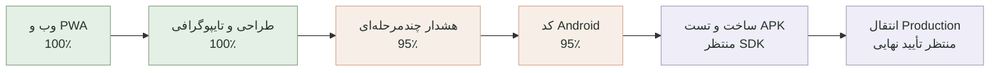

# مختصات پروژه Personal Agent

آخرین به‌روزرسانی: ۲۰۲۶-۰۸-۳۱

این فایل نقشه ثابت پیشرفت پروژه است و بعد از هر مرحله مهم به‌روزرسانی می‌شود. درصدها تخمینی‌اند و بر اساس قابلیت‌های واقعاً پیاده‌سازی و آزمایش‌شده محاسبه می‌شوند.

## موقعیت فعلی

- پیشرفت نسخه وب/PWA: **۱۰۰٪**
- پیشرفت کل محدوده جدید شامل Android و هشدار پیشرفته: حدود **۹۴٪**
- مرحله فعلی: ساخت و اجرای APK آزمایشی روی Emulator
- آخرین مرحله کامل: کدنویسی Android، هشدار چندمرحله‌ای، امنیت، Backup و Rollback
- قدم بعدی: نصب JDK و Android SDK، ساخت APK و تست Alarm روی Emulator
- انتقال دامنه: عمداً تا پایان پروژه متوقف است

محیط لوکال و دیتابیس موجود بدون حذف داده‌ها آماده شده‌اند. به‌دلیل اشغال‌بودن پورت ۳۰۰۰ توسط پروژه‌ای دیگر، نسخه فعلی Personal Agent روی `http://localhost:3001` اجرا می‌شود.

## معنی هر بخش

| بخش | وضعیت واقعی | کار باقی‌مانده |
|---|---:|---|
| پایه فنی، ورود، دیتابیس و امنیت | ۱۰۰٪ | فقط نگهداری و بررسی دوره‌ای |
| کارها و جلسات | ۱۰۰٪ | ایجاد، ویرایش، حذف دومرحله‌ای و هماهنگی یادآوری‌ها کامل است |
| تقویم | ۱۰۰٪ | پیمایش هفته‌ها، افزودن از روز انتخابی و ویرایش مستقیم کامل است |
| شناخت کاربر | ۱۰۰٪ | ساعت و روز کاری، زمان سکوت، سبک برنامه‌ریزی و یادآوری پیش‌فرض ذخیره می‌شود |
| اعلان‌ها | ۱۰۰٪ | مرکز اعلان، اعلان محلی، Push و مسیر Scheduler کامل است؛ ارسال راه دور فقط به کلید VAPID و HTTPS وابسته است |
| LLM و Agent | ۹۰٪ | بدون کلید، حالت محلی امن فعال است؛ اتصال OpenAI آماده و آزمایش زنده آن اختیاری است |
| اپ نصب‌شونده و کنترل کیفیت | ۱۰۰٪ | Manifest، آیکون‌های ۱۹۲ و ۵۱۲، Service Worker، پوسته آفلاین و Responsive کامل است |
| طراحی و تایپوگرافی | ۱۰۰٪ | وزیرمتن محلی، مقیاس فونت یکپارچه، فاصله‌ها، کنتراست و اندازه لمس موبایل کامل شد |
| اپلیکیشن Android | ۹۵٪ | پروژه Capacitor، RTL، آیکون، Splash، پوسته امن و اتصال Alarm آماده است؛ Build APK به JDK/SDK نیاز دارد |
| هشدار فوری چندمرحله‌ای | ۹۵٪ | اعلان، تکرار Alarm، اولویت بالا، Audit، لغو و Mock تماس/پیامک کامل است؛ تست دستگاه واقعی پس از ساخت APK باقی مانده |
| امنیت، Backup و Rollback | ۱۰۰٪ | Rate Limit، هدرهای امنیتی، Audit وابستگی، Snapshot سالم و مستند بازیابی کامل است |
| سرور و دامنه | آماده‌سازی انجام شده | دامنه فقط پس از پایان پروژه و تأیید مالک منتقل می‌شود |

## قانون به‌روزرسانی این نقشه

پس از هر قابلیت کامل، این فایل باید همراه با نتیجه تست‌ها، مرحله فعلی و قدم بعدی به‌روزرسانی و در GitHub ثبت شود.

## آخرین کنترل کیفیت

- Type Check: موفق
- Lint: موفق
- تست خودکار: ۲۳ تست موفق
- Build نهایی: موفق
- سلامت API و اتصال دیتابیس: موفق
- آزمایش واقعی مرورگر: تقویم، افزودن و ویرایش مستقیم در دسکتاپ و نمای موبایل روی `localhost:3001` بدون خطای Console اجرا شد
- PWA: Manifest کامل، آیکون‌های استاندارد نصب، Apple Touch Icon و Service Worker نسخه دوم فعال هستند
- طراحی: فونت وزیرمتن از داخل پروژه بارگذاری می‌شود؛ عنوان ۲۷ تا ۳۲ پیکسل، متن اصلی ۱۵ پیکسل و کنترل‌های لمسی حداقل ۳۸ پیکسل هستند
- امنیت وابستگی‌ها: `pnpm audit --prod` بدون آسیب‌پذیری شناخته‌شده
- Backup: Snapshot تازه محلی با `VACUUM INTO` ساخته شد و `integrity_check = ok` بود
- Android: `cap sync` موفق است؛ Gradle فقط به‌دلیل نبود `JAVA_HOME` و Android SDK هنوز APK نساخته است

## وابستگی‌های اختیاری و معوق

- پروژه بدون `OPENAI_API_KEY` با دستیار محلی کار می‌کند. افزودن کلید در آینده فقط کیفیت فهم زبان طبیعی را ارتقا می‌دهد و مانع استفاده از MVP نیست.
- بدون کلید VAPID، اعلان محلی روی دستگاه فعال است. Push از راه دور پس از آماده‌شدن HTTPS دامنه اضافه می‌شود.
- پیامک و تماس تا انتخاب سرویس‌دهنده، شماره تأییدشده و تأیید هزینه فقط Mock هستند و هیچ داده‌ای ارسال نمی‌کنند.
- نصب JDK و Android SDK تنها وابستگی اجباری باقی‌مانده برای ساخت فایل APK آزمایشی است.
- هیچ‌کدام از این دو مورد مانع ادامه کنترل کیفیت و استفاده محلی نیستند.
